# Credit Card Acquirer Architecture and Operations

## 1. Introduction and The Role of an Acquirer
A credit card acquirer (or acquiring bank) is a financial institution that enables merchants to accept credit and debit card payments. It acts as the critical intermediary connecting merchants, payment gateways, card networks (like Visa, Mastercard), and issuing banks. 

The acquirer assumes the financial risk of the transaction, processes the authorization, and ensures the merchant receives the funds (settlement). 

## 2. The Transaction Lifecycle
The acquiring process typically involves the following steps:
1. **Initiation**: The customer presents card details at a merchant's point-of-sale (POS) or online payment gateway.
2. **Request Transmission**: The merchant's system securely sends the payment details to the acquirer.
3. **Routing**: The acquirer routes the transaction through the appropriate card network (Scheme) based on the card brand.
4. **Authorization Request**: The card network forwards the request to the customer's Issuing Bank.
5. **Authorization**: The issuing bank verifies available funds, checks for fraud, and approves or declines the transaction.
6. **Response**: The decision flows back through the network to the acquirer, and finally to the merchant.
7. **Clearing & Settlement**: (Usually done in batches at the end of the day). The acquirer receives funds from the issuing bank (via the network) and deposits them into the merchant's account, minus various fees (interchange, network fees, acquirer markup).

## 3. Key Engineering Challenges
Building a state-of-the-art acquirer system involves immense technical complexity:

* **Massive Scale & Throughput:** Systems like Uber's settlement accounting process ~1.2 billion settlements monthly. Acquirers must handle extreme transaction peaks with minimal latency (often under a second for authorization).
* **Data Consistency & Immutability:** Financial systems cannot afford dropped or mutated records. The system must guarantee that every cent is accounted for, requiring strict adherence to immutable ledgers.
* **Integration Complexity:** Acquirers must integrate with dozens of different payment service providers (PSPs), each with entirely different report formats, clearing files, and dispute APIs.
* **Reconciliation and Reporting:** Matching internal transaction records against external bank statements and PSP settlement files is highly error-prone due to timing differences and varying data formats.
* **Security & Compliance:** Strict adherence to PCI-DSS, data encryption, tokenization, and handling Personally Identifiable Information (PII).
* **Chargebacks & Disputes:** Implementing robust workflows to track, manage, and arbitrate reversed transactions and fraud claims.

## 4. High-Level System Architecture
Drawing inspiration from modern systems like Stripe's "Ledger" and Uber's settlement architecture, a modern acquirer should be built around **immutability**, **event-driven processing**, and **double-entry bookkeeping**.

### 4.1. Core Components

#### A. Gateway & Authorization Service (Real-time Flow)
* **API Gateway:** Receives transaction requests from merchants. Handles rate limiting, authentication, and tokenization.
* **Routing Engine:** Determines the optimal path for the transaction (e.g., choosing between multiple acquiring connections if acting as an aggregator, or direct to specific card networks).
* **Risk Engine:** Real-time fraud scoring using ML models before sending to the card network.

#### B. The Core Financial Ledger (System of Record)
* **Immutable Event Log:** Every financial action (charge creation, release, refund, chargeback) is recorded as an immutable event. Traditional CRUD updates are strictly forbidden.
* **Double-Entry Bookkeeping:** Similar to Stripe's Ledger, money movement is modeled as transfers between virtual accounts (e.g., `charge_unsubmitted`, `merchant_balance`, `network_payable`). This ensures the system always mathematically balances to zero. State machines dictate how funds flow between these accounts.

#### C. Settlement & Reconciliation Pipeline (Batch/Asynchronous Flow)
Similar to Uber's three-tier settlement architecture:
* **Feed Ingestion Service:** Connects to Card Networks and internal banking partners to securely download massive end-of-day clearing files and settlement reports.
* **Feed Processor Service:** Normalizes disparate file formats from different networks into a unified canonical data model.
* **Reconciliation Engine:** A highly parallelized service that matches normalized settlement events against the internal Core Ledger. It identifies discrepancies (exceptions, un-cleared funds) for manual or automated review.

#### D. Data Quality (DQ) & Observability Platform
A centralized platform continuously querying the core ledger to ensure system health through three primary metrics:
* **Clearing:** Ensures that transient (intermediate) accounts balance to zero over time. If money is "stuck in the pipes" (e.g., a charge was created but a release event from the network never arrived), it raises an alert.
* **Completeness:** Cross-system checks verifying that every transaction ID in the API Gateway exists in the Ledger and Reconciliation databases.
* **Timeliness:** Measures the delay between event creation and ledger ingestion to ensure SLAs are met for merchant reporting.

### 4.2. Recommended Technology Stack Principles
* **Compute:** Microservices architecture deployed on Kubernetes, allowing independent scaling of the Authorization (compute-heavy) and Ledger (I/O-heavy) services.
* **Data Storage:** 
  * Relational Database (e.g., PostgreSQL/CockroachDB/Aurora) for the Core Ledger to leverage strong ACID guarantees and transactional integrity.
  * Message Brokers (e.g., Kafka) to orchestrate event-driven flows between Authorization, Ledger, and Reconciliation services.
* **Data Warehouse:** Exporting read-replicas of the ledger to a data warehouse (e.g., Snowflake, BigQuery) for generating complex merchant statements, analytics, and accounting reports without impacting transactional performance.

## 5. Architectural Diagrams

### 5.1. High-Level Block Diagram
This shows the core entities involved in a credit card transaction and how the Acquirer sits between the merchant and the payment networks.

```mermaid
graph LR
    Client[Cardholder] -->|Presents Card| Merchant[Merchant / POS]
    Merchant -->|Payment Request| Gateway[Payment Gateway]
    Gateway -->|Routes Transaction| Acquirer[Acquirer]
    Acquirer -->|Auth Request| Network[Card Network]
    Network -->|Auth Request| Issuer[Issuing Bank]
    
    %% Return path
    Issuer -.->|Auth Response| Network
    Network -.->|Auth Response| Acquirer
    Acquirer -.->|Auth Response| Gateway
    Gateway -.->|Auth Response| Merchant
    Merchant -.->|Payment Status| Client
```

### 5.2. Sequence Diagram (Real-Time vs. Asynchronous)
This sequence illustrates which parts of the lifecycle happen in real-time (authorization) versus asynchronously at the end of the day (clearing and settlement).

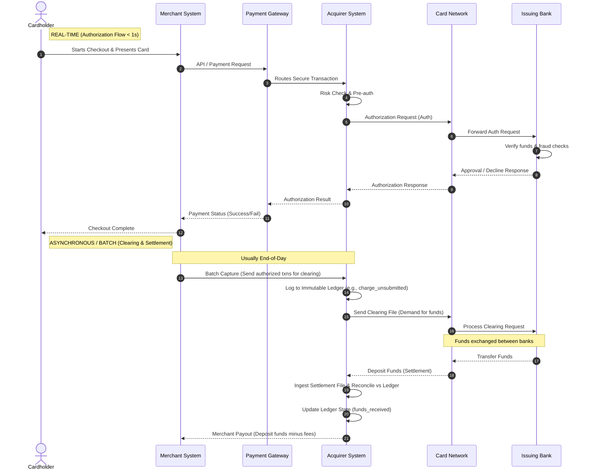

### 5.3. Clarifications on Sequence Steps

Based on the sequence diagram above, here are detailed explanations addressing common points of confusion:

**Step 13: The "Batch Capture" and the "Merchant System"**
The phrase "Merchant System" can represent different things depending on whether the transaction is online or in-store:
* **Scenario A: E-commerce (Online).** The "Merchant System" is the website's backend server (e.g., Shopify, or a custom web app). In step 13, this backend server sends an API call (a "capture" request) to the Acquirer saying, *"Hey, I successfully shipped the shoes to the customer. You can now finalize the $100 charge we authorized earlier today."*
* **Scenario B: Physical Store (POS Machine).** If you build your own card payment machines (terminals), the POS terminal *itself* acts as the edge of the Merchant System. However, individual terminals rarely talk directly to the Acquirer to send end-of-day batches. Typically, the terminal talks to a central **Terminal Management System (TMS)** or a central merchant server. In step 13, it is either the POS terminal (via a daily automated close-out process) or the central TMS that bundles all the day's authorized transactions and sends the clearing file to the Acquirer.

**Why doesn't it clear immediately at step 12?**
When a card is swiped (Steps 1-12), it is only an **Authorization**. The bank puts a "hold" on the funds, but no actual money moves. A merchant might never "capture" those funds (e.g., a hotel holding funds for incidentals, but releasing them if the mini-bar wasn't used; or an e-commerce store that cancels an order before shipping). Step 13 is the explicit command to turn that "hold" into a real charge.

**Step 16 to 17: How long does it wait? (The Settlement Delay)**
The wait time between Step 16 (Network tells Issuer to transfer funds) and Step 17 (Network deposits funds to Acquirer) is typically **1 to 3 Business Days (T+1 to T+3)**.
* **Why the delay?** The traditional banking infrastructure (like ACH in the US, or various RTGS systems globally) operates in daily batches. When the Card Network calculates that Issuer Bank A owes Acquirer Bank B $10,000 for the day's transactions, Bank A actually wires that money to Bank B through the central banking system. This wire/transfer process takes time to clear. 
* **The Exception:** Some modern systems are moving toward "Next day" or even "Same day" settlement (using systems like FedNow or RTP), but the global standard often still incurs a 24-48 hour delay, especially across borders or on weekends. Because of this delay, the Acquirer must maintain strict ledger states (e.g., marking funds as `charge_captured` vs. `funds_received_from_network`) to avoid paying the merchant before the money has actually arrived at the Acquirer's bank account.

## 6. Brazilian Market Specifics

The architecture and behavior of an acquirer in Brazil are significantly different from the standard US or European models. The Central Bank of Brazil (Bacen) enforces strict regulations, and the market is driven by unique consumer behaviors. Any acquirer operating in Brazil must build their core ledger and settlement engines to handle the following complexities:

### 6.1. Installments ("Parcelado") and Extended Settlements
In the US/EU, if a customer buys a $120 item, the acquirer settles $120 (minus fees) to the merchant within T+2 days.
In Brazil, up to 80% of e-commerce transactions use interest-free installments (*Parcelado sem juros*).
* If a customer buys a $120 item in 12 installments, the cardholder pays their issuer $10 a month.
* **The Acquirer's Challenge:** The standard settlement rule in Brazil for credit cards is **T+30 days** for the *first* installment, T+60 for the second, and so on. 
* **Ledger Impact:** The Acquirer's ledger cannot just log a single `funds_due` event. It must explode a single $120 transaction into 12 distinct future settlement events (receivables) spanning an entire year. The reconciliation engine must track each fraction of the payment arriving individually each month.

### 6.2. Receivables Anticipation (Antecipação de Recebíveis)
Because merchants don't want to wait a year to receive their $120, acquirers in Brazil offer "Anticipation." The acquirer pays the merchant the full amount upfront (e.g., at T+1 or T+2), taking on the cash flow burden and charging a financing fee (discount rate).
* **Architecture Impact:** The Acquirer essentially becomes a lender. The system needs a **Credit/Financing Engine** intertwined with the ledger. When a merchant requests anticipation, the system must calculate the Net Present Value (NPV) of those future 12 installments, deduct the anticipation fee, immediately transfer the funds, and then re-assign those future T+30/60/90 receivables from the "merchant payout" bucket to the "acquirer revenue" bucket to pay back the internal loan.

### 6.3. The Registrars of Receivables (Registradoras)
In 2021, the Brazilian Central Bank mandated that every credit card transaction (receivable) must be legally registered in a centralized external database (Registradoras like CIP, CERC, Tag, Nuclea).
* **The Goal:** To allow merchants to use their future credit card sales as collateral to get loans from *any* bank (not just their acquirer).
* **Architecture Impact:** Acquirers must build a robust **Regulatory Integration Layer**. The moment a transaction is captured, the acquirer has a legal obligation to send an event via heavy API/SFTP integrations to the external Registradoras. 
* If a merchant takes a loan from Bank X using their future receivables, the external Registrar sends an instruction back to the Acquirer: *"Do not pay the merchant their T+30 installment on Friday. Reroute that money to Bank X instead."* The Acquirer's settlement engine must dynamically query these external registries immediately before execution to ensure funds are routed to the correct legal owner (the concept of *Trava de Domicílio*).

### 6.4. Strategic Opportunity: The Bank-Acquirer Hybrid
Because you are building an acquirer *inside* an existing bank, there is a massive competitive advantage in the anticipation and registry space:
* **Internal Anticipation:** Usually, if an acquirer wants to prepay a merchant (anticipation), they borrow money from a bank at a certain interest rate, add their own margin, and offer the anticipation to the merchant. Since you *are* the bank, your cost of capital is much lower. You can offer anticipation at very competitive rates and capture the entire spread.
* **Registry Synergies:** While you legally *must* register receivables with external registradoras (like CIP/Nuclea), your bank's lending arm can aggressively target your own acquiring merchants. Because you already have the pristine ledger data of the merchant's transactions, your internal credit risk models can pre-approve them for loans almost instantly, outcompeting external banks who have to rely solely on slower registry queries.


## 7. Deep Dive: Inside the Acquirer System

The external diagrams show the flow, but internally, the Acquirer must handle tremendous edge cases and complexity.

### 7.1. Internal Services Architecture (Event-Driven)
A modern acquirer is heavily event-driven (using Apache Kafka, AWS Kinesis, etc.). Here are the core internal services:
1. **Gateway / Auth Service:** Receives the original JSON or ISO-8583 requests from terminals. Validates the merchant credentials, unpackages the request, and securely passes PIN blocks to the HSM.
2. **Switch / Routing Engine:** Taking the validated request, it decides where to route the transaction (e.g., to Visa, Mastercard, or an internal core banking system for "On-Us" transactions).
3. **Ledger Service:** The immutable database where all financial state changes are recorded in a double-entry format. An initial authorization creates a pending state here.
4. **Clearing File Generator (Outbound File Service):** Batch process that runs at the end of the day to build the demand files.
5. **Feed Ingestion & Reconciliation Service:** Reads the inbound settlement files from the network and matches them against the internal ledger.
6. **Balance & Payout Engine:** A service that continuously processes the ledger (via materialized views or streaming aggregation) to calculate the merchant's available balance and trigger bank payouts.

#### Internal Architecture Diagram

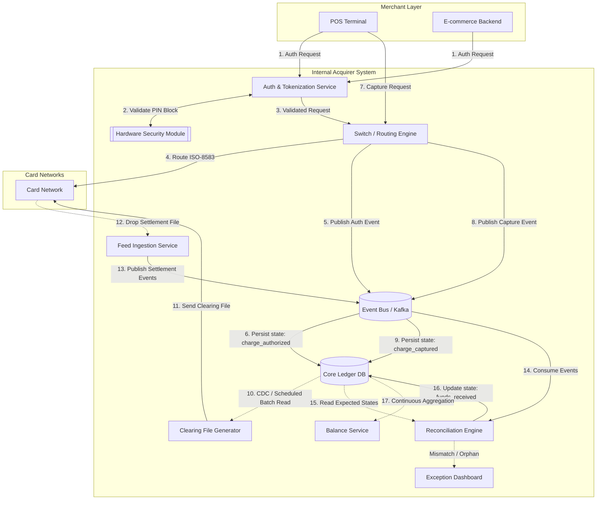

### 7.2. Creating the Clearing File and Ledger States
When the merchant says "capture these 5,000 transactions," the Acquirer must build a "Clearing File" to send to Visa/Mastercard. 
* **The Catch in Building the File:** 
    * Format: Networks require very specific, legacy tape-based formats (like Visa's Base II or Mastercard's IPM). A single misplaced byte ruins the file.
    * Batching rules: A merchant might send 10 small capture requests. The acquirer must aggregate these correctly.
    * Timing: Networks have strict daily cut-off times. If you miss the 4:00 PM EST window, you don't get paid until the *next* day, severely disrupting cash flow.
* **Dealing with Ledger States:**
    * **State 1 (`charge_authorized`):** Immediately after swiping. No money moves.
    * **State 2 (`charge_captured`):** Merchant captured it. The Acquirer's Ledger Service creates an event moving funds from `charge_authorized` to `charge_captured`. 
    * **State 3 (`clearing_sent`):** The Outbound File Service generates the file for Visa and updates the ledger. Now the Acquirer knows, *"I have demanded this money from the network."*

### 7.3. Feed Ingestion: Reading Files & Breaking into Events
Yes, the exact approach when receiving the massive end-of-day settlement files from the Networks is to stream the file and break it down into thousands (or millions) of individual events.
1. The Network drops a multi-gigabyte flat file onto a secure SFTP server.
2. The **Feed Ingestion Service** picks it up, parses the legacy format, and publishes a standard internal event (e.g., `SettlementEventReceived`) to a Kafka topic for *every single line* in the file.
3. This massive fan-out allows dozens of consumer pods to process the reconciliation in parallel, dramatically speeding up end-of-day accounting.

### 7.4. The Reconciliation Engine: What can go wrong?
Reconciliation is comparing the internal Ledger (`clearing_sent`) against the Network's file (`settlement_received`) to verify every penny matches. 

**Common Scenarios and Failures:**
* **The Perfect Match (1-to-1):** Internal Ledger says Transaction X is $100. Network file says they settled Transaction X for $100. The engine moves the ledger state to `funds_received`.
* **Scenario A: The Missing Settlement (Orphaned Record):** We demanded $100 for Transaction Y yesterday. The Network file arrived today, but Y isn't in there. 
    * *Action:* The engine flags Y in an Exception Queue and freezes the merchant payout for Y.
    * *Resolution:* Usually relies on an automated "wait 24 hours" rule, as networks sometimes split files across days. If it's still missing, operations creates a manual investigation ticket with the Network.
* **Scenario B: Amount Mismatch (Tolerance issues):** We demanded $100 for Transaction Z, but the Network settled $99.98.
    * *Cause:* Unexpected cross-border foreign exchange (FX) rate fluctuations, or a late-added scheme fee. 
    * *Action:* If within an acceptable threshold ($0.02), an automated rule posts a "write-off" event to the ledger to balance it to zero and proceeds. If it is way off ($50), it goes to the Exception Queue for manual review.
* **Scenario C: Unexpected Network Settlement (Recon Orphan):** The network file says they are paying us $50 for Transaction W, but our internal Ledger has absolutely no record of Transaction W ever occurring.
    * *Cause:* A severe routing error, a bug in our Auth system failing to log the event, or a file formatting parsing issue.
    * *Action:* The funds are deposited into a generic "Suspense/Holding Account" in the general ledger. They cannot be paid to a merchant because we don't know who owns the money. Operations must investigate to find the true owner.
* **Scenario D: Surprises (Chargebacks & Fines):** The network file contains a -$50 chargeback for a transaction from three months ago that the customer disputed as fraud.
    * *Action:* The engine ingests this unexpected negative event, updates the merchant's balance to deduct the $50, and triggers the Dispute Service to notify the merchant to submit evidence to fight it.

### 7.5. Ledger State Machine
As discussed, events flowing through Kafka aren't just logs; they are **state transitions** applied to the core ledger. To answer your question on who processes balances: A **Balance Service** continuously aggregates these ledger states (often using CDC—Change Data Capture—like Debezium, or materialized views) to show the merchant their "Pending" vs. "Available" balance.

Here is a simplified state machine for a single transaction's lifecycle in the ledger:

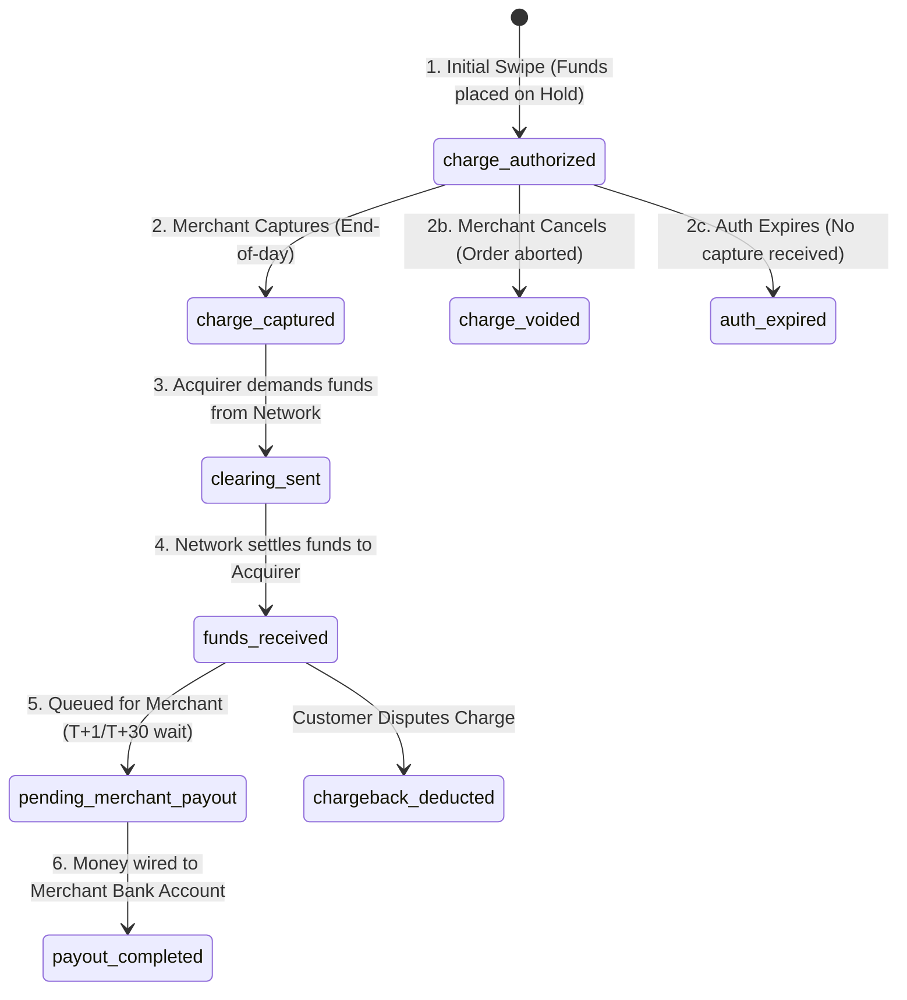

**What happens when a capture never arrives for an authorized transaction?**
This is the `auth_expired` state in the diagram above. Authorizations have a limited lifespan (typically 7-30 days, depending on the card network and merchant category). If the merchant never sends a capture request (e.g., the customer cancelled the order, or the merchant's system had a bug), the hold on the cardholder's funds simply expires. 
* **On the Acquirer side:** A scheduled job must sweep the Ledger for any transactions stuck in `charge_authorized` past their expiry window. It then posts a reversal event (`auth_expired`), which credits back `auth_holding` to zero. No money ever moved, so there is no financial risk—but the Acquirer *must* clean up its ledger to avoid phantom balances inflating reports.
* **On the Cardholder side:** The hold disappears from their card statement, and their available credit is restored.

### 7.6. The Double-Entry Ledger Example

#### What is Double-Entry Bookkeeping?
The core rule is simple: **every financial event must touch exactly two accounts, and the total of all Debits must always equal the total of all Credits across the entire system.** Think of it like energy conservation in physics—money is never created or destroyed, only transferred. 
* **Debit (Dr):** Increases the balance of that account (money flows *into* it).
* **Credit (Cr):** Decreases the balance of that account (money flows *out* of it).

This guarantees that if you sum every single Debit ever recorded and subtract every single Credit ever recorded across all accounts, you always get exactly **$0.00**. If you don't get zero, something is broken. This is the core integrity check of any financial system.

#### Step-by-Step for a $100 Transaction
Consider a customer buying a **$100 physical product**. *(This follows the Brazilian T+30 timeline assuming NO anticipation.)*

| Time | Event Action | Account | Debit (Dr) | Credit (Cr) | Explanation |
| :--- | :--- | :--- | :--- | :--- | :--- |
| **Day 1: 10:00** | `swipe_auth` | `auth_holding` | $100 | | Money-in: We record a $100 hold. |
| | | `external_customer_card` | | $100 | Money-out: The cardholder's available limit decreases. |
| **Day 1: 23:00** | `capture_batch` | `charge_captured` | $100 | | Money-in: The confirmed charge account receives $100. |
| | | `auth_holding` | | $100 | Money-out: The temporary hold is emptied. |
| **Day 2: 02:00** | `registry_sync` | *[N/A — Regulatory]* | — | — | *BRAZIL:* Register the receivable with CIP/Tag. No money moves. |
| **Day 2: 23:30** | `clearing_sent` | `network_receivable` | $100 | | Money-in: We now expect $100 from Visa. |
| | | `charge_captured` | | $100 | Money-out: The captured charge is emptied. |
| **Day 3: 08:00** | `settlement_recon` | `acquirer_bank_account` | $98 | | Money-in: Visa wires $98 physical cash into our bank. |
| | | `network_receivable` | | $98 | Money-out: $98 of the $100 we expected has arrived. |
| **Day 3: 08:00** | `fee_reconciliation` | `fee_expense_account` | $2 | | Money-in: We record a $2 business expense. |
| | | `network_receivable` | | $2 | Money-out: The remaining $2 clears `network_receivable` to $0. |
| **Day 30: 09:00** | `merchant_payout` | `merchant_payable` | $97 | | Money-in: We recognize a $97 liability to the merchant. |
| | | `acquirer_bank_account` | | $97 | Money-out: We earmark $97 from our bank for payout. |
| **Day 30: 15:00** | `wire_transfer` | `merchant_external_bank` | $97 | | Money-in: The merchant's external bank receives $97. |
| | | `merchant_payable` | | $97 | Money-out: Our liability to the merchant clears to $0. |

> **Integrity Check:** Sum all Debits = $100+$100+$100+$98+$2+$97+$97 = **$594**. Sum all Credits = $100+$100+$100+$98+$2+$97+$97 = **$594**. The system balances perfectly. ✅

#### Account Balances over Time
The running balance of each account after each step (Internal vs External):

| Event | External Balances (Not Controlled) | Internal Balances (Controlled by Acquirer) |
| :--- | :--- | :--- |
| **Initial State** | Customer Card: `$0`<br>Merchant Bank: `$0` | All Internal Accounts: `$0` |
| **After `swipe_auth`** | Customer Card: `-$100` | `auth_holding`: `+$100` |
| **After `capture_batch`** | Customer Card: `-$100` | `charge_captured`: `+$100`<br>`auth_holding`: `$0` |
| **After `clearing_sent`** | Customer Card: `-$100` | `network_receivable`: `+$100`<br>`charge_captured`: `$0` |
| **After `settlement_recon` & `fee`** | Customer Card: `-$100` | `acquirer_bank_account`: `+$98`<br>`fee_expense_account`: `+$2`<br>`network_receivable`: `$0` |
| **After `merchant_payout`** | Customer Card: `-$100` | `acquirer_bank_account`: `+$1`<br>`fee_expense_account`: `+$2`<br>`merchant_payable`: `+$97` |
| **After `wire_transfer`** | Customer Card: `-$100`<br>Merchant Bank: `+$97` | `acquirer_bank_account`: `+$1` <br>`fee_expense_account`: `+$2`<br>`merchant_payable`: `$0` |

*End state: The merchant got $97, the network kept $2, and the acquirer retained $1 profit.*

### 7.7. Bypassing the Network: "On-Us" Transactions
*If I identify the issuing bank is mine, I can skip the network, right?*
**Yes.** This is the holy grail for a Bank-Acquirer hybrid. It is called an **"On-Us" transaction**.
If your POS terminal reads a card and the Switch recognizes the BIN (Bank Identification Number) belongs to *your* bank, the Switch bypasses Visa/Mastercard entirely and routes the authorization directly to your internal core banking issuer system. 
* **The Benefit:** You pay **zero** network scheme fees for these transactions, drastically increasing your profit margin. Settlement is instantaneous because the money simply moves from one internal bank account to another.

### 7.8. Hardware Security Modules (HSMs) and PIN Validation
*How do I confirm PINs? Is there a special way to store and access secrets?*
PINs must NEVER touch a standard database or application server in plaintext. The payment industry relies on **Hardware Security Modules (HSMs)**—highly secure, tamper-resistant physical servers.
* **The Flow:** When a user types their PIN on a POS pad, the pad encrypts it immediately into a "PIN Block" using a secure key it was injected with at the factory.
* **The Acquirer:** The Auth Service receives this encrypted PIN block. *The Auth Service code cannot decrypt it.* 
* **Validation:** 
    * If the transaction is routed to Visa, the acquirer just passes the encrypted block blindly through the Switch. 
    * If it is an **"On-Us"** transaction (as described above), your internal Auth Service sends the encrypted PIN Block strictly to your *internal* HSM cluster via secure socket (often using protocols like Thales Payshield). The HSM has the master keys safely trapped in hardware, decrypts the block entirely inside its secure boundary, compares it to the correct hashed PIN for that card, and returns a simple `YES` or `NO` back to your Auth Service.

### 7.9. Deep Dive: Feed Ingestion Architecture & Challenges
The Feed Ingestion Service is arguably one of the most operationally complex pieces of an acquirer. It's the bridge between the legacy file-based banking world and the modern event-driven microservices world.

Here is a critical architectural breakdown of how it should be built, and what can go disastrously wrong.

#### A. How the Architecture Looks
Modern ingestion pipelines typically follow a "Cloud Storage + Event Trigger + Worker Pool" pattern:

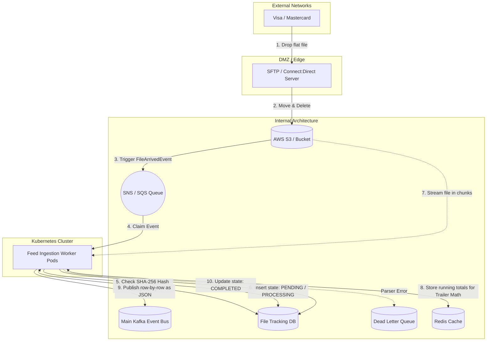

1. **The Drop Zone:** Visa/Mastercard drops a flat file (e.g., standard `.csv`, or legacy fixed-width `.txt` formats) via a secure tunnel (SFTP/Connect:Direct) into an external-facing DMZ.
2. **Move to Cloud Storage:** A simple script or listener immediately moves that file into a secure cloud object store (like an AWS S3 `inbound/` bucket) and deletes it from the edge server.
3. **Event Generation:** The moment the file lands in the `inbound/` bucket, the S3 bucket fires an event (e.g., via AWS SNS/SQS or a Kafka topic: `FileArrivedEvent`).
4. **The Processing Workers:** A pool of horizontally scaled Feed Ingestion worker pods listens to that event. One pod claims the file, validates the SHA-256 hash against the DB to skip duplicates, streams it line by line (using Redis to count totals), transforms each line into JSON, and pumps it onto the main Kafka `SettlementEvent` topic.

#### B. How do we manage files we already read?
You must maintain a relational **File Tracking Database (e.g., PostgreSQL)**. Never rely solely on moving files between S3 folders (like `inbound/` -> `processed/`) as your source of truth, as S3 is not a transactional database.

A typical `Settlement_Files` table schema includes:
* `network_file_id` (Unique hash or filename from the network)
* `status` (PENDING, PROCESSING, COMPLETED, FAILED)
* `total_records_expected` (From the file's control trailer)
* `records_successfully_processed`
* `created_at` / `completed_at`

**The State Machine Flow:**
1. File lands -> Row inserted as `PENDING`.
2. Worker picks it up -> Updates row to `PROCESSING`.
3. Worker finishes -> Updates row to `COMPLETED` and moves the S3 object to an `archive/` bucket. 

#### D. Critical Architectural Problems (What goes wrong?)

Being critical, here are the nastiest problems an architect must solve for Feed Ingestion:

**1. The "Out of Memory" (OOM) File Bomb**
* **The Problem:** A junior engineer writes a script that says `file_contents = s3.get_object().read()`. Visa drops a 15GB settlement file. The Kubernetes pod hits its 2GB memory limit and crash-loops forever.
* **The Solution:** The ingestion service must **Stream Process**. It must read the file in chunks or stream it line-by-line (`streamReader.readLine()`), process that one line, emit it to Kafka, and immediately garbage collect the memory. 

**2. The Re-delivery Dilemma (Idempotency)**
* **The Problem:** What if the worker pod crashes halfway through processing a 1,000,000 line file? Or what if Visa accidentally drops the exact same file twice on the SFTP?
* **The Solution:** 
    * *File-level Idempotency:* Before processing, hash the file (SHA-256) or check the Network sequence number against the File Tracking DB. If you've seen it, reject it.
    * *Row-level Idempotency:* Kafka consumers downstream (the Reconciliation Engine) must be idempotent. If the Feed Ingester crashes at line 500,000, it simply spins back up and restarts from line 1. The Reconciliation Engine must recognize, *"I've already updated the ledger for Transaction #123,"* and safely ignore the duplicate event.

**3. Partial Failures (The "Bad Apple" Row)**
* **The Problem:** A file has 500,000 rows. Row 400,123 has a malformed amount string containing a letter (`10A.00`). A poorly written parser throws an unhandled Exception, and the entire file fails to process. 499,999 merchants don't get paid because of one bad row.
* **The Solution:** The parser must catch row-specific exceptions. If a row is garbage, the worker writes that specific raw text line to a **Dead Letter Queue (DLQ)**, increments an `error_count` metric, and continues processing the rest of the file. Operations can manually fix the DLQ later.

**4. The Trailer Totals Mismatch**
* **The Problem:** Legacy banking files usually have a "Header" (start date), millions of "Detail" rows, and a "Trailer" at the bottom that says `Total_Records: 1000000, Total_Amount: $50,000,000`. 
* **The Solution:** The Feed Ingester must hold state in **Redis** (or memory) during processing because the File Tracking DB is too slow for millions of rapid increments. As it streams, it increments row counts and sums amounts in Redis. When it hits the Trailer row, it compares its internal math to the Trailer's math. If they do not match, the file is corrupt or truncated. The system must raise a critical alarm and halt downstream payouts.
    * **Parallel Processing & Redis Concurrency (.NET Context):** If you are reading the S3 stream using a single reader thread and fanning out the actual parsing to a pool of parallel worker threads (e.g., using .NET `System.Threading.Channels`), you *must* rely on Redis for the centralized aggregation to avoid race conditions.
    * *The Concurrency Gotcha:* If Thread A and Thread B both try to read the current count from Redis, add $10, and write it back `(Get -> Add -> Set)`, they might overwrite each other. 
    * *The Fix:* You must use Redis's native atomic increment commands. In C# (using StackExchange.Redis), you would use `db.StringIncrementAsync("file_123_count")` and `db.StringIncrementAsync("file_123_amount", 10.50)`. Because Redis is single-threaded at its core, these `INCR` / `INCRBYFLOAT` commands are guaranteed absolutely mathematically correct, no matter how many parallel .NET threads hit them simultaneously.

**5. How to Chunk a 15GB S3 File for Parallel Workers (The .NET Channel Pattern)**
* **The Problem:** You have a 15GB text file and want to limit memory usage to ~10MB while keeping 10 worker threads busy. Do you read 1MB raw byte chunks, or do you read by lines?
* **The Solution (Line Batching):** For text-based financial files (CSV, fixed-width), you must chunk by **lines**, not arbitrary byte sizes. If you blindly read a 1MB byte chunk, your stream will almost certainly slice a 120-character transaction line directly in half (e.g., bytes stop at `"John Doe, 150"` instead of `"John Doe, 150.00"`). The parser worker will catastrophicly fail on the broken string.
* **The Pattern (Producer-Consumer via Channels):**
    1. **The Producer (1 Reader Thread):** A blazing fast single thread opens the continuous S3 `StreamReader`. It calls `.ReadLineAsync()` in a tight loop. Because the reader only holds one string in memory at a time, its memory footprint is effectively zero.
    2. **The Batcher:** Instead of pushing individual lines to a `.NET Channel` (which creates too much locking overhead), the Producer adds lines to a `List<string>`. Once the list hits exactly `10,000` lines (a logical block of work), it creates an immutable array and `WriteAsync`'s that entire array into the `Channel`.
    3. **Bounded Channels (Backpressure):** You create the channel with `BoundedChannelOptions(Capacity = 10)`. This is the most crucial part! If the 10 worker threads get slow, the Channel fills up with 10 arrays (totaling 100,000 lines). The blazing fast Producer thread is *forced to pause* and wait. This enforces **Backpressure**, mathematically guaranteeing your application will never process more than 10 blocks at the same time, keeping RAM strictly capped.
    4. **The Consumers (10 Worker Threads):** Ten parallel threads call `Channel.ReadAsync()`. A worker grabs an array of 10,000 perfect, unbroken string lines, iterates through them, parses the amounts, fires the Kafka events, sends the atomic increments to Redis, and then reaches back into the Channel for the next array.

---

### 7.10. Deep Dive: Outbound File Service (Clearing File Generation)

When generating outgoing clearing files for networks like Visa or Mastercard, the Acquirer must select millions of `charge_captured` transactions from the Ledger Database, format them into strict legacy structures (e.g., fixed-width Base II or IPM), compute file-level totals (checksums/trailers), and transmit them. 

This poses massive architectural challenges. You cannot simply `SELECT *` 20 million rows, build a 15GB string in memory, and upload it. The database will choke, and the pod will throw an OutOfMemory (OOM) exception. Furthermore, a transaction must exist in exactly *one* clearing file to avoid double-billing the cardholder.

#### A. Architectural Alternatives for Outbound Generation

##### Alternative 1: The Monolithic Paged Job (The Anti-Pattern)
* **Approach:** A massive nightly cron job queries the DB using `OFFSET/LIMIT` pagination, formatting and appending to a local file stream, and updating `status = 'clearing_sent'` row-by-row.
* **Why big players abandon this:** Relational databases degrade terribly on deep `OFFSET` pagination. Holding a long-running massive read/write transaction spikes CPU and blocks real-time authorization queries. If the job runs for 4 hours and fails at hour 3, resuming gracefully without duplicating records is a nightmare.

---

##### Alternative 2: Event-Sourced CDC Pipeline (The Stripe Model)

Stripe's financial infrastructure is built around an **immutable, event-sourced ledger** with Apache Kafka as the financial source of truth. Rather than querying the operational database at clearing time, every state transition is streamed in real-time into a secondary read-optimized store specifically designed for batch extraction.

**Core Principle:** The operational Ledger DB is *never* queried for clearing file generation. Instead, CDC feeds a downstream "Clearing Outbox" that is physically optimized for sequential reads.

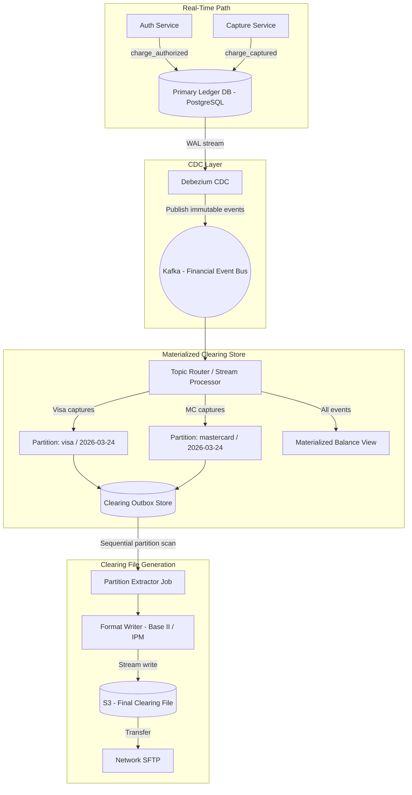

**How It Works Step-by-Step:**

1. **During the day:** Every `charge_captured` event flows through CDC → Kafka. A stream processor (Kafka Streams or Flink) routes each event into a **partitioned Clearing Outbox store** — keyed by `(network, clearing_date)`. This store can be Cassandra (wide columns), a date-partitioned PostgreSQL table, or Apache Hive/Iceberg on S3.

2. **The "hot path" separation:** The same Kafka events also feed **materialized balance views** — pre-computed aggregations that power the merchant dashboard ("Your pending balance: $4,230"). This is why Stripe processes billions of events daily through Kafka — the event bus feeds multiple downstream consumers without touching the primary Ledger.

3. **At clearing time (e.g., 11 PM):** The Extractor job does *not* run a complex analytical query. It simply reads the pre-sorted `visa/2026-03-24` partition sequentially. Because the data was inserted in temporal order throughout the day, the read is essentially a sequential disk scan — the fastest possible I/O pattern. The Formatter converts each row into Visa Base II fixed-width format, streams it to S3, and computes the trailer math on the fly.

**Why This Works:**
- **Zero load on the primary Ledger DB** at clearing time — the operational database only serves real-time authorization.
- The Clearing Outbox is a **write-optimized append-only store** — no indexes to maintain, no B-tree overhead.
- Data is **physically co-located by network and date**, so extraction is a single sequential scan, not a scattered query.

**Trade-offs:**
- You must maintain a **secondary datastore** in sync with the primary Ledger. CDC lag introduces eventual consistency — typically 1-5 seconds, which is acceptable for batch clearing.
- Schema evolution in the Ledger must be carefully mirrored in the Clearing Outbox.
- **Exactly-once delivery** between Kafka and the Clearing Store must be guaranteed (Kafka Streams or Flink provide this natively via their state stores).

---

##### Alternative 3: Distributed Spark MapReduce (The Uber Model)

Uber's settlement architecture processes **1.2 billion settlements monthly** across 50+ Payment Service Providers. At this scale, even a pre-materialized partition scan is too slow for a single machine. Uber uses **Apache Spark on a centralized data lake** (Hive/Parquet on HDFS/S3) to distribute the clearing file generation across hundreds of worker nodes.

**Core Principle:** The data lake is the single source of truth for batch operations. Spark jobs read partitioned Parquet files, apply business logic in parallel, and assemble the final output using a MapReduce pattern with S3 Multipart Upload.

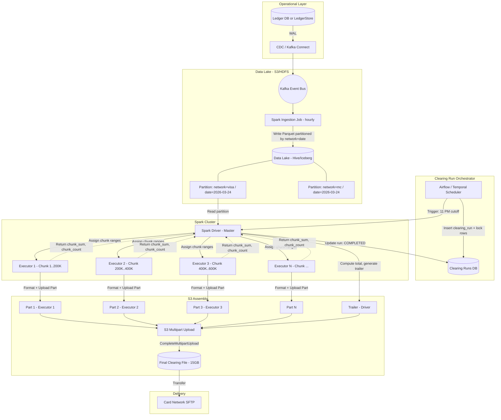

**How It Works Step-by-Step:**

1. **Continuous ingestion into the Data Lake:** Throughout the day, a Spark Streaming or hourly batch job reads `charge_captured` events from Kafka and writes them as **Parquet files** into a Hive/Iceberg table, partitioned by `(network, clearing_date)`. Parquet is columnar and compressed — 20 million rows that would be 15GB as text occupy ~2-3GB as Parquet.

2. **The Orchestrator triggers the run:** At 11:00 PM, an Airflow or Temporal DAG fires. It creates a `clearing_run` record in the Runs DB and tells Spark: *"Generate the Visa clearing file for 2026-03-24."*

3. **The Map Phase (Distributed Formatting):**
   - The Spark Driver reads the metadata of the `visa/2026-03-24` partition — it knows there are N Parquet files totaling 20 million rows.
   - It divides the work into chunks (e.g., 100 chunks of 200,000 rows each).
   - Each Spark Executor reads its chunk of Parquet data, converts each row into Visa Base II fixed-width format, and uploads the formatted text as an **S3 Multipart Upload Part**.
   - Each Executor returns its `(chunk_record_count, chunk_total_amount)` to the Driver.

4. **The Reduce Phase (Trailer Generation):**
   - The Driver aggregates all chunk totals: `total_records = SUM(chunk_counts)`, `total_amount = SUM(chunk_amounts)`.
   - It generates the file Header (with metadata) and Trailer (with totals).
   - It uploads the Header as Part 0 and the Trailer as the final Part.
   - It calls `CompleteMultipartUpload` — S3 stitches all parts into a single 15GB object in milliseconds.

5. **Delivery:** The final S3 object is transferred to the card network's SFTP server. The clearing run is marked `COMPLETED`.

**Why This Works at Scale:**
- **Horizontal parallelism:** 100 Spark Executors process 200,000 rows each in parallel. A single node taking 2 hours finishes in ~72 seconds with 100 nodes.
- **No memory pressure:** Each Executor only holds ~200,000 rows × ~100 bytes = ~20MB in memory. The 15GB file is never held by any single machine.
- **S3 Multipart Upload** eliminates the "assemble on disk" problem. No machine ever needs 15GB of local disk.
- **Fault tolerance:** If Executor 42 crashes, Spark retries just that chunk. The other 99 chunks are already uploaded to S3.

**Trade-offs:**
- **Infrastructure cost:** Running a Spark cluster (even serverless Spark on EMR/Glue) adds significant operational and compute cost.
- **Latency:** The Data Lake ingestion introduces a delay (minutes to an hour). This is acceptable for batch clearing but means the data is not "live."
- **Sequence number assignment:** The Driver must pre-assign global sequence number ranges to each Executor (e.g., Executor 1 gets lines 1-200,000, Executor 2 gets 200,001-400,000). This is straightforward because the Driver knows the total row count before dispatching.

---

#### The Soft Cutoff Strategy (Absorbing CDC Latency)

Your intuition about setting the business cutoff *before* the actual network cutoff is exactly how the industry handles CDC latency. This is called a **"Soft Cutoff"** or **"Internal Cutoff Window."**

```
Network Hard Cutoff: 4:00 PM EST (Visa's deadline)
                     ▲
                     │
    ┌────────────────┤
    │  Buffer Zone   │  ← 30 min safety margin
    │  (CDC drain +  │
    │   processing)  │
    └────────────────┤
                     │
Internal Soft Cutoff: 3:30 PM EST (Your system's cutoff)
                     ▲
                     │
    All merchants must capture by this time to be included
    in today's clearing file. Anything after → tomorrow.
```

**How it works in practice:**

1. **3:30 PM EST (Soft Cutoff):** Your system stops accepting new `charge_captured` events into today's clearing run. The SQL equivalent is:
   ```sql
   UPDATE ledger SET clearing_run_id = 999
   WHERE status = 'captured'
     AND clearing_run_id IS NULL
     AND captured_at < '2026-03-24T19:30:00Z'  -- 3:30 PM EST in UTC
   ```

2. **3:30 - 3:45 PM (CDC Drain Window):** Even though the soft cutoff has passed, Debezium is still processing WAL events from transactions captured at 3:29:59 PM. The system waits 15 minutes for all CDC events to propagate through Kafka and arrive in the data lake or clearing store. This absorbs:
   - Debezium WAL polling latency (~100-500ms)
   - Kafka produce + consumer lag (~1-5 seconds)
   - Spark ingestion job latency (minutes, if hourly)

3. **3:45 PM (Spark Job Triggers):** The MapReduce clearing file generation begins. It now has 15 minutes to:
   - Read the pre-materialized partition
   - Distribute work across Executors
   - Upload all parts to S3
   - Compute the trailer and finalize

4. **4:00 PM (Network Hard Cutoff):** The assembled file is transferred to Visa's SFTP. You had a 30-minute buffer to absorb all latency.

**What about the "gap" transactions?** Transactions captured between the soft cutoff and the hard cutoff simply go into **tomorrow's clearing run**. The merchant gets paid one day later for those specific transactions. This is universally accepted in the industry — merchants understand that "same-day" clearing has a cutoff, just like banks have wire transfer cutoff times.

**Is it feasible?** Absolutely — this is standard practice:
- Visa's actual hard cutoff varies by region but is typically a fixed daily time.
- Every major acquirer (Adyen, Worldpay, FIS) runs their internal cutoff 15-60 minutes before the network deadline.

> [!IMPORTANT]
> **Corrected Soft Cutoff Timing — Ingestion Frequency Matters**
> 
> The soft cutoff buffer is driven by the **worst-case CDC-to-lake latency**, which is dominated by how frequently the Spark ingestion job runs:

```
Worst case with hourly batch ingestion:

Transaction captured at 2:01 PM
  → CDC event arrives in Kafka at 2:01:03 PM     (~3 sec Debezium + Kafka)
  → Next Spark batch runs at 3:00 PM              (worst case: 59 min wait)
  → Spark writes Parquet at 3:05 PM               (~5 min batch processing)
  → Data is queryable in lake at 3:05 PM

Total worst-case latency: ~64 minutes
+ Spark MapReduce processing time: ~10 minutes
+ Safety margin: ~5 minutes
= Required soft cutoff buffer: ~80 minutes
```

| Ingestion Frequency | Worst-Case CDC-to-Lake Lag | Required Soft Cutoff Buffer | If Hard Cutoff = 4:00 PM EST |
|---------------------|----------------------------|----------------------------|-------------------------------|
| **Hourly batch** | ~64 min | **~80 min** | Soft cutoff at **2:40 PM** |
| **Every 15 min** | ~19 min | **~35 min** | Soft cutoff at **3:25 PM** |
| **Every 5 min** (micro-batch) | ~9 min | **~25 min** | Soft cutoff at **3:35 PM** |
| **Continuous streaming** | ~5 sec | **~15 min** | Soft cutoff at **3:45 PM** |

**Recommendation:** A **15-minute ingestion cycle** is the practical sweet spot. It's simple to operate (a scheduled Spark batch, not a continuously running streaming job), and it allows a soft cutoff of ~3:25 PM — only 35 minutes of gap transactions for the merchant.

---

#### The Clearing Orchestrator — Deep Dive

The orchestrator is the **control plane** of the clearing pipeline. It doesn't process any financial data itself — it coordinates the multi-step state machine: lock rows → wait for drain → validate → trigger Spark → verify → deliver → update state.

##### Can It Be a Regular .NET/Python Service?

**Yes — and that's often the right choice.** The orchestrator does not need to be a heavyweight workflow engine. Here's the spectrum:

| Approach | Technology | Best When |
|----------|-----------|-----------|
| **A. Regular .NET/Python service** | A `BackgroundService` (C#) or `APScheduler` (Python) with a state machine in PostgreSQL | You have 1-3 clearing pipelines (e.g., Visa + Mastercard). Simple, your team already knows .NET. |
| **B. Temporal** | Temporal workflows in Go/Python/Java | You need durable execution, human approval gates, complex retry logic across many (10+) pipelines. |
| **C. Apache Airflow** | Python DAGs | Your data engineering team already has Airflow for other ETL. Clearing becomes "just another DAG." |

> [!NOTE]
> **For a top 5 bank in Brazil, I'd recommend starting with option A (a .NET service)** and graduating to Temporal/Airflow only when orchestration complexity exceeds what a simple state machine can handle. Here's why:

**A regular .NET service connecting to Spark works like this:**

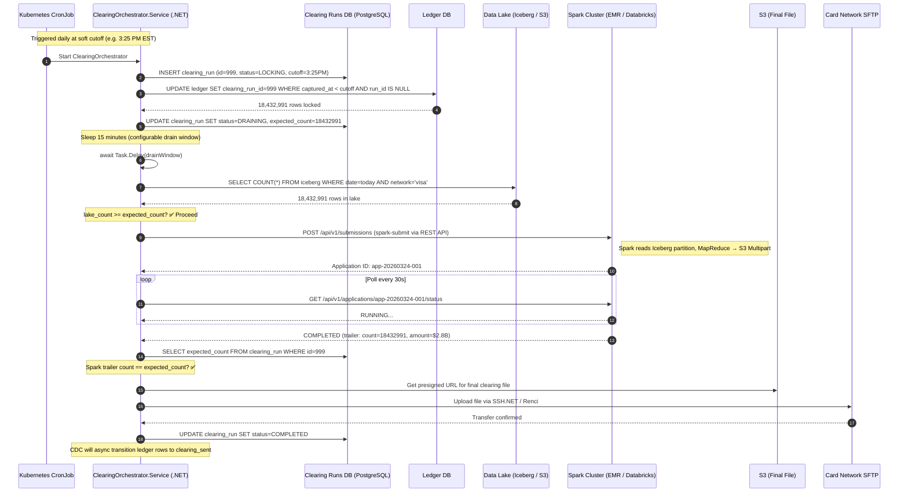

**How the .NET service talks to Spark:**
- **Option 1: REST API** — Spark clusters (EMR, Databricks, standalone) expose a REST API for job submission. Your .NET service sends a `POST` with the JAR path + arguments and polls for completion.
- **Option 2: AWS SDK** — If using EMR, use the `Amazon.ElasticMapReduce` SDK to call `AddJobFlowSteps`. For AWS Glue, use `StartJobRun`.
- **Option 3: Databricks SDK** — Databricks has a .NET/Python SDK for submitting and monitoring jobs.
- **Option 4: CLI wrapper** — The simplest: your .NET service shells out to `spark-submit` via `Process.Start()` and reads stdout. Not elegant, but works for a first version.

**What the .NET service is responsible for:**
1. **State machine management** — Tracking the clearing run through `LOCKING → DRAINING → VALIDATING → GENERATING → VERIFYING → DELIVERING → COMPLETED`
2. **Retry logic** — If Spark fails, the service can retry the job (the lake data is immutable, so retries are safe). If SFTP fails, retry the upload.
3. **Alerting** — If any step fails after N retries, fire a PagerDuty/Slack alert for operations.
4. **Idempotency** — If the service itself crashes and restarts, it reads the `clearing_run` state from PostgreSQL and resumes from the last completed step.

**When to graduate to Temporal/Airflow:**
- When you have **10+ clearing pipelines** (Visa, Mastercard, Elo, Hipercard, PIX, multiple Registradoras) and the state machine code becomes unmanageable.
- When you need **human approval gates** (e.g., a compliance officer must approve the file before SFTP transfer).
- When you need **cross-pipeline dependencies** (e.g., "don't submit the Registradora file until Visa clearing is confirmed").

##### The Orchestrator State Machine

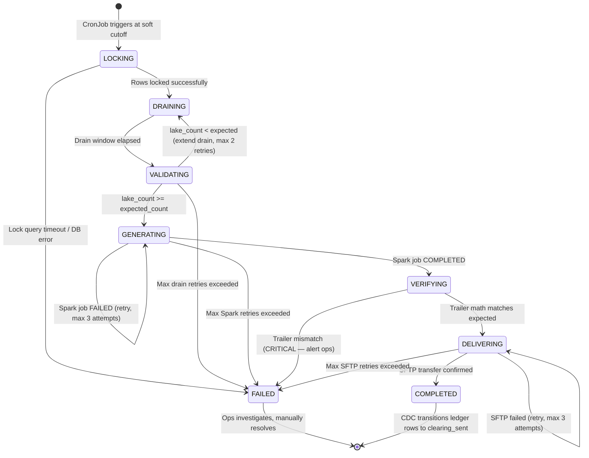

---

#### Your Hybrid Approach: CDC → Kafka → Spark (The Convergence)

Based on our discussion, your ideal architecture converges the Stripe and Uber models:

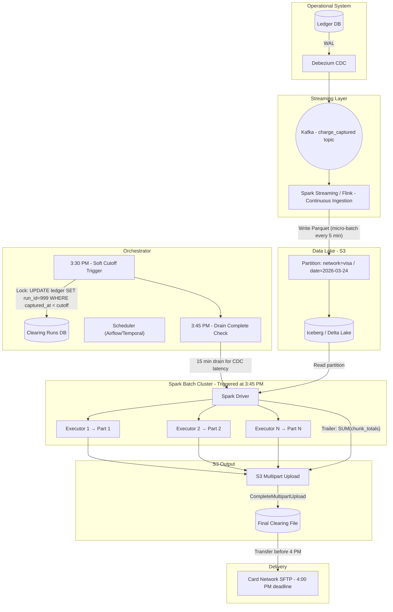

**This gives you:**
1. **Stripe's CDC materialization** — data flows continuously into a pre-sorted data lake via Kafka + Spark Streaming. No thundering-herd query at clearing time.
2. **Uber's MapReduce** — at clearing time, a Spark batch job distributes the file formatting across N executors, each uploading a part to S3. The Driver computes the trailer from chunk totals.
3. **The soft cutoff** — your internal cutoff (3:30 PM) gives a 30-minute buffer before Visa's hard deadline (4:00 PM). The drain window (15 min) absorbs CDC pipeline latency.
4. **The Run Lock** — the `clearing_run_id` is stamped on ledger rows at the soft cutoff, guaranteeing exactly-once inclusion. If the Spark job fails, you null out the run_id and retry.

**The sequence number problem is naturally solved:** Because the Spark Driver knows the total row count from the partition metadata *before* dispatching, it pre-assigns global sequence number ranges to each Executor. Executor 1 gets lines 1-200,000, Executor 2 gets 200,001-400,000. No Redis serialization point needed — the Driver is the single coordinator.

#### B. The State Update Strategy (Pessimistic Locking vs. Run Locking)
Regardless of the distributed approach, how do you safely mark those 20 million rows as `clearing_sent` without brutal database locks?
* **Pessimistic Row-Locking:** Slow and dangerous at high volume.
* **The "Run ID" Staging Pattern (Best Practice):** 
    1. Create a `Clearing_Runs (id, status, total_amount)` table.
    2. Insert a new run: `INSERT INTO Clearing_Runs VALUES (999, 'BUILDING', 0)`.
    3. Perform a massive bulk pseudo-lock: `UPDATE ledger SET clearing_run_id = 999 WHERE status = 'captured' AND clearing_run_id IS NULL`. This immediately "locks" the transactions to this specific file run using a simple foreign key. Relational DBs can update millions of rows in seconds.
    4. The file generation workers now query `WHERE clearing_run_id = 999`. 
    5. If the file generation succeeds and is sent to Visa, the run is updated to `'COMPLETED'` and a CDC event asynchronously transitions the underlying ledger rows to `clearing_sent`.
    6. If the file generation fails catastrophically, you simply set `run_id = 999` back to null, unlocking them for the next attempt. This guarantees exactly-once inclusion.

#### C. Proposed Hybrid: CDC → Kafka → Continuous S3 Materialization

A fourth approach combines CDC event streaming with continuous, incremental file building throughout the day. Instead of a massive batch job at 11 PM, the clearing file is *already assembled* when the cutoff arrives.

##### The Core Idea
1. **CDC streams** every `charge_captured` event from the Ledger into a Kafka topic in real-time (via Debezium).
2. **A pool of Kafka consumers** reads these events throughout the day. Each consumer writes its consumed records as formatted text into **parts** of an S3 Multipart Upload.
3. **A datetime cursor** acts as the logical "run lock" — every event with `captured_at < cutoff_timestamp` belongs to today's file; everything after belongs to tomorrow's.
4. **At cutoff time**, the file is essentially pre-built. A finalizer job computes the trailer, uploads it as the last part, and calls `CompleteMultipartUpload`.

##### Architecture Diagram

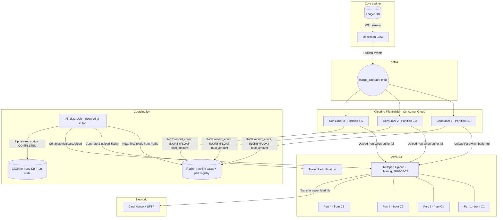

##### Detailed Flow

```
Timeline of a single clearing day:

00:00 UTC  ─── Finalizer creates new Clearing Run (run_id=999, cutoff=23:59:59)
             └── Initiates S3 Multipart Upload → gets upload_id
             └── Stores {upload_id, run_id} in Clearing Runs DB
             └── Resets Redis counters: record_count=0, total_amount=0

00:01-23:59 ─── Throughout the day:
             ├── Merchant captures transaction → Ledger writes charge_captured
             ├── Debezium CDC publishes event to Kafka
             ├── Consumer reads event, checks: captured_at < cutoff?
             │   ├── YES → Format as fixed-width text, buffer in memory
             │   │         When buffer reaches 50,000 lines:
             │   │           1. Upload buffer as S3 Part (UploadPart)
             │   │           2. Redis INCR record_count by 50,000
             │   │           3. Redis INCRBYFLOAT total_amount by sum
             │   │           4. Commit Kafka offset
             │   └── NO  → Skip (belongs to tomorrow's run)
             │
23:59:59 ──── CUTOFF
             ├── Consumers flush any remaining buffered lines as final parts
             ├── Consumers signal "drain complete" (e.g. Redis SET consumer:1:done = true)
             │
00:00+1 ───── Finalizer job activates:
             ├── Waits until all consumers report drain complete
             ├── Reads Redis: record_count=18,432,991, total_amount=$2,847,129,403.12
             ├── Generates Header + Trailer rows with these totals
             ├── Uploads Header as Part 0, Trailer as final Part
             ├── Calls CompleteMultipartUpload (S3 stitches all parts)
             ├── Updates Clearing Run → COMPLETED
             └── Transfers file to Visa SFTP
```

##### Critical Engineering Questions

> [!CAUTION]
> **Q1: Part Ordering — How do you guarantee the file is valid?**

Visa/Mastercard clearing files require sequential record numbers (e.g., `RECORD 0000001`, `RECORD 0000002`, ...). But if Consumer 1 uploads Part A with 50,000 records, and Consumer 2 uploads Part B with 50,000 records, the records inside Part A are numbered 1-50,000 and Part B is *also* numbered 1-50,000. When S3 stitches them, the sequence is broken.

**Possible solutions:**
- **Option A (Post-process):** Don't embed sequence numbers during the day. After `CompleteMultipartUpload`, a lightweight streaming job reads the S3 file sequentially, adds line numbers, and writes a new file. This defeats the purpose of pre-building.
- **Option B (Redis global counter):** Each consumer calls `Redis INCRBY record_count 50000` *before* formatting. Redis returns the new value (e.g., 350,000). The consumer knows its block occupies lines 300,001-350,000 and numbers them accordingly. This works but creates a serialization point — Redis must be the single source of truth for ordering.
- **Option C (Skip line numbers, use logical keys):** If the network format allows it, use unique transaction IDs instead of sequential line numbers. Not all networks support this.

> [!CAUTION]
> **Q2: The Cutoff Race Condition — CDC Latency**

Debezium has inherent latency (WAL polling interval + Kafka produce + consumer lag). If a merchant captures a transaction at 23:59:58 and your cutoff is 23:59:59, the CDC event might arrive in the Kafka consumer at 00:00:03 — *after* the cutoff.

**The dilemma:** Do you use `captured_at` from the DB row (the business timestamp) or the Kafka event timestamp (the arrival time)?
- If you use `captured_at`: ✅ Correct, but the consumer must hold its "drain" window open for N seconds after cutoff to catch late CDC events. How long is long enough? 5 seconds? 30 seconds? This becomes a tunable SLA.
- If you use Kafka timestamp: ❌ A transaction captured at 23:59:58 that arrives at 00:00:03 gets assigned to *tomorrow's* file. The merchant doesn't get paid today.

> [!WARNING]
> **Q3: Consumer Crash Mid-Day — Duplicate Parts in S3**

Consider: Consumer 2 buffers 50,000 lines, uploads Part 7 to S3, then crashes *before* committing its Kafka offset. On restart (or rebalance), a new consumer re-reads those same 50,000 events from Kafka, formats them, and uploads them as Part 12. Now the final file contains 50,000 duplicate transactions. You've double-billed 50,000 cardholders.

**Possible mitigations:**
- **Exactly-once Kafka semantics** (`enable.idempotence=true` + transactional producer) to ensure offset commits are atomic with the "processed" marker. But you're not producing to Kafka — you're uploading to S3, so Kafka transactions don't help here.
- **Dedup at finalization:** Before calling `CompleteMultipartUpload`, the Finalizer downloads all parts, deduplicates by transaction ID, and re-uploads a clean file. This is expensive and defeats the "pre-built" benefit.
- **Idempotent part uploads:** Each consumer names its part deterministically based on the Kafka offset range it consumed (e.g., `part_p2_offset_150000_200000`). If it crashes and re-uploads, it overwrites the same part key. S3 Multipart doesn't natively support this — you'd need a side-channel registry in Redis mapping offset ranges to part numbers.

> [!WARNING]
> **Q4: S3 Multipart Upload Lifetime & Cost**

An S3 Multipart Upload has no hard expiry, but **incomplete multipart uploads are billed for storage** of every uploaded part. If the Finalizer never calls `CompleteMultipartUpload` (e.g., a bug, infra outage), you accumulate orphaned parts. AWS recommends setting an S3 Lifecycle Rule to auto-abort incomplete multipart uploads after N days.

Also: a Multipart Upload can have at most **10,000 parts**, and each part must be at least **5 MB** (except the last). If your consumers flush too frequently (e.g., every 1,000 lines = ~100KB), you'll hit the minimum part size constraint. You need to buffer at least ~50,000 lines per part to safely exceed 5MB.

> [!IMPORTANT]
> **Q5: Rebalancing Kafka Consumers Mid-Day**

If a consumer pod dies or Kubernetes reschedules it, a Kafka consumer group **rebalance** occurs. Partitions are reassigned. The new consumer for partition 3 must know:
- Which S3 Multipart Upload ID to append to
- What the current part number is
- Where the Redis counters stand

All of this coordination state must live outside the consumer's memory (in Redis or the Clearing Runs DB). This is solvable but adds significant operational complexity.

> [!NOTE]
> **Q6: The Datetime Cursor as Run Lock — Edge Cases**

Using `captured_at < cutoff_timestamp` as the run lock is elegant but has subtleties:
- **Timezone hell:** If your Ledger stores `captured_at` in UTC but the network cutoff is defined as "4:00 PM EST," you must be extremely precise about the conversion. A 1-second error at the boundary means transactions land in the wrong file.
- **Clock skew:** If Ledger DB replicas have slightly different clocks (common in distributed PG setups), two replicas might disagree on whether a transaction is "before" or "after" the cutoff.
- **Amendment/correction:** What if a merchant voids a transaction at 3:00 PM that was already written to today's clearing file at 1:00 PM? The void event arrives via CDC, but the original record is already baked into Part 5 of the S3 file. You'd need an "adjustment record" mechanism in the clearing format, or a post-processing step.

##### Verdict: It's a Strong Architecture With Solvable Problems

The continuous materialization approach is genuinely better than a big-bang nightly batch. The key advantages are:
1. **Near-zero cutoff latency** — the file is 99.9% built when the window closes.
2. **No thundering-herd DB query** at 11 PM — the load is spread across the entire day.
3. **Natural horizontal scaling** — more Kafka consumer pods = more write throughput.

The hardest problems to solve (in priority order) are:
1. **Q3 (Duplicate parts on crash)** — this is the most dangerous for financial correctness. The idempotent part naming + Redis offset registry is the cleanest solution.
2. **Q1 (Sequence numbering)** — the Redis global counter approach (Option B) works well if you accept Redis as a serialization point.
3. **Q2 (CDC latency at cutoff)** — a configurable drain window (e.g., 30 seconds after cutoff) with a hard deadline is standard practice.
4. **Q6 (Amendments)** — most networks support adjustment/reversal records in clearing files, so this is a format concern, not an architectural one.
