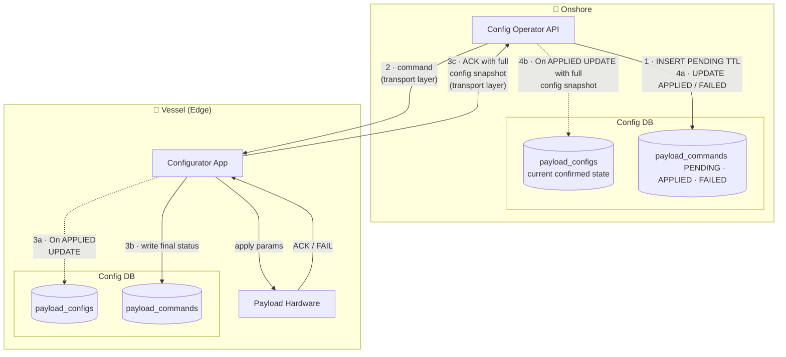
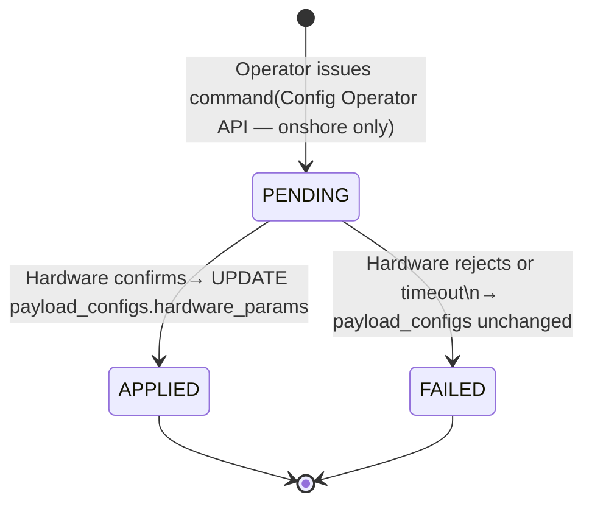

# ADR: Payload Schema — Configuration and Readings Model

**Status:** Draft
**Date:** 2026-02-25

---

## 1. Context

This ADR is a companion to the **[ADR: Shared Vessel Data Platform](adr_shared_data_platform.md)** and the **[ADR: Vessel Health Subsystem](adr_vessel_health_subsystem.md)**. Those documents define the platform-level architecture — brokers, databases, aggregator component design, schema strategy, and infrastructure health monitoring. This document goes one level deeper: it defines how payload-specific configuration and reading data are modelled within the Config DB and TimescaleDB stores already established.

**Terminology note:** This ADR uses **payload** to refer to any device on the vessel that has a Connector, produces observations, and is managed through this platform. This includes mission payloads (MBES, INS, GNSS, DVL, etc.) and infrastructure payloads (PDU). The term aligns with existing system vocabulary where both sensor devices and power infrastructure are treated as vessel payloads.

Two questions are addressed:

1. **Config DB model** — how to represent payload configuration, covering both *reporting config* (batching interval and aggregation function) and *hardware command config* (parameters issued downstream to physical devices), and how to track command delivery through a state machine.

2. **Readings model** — what the `data` field in `payload_readings` contains per payload type.

The **topology record** (`payload_topology_links`, PDU/NPort assignments) defined in the health subsystem ADR is noted as a related concern but is out of scope here. See §6 for a forward note on PDU topology representation.

---

## 2. Scope

| In scope | Out of scope |
| :--- | :--- |
| Config DB schema for reporting config and hardware command config | `payload_topology_links` (PDU outlet → payload assignments — see health ADR) |
| Command state machine and delivery tracking | Real-time command delivery protocol |
| `payload_readings.data` shape per payload type | Onshore typed projection tables (noted, deferred) |
| PDU readings and commands | NPort Port Server (health ADR) |
| Command param validation (pg_jsonschema) | Schema Registry / contract versioning implementation |

---

## 3. Unified Connector and Reporter Framework
All devices on the vessel — mission payloads (MBES, INS, GNSS) and infrastructure payloads (PDU) — follow the same two-step pattern:

1. **Connector** (always-on, 1 per device): reads from the device using its native protocol, writes raw observations to TimescaleDB. The protocol differs per device type (NMEA, SNMP, UDP, proprietary); the storage target and pattern do not.
2. **Reporter** (scheduled or event-driven): reads from TimescaleDB, applies typed configuration or rules, publishes to the broker.

Three reporter types operate on the same TimescaleDB:

| Reporter | Reads from | Config source | Publishes |
| :--- | :--- | :--- | :--- |
| **Aggregation Reporter** | `payload_readings` | `payload_configs` (interval, fn) | Aggregated telemetry |
| **Topology Health Reporter** | `payload_readings` (PDU, connectivity data) | Topology rules (declared topology) | Health transition events |
| **Payload Health Reporter** | `payload_readings` | Per-payload quality rules (schema-aware) | Quality / anomaly events |

The Health Watchdog described in the companion health ADR is the **Topology Health Reporter** in this framework — a reporter instance with topology rules as its config, not a separate system. The Payload Health Reporter is the schema-aware quality monitor noted as out of scope in §5 of that ADR.

This ADR covers the schema for the **Aggregation Reporter** pipeline: `payload_configs`, `payload_commands`, and `payload_readings`. The Topology Health Reporter and Payload Health Reporter share the same TimescaleDB but their rule configurations are addressed in companion documents.

---

## 4. Config DB — Design

### 4.1 Model Overview

Two distinct concerns live in the Config DB:

| Concern | Description | Changes when |
| :--- | :--- | :--- |
| **Reporting config** | Batching interval and aggregation function — governs how the Aggregator batches and forwards readings | Operator adjusts reporting frequency or function |
| **Payload command** | Payload-type-specific hardware parameters (frequencies, beam angles, outlet states, operating modes) | Operator issues a new configuration command to the payload |

These concerns share a `payload_id` key and both represent "what this payload is currently doing", but they have different delivery semantics:

- Reporting config takes effect **immediately and locally** — the Coordinator reconfigures the Agg Job with no involvement of the physical device.
- Payload commands are **delivered asynchronously to payload hardware** and may fail. Only when the hardware confirms the command is the config considered applied.

#### Design decision — asymmetric state management

> **Pattern note:** This design is inspired by the **SAGA pattern** (distributed transaction pattern). In a Saga, a long-running transaction is broken into a sequence of local transactions, each with a compensating action. Here, the "transaction" is a hardware configuration change that spans two disconnected systems (onshore and vessel). Each side performs its local state update independently, and the onshore side moves from `PENDING` to `APPLIED` or `FAILED` only when it receives the vessel's confirmation — the distributed equivalent of a saga step completing. There is no two-phase commit and no assumption of synchronous coordination.

The vessel and onshore sides have different responsibilities and different complexity requirements. Modelling them symmetrically would be overengineering the vessel side.

- **Onshore** holds the full state machine. `payload_commands` tracks every command from issuance (`PENDING`) through to hardware confirmation (`APPLIED`) or failure (`FAILED`). `payload_configs` is updated only when the vessel sends back a confirmed config snapshot — so it always reflects what the payload is *actually* doing, not what was commanded.
- **Vessel** keeps it simple. The Configurator App manages in-flight state in memory. The DB records only the final outcome: the command receipt log is written once (on completion), and `payload_configs` is updated directly by the app on a successful apply. No DB-level state machine transitions on the vessel.

Both sides share the `payload_configs` table structure (it is the current confirmed state on each side), but `payload_commands` has a different role on each side.

**Why the vessel sends back a full config snapshot, not just ACK:**
When a command is applied, the vessel sends back its current `payload_configs.hardware_params` rather than a simple acknowledgement. This matters because a device may normalise or clamp values (e.g. rounding a requested frequency to the nearest supported step, or a PDU confirming the outlet state after the relay has settled). Onshore `payload_configs` is updated with what was *actually* applied, not what was *requested*.

---

### 4.1.1 Vessel and Onshore State Management — Overview



**Reading the diagram:**

- **Solid arrows** — active operations: command delivery, hardware interaction, log writes.
- **Dashed arrows** — conditional: `payload_configs` is only written on `APPLIED`. A failed command leaves `payload_configs` unchanged on both sides — the previous confirmed state is preserved.
- The vessel is the **source of truth**: it sends back the full `payload_configs` state (step 3c), not a bare ACK. Onshore `payload_configs` reflects what the payload confirmed, not what was requested.
- If the bridge is down when step 3c is sent, the vessel `payload_configs` is already updated. The onshore catches up when the confirmation arrives. The onshore `payload_commands` row stays `PENDING` until then.

---

### 4.1.2 State Mismatch — ACK Delivery Failure

**Failure scenario:** the vessel applies a command and updates its local `payload_configs` (steps 3a–3b complete), but the satellite link fails before step 3c reaches onshore. Result: vessel state is correct; onshore `payload_commands` stays `PENDING`; onshore `payload_configs` is stale.

**Why this matters:**

- **Operator ambiguity.** `PENDING` is indistinguishable from "applied but ACK lost" versus "command never reached the vessel". The operator cannot know which case they are in without querying the vessel directly.
- **Re-issue risk.** An operator who re-issues a command after a timeout has no guarantee the vessel won't apply it twice. For PDU outlet commands (power cycling critical equipment mid-mission), this is a real hazard. Safe re-issue requires an idempotency guarantee that the current design does not yet state explicitly.
- **Unbounded `PENDING` rows.** Without a timeout or TTL policy, unresolved `PENDING` rows accumulate indefinitely if ACKs are lost. This is a forward dependency on open question #1 (concurrent command policy and timeout).

**Outbox Pattern — considered and rejected:**

The Outbox Pattern would solve this by writing the ACK message to a local outbox table in the same DB transaction as the state update, then having a relay process retry delivery until onshore acknowledges receipt. This guarantees at-least-once delivery. **Rejected** — it requires a new outbox table, a dedicated relay process, and idempotency handling on the onshore side. The complexity is disproportionate to the failure window: the link must fail in the narrow interval between the vessel writing its state (step 3a–3b) and sending step 3c. Acceptable for a high-frequency transactional system; not justified here.

**Accepted mitigation — periodic config sync heartbeat:**

The vessel publishes a full snapshot of its current `payload_configs` on a regular interval (e.g. every 5 minutes) independently of any command flow. This is a lightweight MQTT message on a timer — no new tables, no new processes. Onshore reconciles any stale `PENDING` rows against the received snapshot: if a payload's confirmed `hardware_params` in the snapshot matches the params of a `PENDING` command, that command is moved to `APPLIED`. Recovery is bounded by the heartbeat interval, not by operator intervention.

This is the accepted trade-off: **eventual consistency via periodic state sync**, rather than guaranteed event delivery. The vessel remains the source of truth in all cases.

> **Forward dependency:** Before the Configurator App is implemented, the team must define: (a) the `PENDING` timeout policy (when does onshore transition to `FAILED` if no ACK or heartbeat reconciliation arrives?), and (b) the re-issue idempotency guarantee (same command ID + same params = no-op if already applied on vessel). Both are implementation concerns; the DB schema as defined supports them.

---

### 4.2 Table: `payloads` (Registry)

The authoritative list of every payload on the vessel. Both the config table and the command log reference it.

```sql
CREATE TABLE payloads (
    payload_id      TEXT        NOT NULL PRIMARY KEY,
    payload_type    TEXT        NOT NULL,   -- 'MBES' | 'INS' | 'GNSS' | 'DVL' | 'PDU' | ...
    display_name    TEXT,
    model           TEXT,                   -- device model, e.g. 'R2Sonic 2024', 'Applanix POS MV'
    serial_number   TEXT,                   -- device serial number
    vessel_id       TEXT        NOT NULL,
    active          BOOLEAN     NOT NULL DEFAULT TRUE,
    created_at      TIMESTAMPTZ NOT NULL DEFAULT now()
);
```

---

### 4.3 Table: `payload_configs` (Current State)

One row per payload. Combines reporting config (applied immediately by the Coordinator) with the currently-applied hardware params (updated only when a hardware command transitions to `APPLIED`).

```sql
CREATE TABLE payload_configs (
    payload_id                  TEXT        NOT NULL PRIMARY KEY
                                            REFERENCES payloads(payload_id),

    -- Reporting / batching config (Coordinator reads these)
    interval_s                  INTEGER     NOT NULL,
    aggregation_fn              TEXT        NOT NULL,   -- 'avg' | 'last' | 'min' | 'max'
    output_topic                TEXT,                   -- MQTT topic override; NULL = default
    reporting_active            BOOLEAN     NOT NULL DEFAULT TRUE,

    -- Currently-applied hardware params (updated on APPLIED command only)
    hardware_params             JSONB,                  -- NULL until first command is confirmed
    hardware_params_applied_at  TIMESTAMPTZ,
    hardware_params_command_id  BIGINT,                 -- FK → payload_commands.id (onshore only)

    updated_at                  TIMESTAMPTZ NOT NULL DEFAULT now()
);
```

**Notes:**

- `hardware_params` is `NULL` on initial row creation and remains `NULL` until the first hardware command is confirmed applied. The system must handle this state.
- `hardware_params_command_id` links back to the specific `payload_commands` entry that produced the current state. Audit trail is bidirectional.
- Reporting config changes are written here directly by the operator API and polled by the Coordinator — no command state machine involved.

---

### 4.4 Table: `payload_commands`

The table has a different role on each side.

#### Onshore — state machine

Tracks every command from issuance to resolution. The `PENDING` state exists only here — it represents the window between the operator issuing a command and the vessel confirming it.

```sql
CREATE TABLE payload_commands (
    id              BIGSERIAL   PRIMARY KEY,
    payload_id      TEXT        NOT NULL REFERENCES payloads(payload_id),
    params          JSONB       NOT NULL,
    issued_by       TEXT,
    issued_at       TIMESTAMPTZ NOT NULL DEFAULT now(),
    applied_at      TIMESTAMPTZ,                -- NULL until APPLIED
    status          TEXT        NOT NULL DEFAULT 'PENDING',
                                                -- 'PENDING' | 'APPLIED' | 'FAILED'
    failure_reason  TEXT                        -- NULL unless FAILED
);

CREATE INDEX ON payload_commands (payload_id, issued_at DESC);
```

#### Vessel — receipt log

Records what arrived and what the outcome was. There is no `PENDING` state in the DB — the Configurator App manages in-flight state in memory. The row is written once, when the outcome is known.

```sql
CREATE TABLE payload_commands (
    id              TEXT        NOT NULL PRIMARY KEY,   -- command ID from onshore, for correlation
    payload_id      TEXT        NOT NULL REFERENCES payloads(payload_id),
    params          JSONB       NOT NULL,
    received_at     TIMESTAMPTZ NOT NULL DEFAULT now(),
    status          TEXT        NOT NULL,               -- 'APPLIED' | 'FAILED'
    applied_at      TIMESTAMPTZ,
    failure_reason  TEXT
);

CREATE INDEX ON payload_commands (payload_id, received_at DESC);
```

---

### 4.5 Command State Machine



**State transitions:**

| Transition | Trigger | Side effect on `payload_configs` |
| :--- | :--- | :--- |
| `PENDING → APPLIED` | Configurator App receives hardware acknowledgement | `hardware_params` = confirmed values; `hardware_params_applied_at` = now(); `hardware_params_command_id` = command id |
| `PENDING → FAILED` | Hardware rejects, or delivery timeout | `payload_configs` unchanged — previous applied params remain |

**Command cycle — step by step:**

1. Operator calls Config Operator API → API inserts into onshore `payload_commands` (`PENDING`) → publishes command to transport layer → forwarded downstream to vessel.
2. Vessel transport layer delivers to the Configurator App. App holds state in memory, delivers params to payload hardware.
3. Hardware ACKs:
   - (a) Configurator App updates vessel `payload_configs.hardware_params` with the confirmed values.
   - (b) Configurator App writes the outcome to vessel `payload_commands` receipt log (`APPLIED`).
   - (c) Configurator App sends the full `payload_configs` snapshot upstream via transport layer.
4. Config Operator API receives the ACK snapshot:
   - (a) Updates onshore `payload_commands` to `APPLIED`.
   - (b) Updates onshore `payload_configs` with the received snapshot.

If the hardware rejects the command: Configurator App writes `FAILED` to vessel receipt log, vessel `payload_configs` is unchanged, failure reason is sent upstream, Config Operator API transitions onshore `payload_commands` to `FAILED`.

> **Open question — concurrent commands:** If a new command is issued while a previous one is still `PENDING`, should the system: (a) reject until the previous resolves, (b) replace the pending command, or (c) queue them? This must be defined before the Configurator App is implemented.

---

### 4.6 Command Param Validation

Because `hardware_params` and `payload_commands.params` are JSONB, the database does not enforce field presence or types at the column level. Two approaches:

#### Option A — Application-layer validation (default)

The Configurator App validates `params` against a per-payload-type JSON Schema document before writing to the DB. Schema definitions are the versioned data contracts referenced in §7.4.3 of the main ADR and live in the application codebase.

**Trade-off:** Validation is in the application. Any client writing to `payload_commands` that bypasses the Configurator App can insert invalid params. Lower operational risk on the vessel since no DB extension is required.

#### Option B — DB-level constraint via `pg_jsonschema` (optional enhancement)

The `pg_jsonschema` PostgreSQL extension exposes a `jsonb_matches_schema` function usable in a `CHECK` constraint, enforcing the schema at the DB layer regardless of which client writes the row.

```sql
-- Example: enforce required fields for MBES commands
ALTER TABLE payload_commands ADD CONSTRAINT valid_mbes_params CHECK (
    (SELECT payload_type FROM payloads WHERE payload_id = payload_commands.payload_id) != 'MBES'
    OR jsonb_matches_schema(
        '{
            "type": "object",
            "required": ["frequency_khz", "beam_angle_deg"],
            "properties": {
                "frequency_khz":  { "type": "number", "minimum": 100, "maximum": 700 },
                "beam_angle_deg": { "type": "number", "minimum": 10,  "maximum": 160 }
            }
        }',
        params
    )
);
```

**Trade-off:** DB-layer safety net — no client can bypass it. However, every schema evolution requires a DDL migration on both vessel and onshore instances. On a vessel, DDL migrations are operationally expensive.

> **Recommendation:** Start with Option A. Add Option B selectively on payload types where invalid hardware params carry high operational risk (e.g. a wrong MBES frequency command, or a PDU outlet command that could cut power to critical equipment mid-mission).

---

## 5. Readings Model

### 5.1 Storage Strategy — Unified Table vs. Per-Payload Tables

Before defining the table structure, one foundational decision must be made: should the readings store be a **single unified table** shared across all payload types, or **one typed table per payload type**?

#### Option A — Per-payload typed tables

One table per payload type: `mbes_readings`, `pdu_readings`, `ins_readings`, etc. Each has typed columns matching that payload's specific fields.

| Advantage | Disadvantage |
| :--- | :--- |
| Typed columns — DB-level constraints without `pg_jsonschema` | Every new payload type requires a DDL migration on vessel and onshore |
| Queries use column references rather than JSONB operators | DDL migrations on vessels are operationally expensive and risky |
| Schema is self-documenting in the DB structure | Each Connector writes to a different target — non-uniform code path |
| No JSONB extraction overhead on field-level reads | Reporters must know which table to query per payload type |
| | Aggregation across payload types requires UNION queries |
| | Fleet management: more tables to back up, replicate, and retain |

#### Option B — Single unified table with JSONB `data` column *(chosen)*

One `payload_readings` hypertable for all payload types. A `payload_type` column discriminates. The `data` JSONB column holds the payload-specific fields.

| Advantage | Disadvantage |
| :--- | :--- |
| All Connectors write to the same target — uniform code path | No DB-level column constraints on payload-specific fields |
| New payload type needs no DDL migration — only an application-level schema definition | JSONB operators required for field-level queries (`data->>'depth_m'`) |
| Schema evolution is application-layer — no DDL on vessel or onshore | Payload contracts are not visible in the DB structure itself |
| All three Reporters query one table regardless of payload type | |
| One table to manage, back up, and replicate across the fleet | |
| TimescaleDB compression applies uniformly across all payload types | |

#### Decision: Option B

The primary query pattern in this architecture is always time-bounded per payload: `WHERE payload_id = X AND ts BETWEEN ...`. This is fully served by the `(payload_id, ts DESC)` index regardless of the `data` column type. The main performance cost of JSONB — field-level scan overhead — is not a concern for the Aggregation Reporter or Topology Health Reporter, which never scan across all payloads on an unbounded field.

The decisive factors are operational:

- **Vessel constraints.** DDL migrations that fail or cause downtime during a mission are unacceptable. The vessel is a constrained, hard-to-reach environment with limited maintenance windows.
- **Evolving payload portfolio.** New payload types (NPort, future instruments) require no coordination between application teams and DB administrators — the Connector just writes to the existing table with a new `payload_type` value.
- **Uniform Connector pattern.** All Connectors share the same write interface. Adding a payload type is an application concern, not a schema concern.
- **Field-level contracts enforced at the application layer.** The Connector's output schema and the Config Operator API enforce field presence and types — the DB does not need to duplicate this.

---

### 5.2 Vessel-Side Schema Strategy

§9.2 of the main ADR established a single unified `sensor_readings` hypertable with a `payload JSONB` column on the vessel. This table is renamed `payload_readings` in this ADR to align with the payload terminology. The design decision stands: the vessel-side store is schema-free at the database level, and each payload type defines its own data contract at the application level.

```sql
CREATE TABLE payload_readings (
    ts           TIMESTAMPTZ  NOT NULL,
    payload_id   TEXT         NOT NULL,
    payload_type TEXT         NOT NULL,   -- 'MBES' | 'INS' | 'PDU' | ...
    data         JSONB        NOT NULL
);

SELECT create_hypertable('payload_readings', 'ts');
CREATE INDEX ON payload_readings (payload_id, ts DESC);
```

---

### 5.3 Payload Readings Are Self-Contained

Payloads in this architecture are not dumb transducers requiring post-hoc enrichment. Mission payloads such as MBES receive navigation inputs (position, attitude) directly at the hardware level as part of their operational configuration. The payload's native output is already the processed product of that integration. The Connector reads the payload's output directly — no cross-payload context embedding at the platform level.

Each payload type's `data` field contains exactly the observations produced by that payload's native protocol or management interface.

> If a future payload type is introduced whose native output requires external context, this decision should be revisited for that payload specifically — not as a platform-wide pattern change.

---

### 5.4 Per-Payload Data Schemas

The following sections define the `data` JSONB shape for each payload type. These are the **inbound data contracts** referenced in §7.4.3 of the main ADR. Sections are completed as payload documentation is provided.

---

#### 5.3.0 Base Fields (All Payload Types)

Every `data` JSONB written by a Connector must include the following field, regardless of payload type:

| Field | Type | Unit | Required | Notes |
| :--- | :--- | :--- | :--- | :--- |
| `connection_status` | enum | — | Yes | `CONNECTED` · `DISCONNECTED` · `DEGRADED` — Connector-level observable; written on every cycle, including when the device is unreachable |

**Connector behaviour when the device is unreachable:**
When `connection_status` is `DISCONNECTED` or `DEGRADED`, only this field is guaranteed to be present. All payload-specific fields may be absent — the Connector cannot read from a device it cannot reach. The reading is still a valid observation: the payload was unreachable at this timestamp.

**What `connection_status` represents:**
It is the Connector's own protocol-level observable — whether the Connector's connection to the device is alive. It is a factual report, not a derived quality assessment. Richer quality fields (e.g. `pos_mode`, `imu_status`, accuracy estimates) are payload-specific and appear in the individual schemas below.

**Static identity fields:**
`model` and `serial_number` belong in the `payloads` registry (§4.2), not in readings. They do not change cycle to cycle and would waste storage if repeated in every row.

---

#### 5.3.1 Multibeam Echosounder (MBES)

**Example models:** R2Sonic 2024
**Primary output:** Bathymetric depth soundings, swath coverage
**Connectivity:** Ethernet-native

*Preliminary — to be completed with full sensor documentation.*

**Reading data:**

| Field | Type | Unit | Required | Notes |
| :--- | :--- | :--- | :--- | :--- |
| `depth_m` | float | m | Yes | Primary depth sounding |
| `swath_width_m` | float | m | Yes | Across-track swath coverage |
| `frequency_khz` | float | kHz | Yes | Active operating frequency |
| `pulse_length_us` | float | μs | Yes | |
| `ping_rate_hz` | float | Hz | Yes | |
| `beam_count` | integer | — | Yes | |
| `sound_velocity_ms` | float | m/s | Yes | Applied sound velocity at transducer face |
| `phase_stability` | float | — | No | Phase stability indicator |
| `pulse_stability` | float | — | No | Pulse stability indicator |
| `temperature_c` | float | °C | No | Transducer temperature |

**Reporting config defaults:**

| Parameter | Default | Notes |
| :--- | :--- | :--- |
| `interval_s` | 1 | 1-second batching window |
| `aggregation_fn` | `last` | Last ping in window; averaging depth soundings across pings is not meaningful |

**Command params:**

| Parameter | Type | Unit | Notes |
| :--- | :--- | :--- | :--- |
| `frequency_khz` | float | kHz | Operating frequency |
| `beam_angle_deg` | float | degrees | Swath opening angle |
| `angle_correction_deg` | float | degrees | Roll/pitch correction offset |
| `operating_mode` | enum | — | `NORMAL` · `DEEP` · `SHALLOW` |
| `power_level` | enum | — | `LOW` · `MEDIUM` · `HIGH` |

---

#### 5.3.2 Power Distribution Unit (PDU)

**Example models:** CyberPower PDU
**Primary output:** Device-level power metrics + per-outlet state
**Connectivity:** Ethernet (SNMP)

The PDU Connector reads device-level and per-outlet metrics via SNMP and writes raw hardware observables only. The mapping from outlet index to payload is **not** embedded in the reading — that is topology knowledge, which lives exclusively in `payload_topology_links`.

> **Topology join key — `outlet_index`.** The Topology Health Reporter evaluates power health by joining `payload_topology_links` (which outlet on which PDU should power each payload) against the latest `payload_readings` for that PDU (what state that outlet is actually in). The join key is `(payload_id, outlet_index)`. No cross-table coupling is needed in the Connector — it stays topology-unaware. This also composes correctly with multiple PDUs: each PDU is a distinct `payload_id`, so outlet indices are scoped per PDU and never collide. See §6, item 5.

**Reading data:**

*Device-level fields:*

| Field | Type | Unit | Required | Notes |
| :--- | :--- | :--- | :--- | :--- |
| `connection_status` | enum | — | Yes | `CONNECTED` · `DISCONNECTED` · `DEGRADED` — base field (§5.3.0) |
| `voltage_v` | float | V | Yes | Input voltage |
| `current_a` | float | A | Yes | Total load current |
| `power_w` | float | W | Yes | Total power consumption |
| `frequency_hz` | float | Hz | Yes | AC supply frequency |
| `unit_name` | string | — | No | PDU unit name |
| `port_name` | string | — | No | PDU network port name |
| `location` | string | — | No | Physical rack location (e.g. `PWR-10`) |
| `ip_address` | string | — | No | Management IP address |
| `outlets` | array | — | Yes | Per-outlet metering — see below |

*Per-outlet fields (each element of `outlets` array):*

| Field | Type | Unit | Required | Notes |
| :--- | :--- | :--- | :--- | :--- |
| `outlet_index` | integer | — | Yes | Outlet number on the PDU — join key for topology evaluation |
| `state` | enum | — | Yes | `ON` · `OFF` · `LOCKED` |
| `current_a` | float | A | No | Per-outlet current draw (if PDU supports per-outlet metering) |

**Reporting config defaults:**

| Parameter | Default | Notes |
| :--- | :--- | :--- |
| `interval_s` | 30 | PDU state is low-frequency; 30 s is sufficient for health monitoring |
| `aggregation_fn` | `last` | Outlet state is a snapshot — averaging is not meaningful |

**Command params:**

PDU commands are outlet-level operations. All commands target a specific outlet by index.

| Parameter | Type | Notes |
| :--- | :--- | :--- |
| `outlet_index` | integer | Target outlet on the PDU |
| `action` | enum | `ON` · `OFF` · `REBOOT` · `LOCK` · `UNLOCK` |
| `sequence_delay_s` | integer | Optional — delay before applying action (for power sequencing) |

> **Note — power sequencing and daisy-chain control:** The PDU supports device-level power sequencing (controlled startup order across outlets) and daisy-chain command propagation across linked PDUs. These are device-level capabilities that may require a separate command shape (`outlet_index` absent, `action = POWER_SEQUENCE`). The command param schema should be extended when these capabilities are brought into operational use.

---

#### 5.3.3 Inertial Navigation System (INS)

**Example models:** Applanix POS MV
**Primary output:** Attitude, heading, position, velocity, heave
**Connectivity:** Ethernet-native

*Preliminary — based on POS MV monitoring interface. To be confirmed against output message spec.*

**Reading data:**

*Status fields:*

| Field | Type | Unit | Required | Notes |
| :--- | :--- | :--- | :--- | :--- |
| `connection_status` | enum | — | Yes | `CONNECTED` · `DISCONNECTED` · `DEGRADED` — base field (§5.3.0) |
| `pos_mode` | string | — | Yes | Operating mode — e.g. `Nav: Aligned`, `Degraded`, `Attitude` |
| `imu_status` | string | — | Yes | `OK` · `ERROR` |
| `nav_status` | string | — | Yes | Solution type code — e.g. `CA` (combined), `GPS` |
| `gams_status` | string | — | No | GAMS heading solution status — `OK` · `NOT_READY` |

*Position fields:*

| Field | Type | Unit | Required | Notes |
| :--- | :--- | :--- | :--- | :--- |
| `latitude_deg` | float | deg | Yes | |
| `longitude_deg` | float | deg | Yes | |
| `altitude_m` | float | m | Yes | |
| `position_accuracy_m` | float | m | Yes | 1-sigma position accuracy estimate |

*Attitude fields:*

| Field | Type | Unit | Required | Notes |
| :--- | :--- | :--- | :--- | :--- |
| `roll_deg` | float | deg | Yes | |
| `pitch_deg` | float | deg | Yes | |
| `heading_deg` | float | deg | Yes | True heading |
| `roll_accuracy_deg` | float | deg | Yes | 1-sigma attitude accuracy |
| `pitch_accuracy_deg` | float | deg | Yes | |
| `heading_accuracy_deg` | float | deg | Yes | |

*Velocity fields:*

| Field | Type | Unit | Required | Notes |
| :--- | :--- | :--- | :--- | :--- |
| `velocity_north_ms` | float | m/s | Yes | |
| `velocity_east_ms` | float | m/s | Yes | |
| `velocity_down_ms` | float | m/s | Yes | |
| `velocity_north_accuracy_ms` | float | m/s | Yes | 1-sigma velocity accuracy |
| `velocity_east_accuracy_ms` | float | m/s | Yes | |
| `velocity_down_accuracy_ms` | float | m/s | Yes | |
| `speed_knots` | float | kn | No | Ground speed |
| `track_deg` | float | deg | No | Course over ground |

*Heave field:*

| Field | Type | Unit | Required | Notes |
| :--- | :--- | :--- | :--- | :--- |
| `heave_m` | float | m | Yes | Real-time heave; positive = upward |

*Dynamics fields:*

| Field | Type | Unit | Required | Notes |
| :--- | :--- | :--- | :--- | :--- |
| `angular_rate_longitudinal_degs` | float | deg/s | No | |
| `angular_rate_transverse_degs` | float | deg/s | No | |
| `angular_rate_vertical_degs` | float | deg/s | No | |
| `accel_longitudinal_ms2` | float | m/s² | No | |
| `accel_transverse_ms2` | float | m/s² | No | |
| `accel_vertical_ms2` | float | m/s² | No | |

**Reporting config defaults:**

| Parameter | Default | Notes |
| :--- | :--- | :--- |
| `interval_s` | 1 | 1-second batching window |
| `aggregation_fn` | `last` | Point-in-time snapshot; averaging heading across a window is unsafe (wrap-around at 0°/360°) |

**Command params:**

| Parameter | Type | Notes |
| :--- | :--- | :--- |
| `action` | enum | `RECONNECT` · `RESTART` |

---

#### 5.3.4 INS (ROV)

*To be completed — expected to share the base INS reading schema (§5.3.3) with ROV-specific fields to be confirmed against the ROV INS output spec.*

---

#### 5.3.5 GPS / GNSS Receiver

*To be completed — payload documentation in progress.*

---

#### 5.3.6 Sub-Bottom Profiler (SBP)

*To be completed — payload documentation in progress.*

---

#### 5.3.7 Side Scan Sonar (SSS)

*To be completed — payload documentation in progress.*

---

#### 5.3.8 Multiplexer (MUX)

*To be completed — payload documentation in progress.*

---

#### 5.3.9 Time Sync

*To be completed — payload documentation in progress.*

---

#### 5.3.10 Magnetometer

*To be completed — payload documentation in progress.*

---

## 6. Open Questions

| # | Question | Owner | Blocks |
| :--- | :--- | :--- | :--- |
| 1 | **Concurrent command policy and in-flight locking — out of scope.** Two related concerns are deferred to Configurator App implementation: (a) the concurrency policy — whether a new command should be rejected, replace, or queue behind a `PENDING` one; (b) the in-flight lock mechanism — whether the "this payload is in-flight" gate is enforced via a Redis distributed lock with TTL (natural expiry for unreliable links), a `locked_until` column in `payload_configs` (pure SQL, no new infrastructure), or another strategy. The late-ACK problem applies to all approaches: the ACK must carry the originating command ID so a stale response arriving after a timeout can be discarded. These are implementation concerns; the DB schema as defined supports any of them. | Platform team | Configurator App implementation |
| 2 | **Hardware acknowledgement — resolved.** The Connector abstracts the protocol-level hardware interaction synchronously. The Configurator App sends a command to the Connector and receives a synchronous APPLIED or FAILED result. No timeout-based FAILED logic is needed at the App level for the hardware interaction itself. The Connector is responsible for any retries or protocol-level polling required to determine the outcome. This matches the existing vessel-side design: the `payload_commands` receipt log row is written once, with the final outcome. | Per payload | — |
| 3 | **`pg_jsonschema` availability — answered.** `pg_jsonschema` is **not bundled with PostgreSQL** — any version. It is an external open-source extension by Supabase (written in Rust via pgrx) and must be installed explicitly on each instance. On the vessel, this means an additional operational dependency that must be managed through maintenance windows. This confirms **Option A (application-layer validation) as the default** for vessel instances. Option B can be considered for onshore instances where DDL migrations are lower-risk, and selectively for high-risk payload types. | Infrastructure | — |
| 4 | **Navigation context in native output — resolved.** Confirmed: some payloads (e.g. PDU) do not integrate navigation context in their native output, and that is expected. The §5.3 design decision accommodates this naturally — each payload's `data` contains exactly what its native protocol produces. Mission payloads such as MBES receive navigation input at the hardware level and their native output is the integrated product. Infrastructure payloads (PDU) produce power metrics with no navigation context. No cross-payload context embedding is needed at the platform level. | Survey + Robotics | — |
| 5 | **PDU topology representation — resolved.** `payload_topology_links` is the sole source of the outlet→payload mapping (declared topology). PDU readings contain raw hardware observables only — `outlet_index`, `state`, `current_a` — with no reference to which payload an outlet powers. The PDU Connector is topology-unaware. The Topology Health Reporter joins `payload_topology_links` against `payload_readings` using `(pdu_payload_id, outlet_index)` as the key to evaluate whether each declared power link is satisfied. Multiple PDUs are handled naturally: each PDU has a distinct `payload_id`, scoping its outlet indices. **Topology config belongs in `payload_configs`**: the Topology Health Reporter follows the same reporter pattern as the Aggregation Reporter — Connector writes to TimescaleDB, Reporter reads TimescaleDB and its rule config (`payload_topology_links`), publishes events. Same architecture, different config source. | Platform | — |
