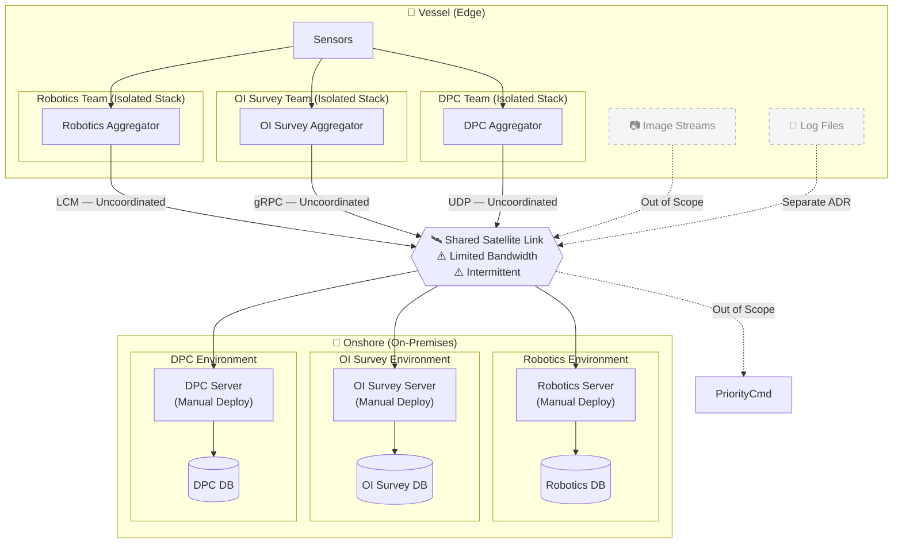
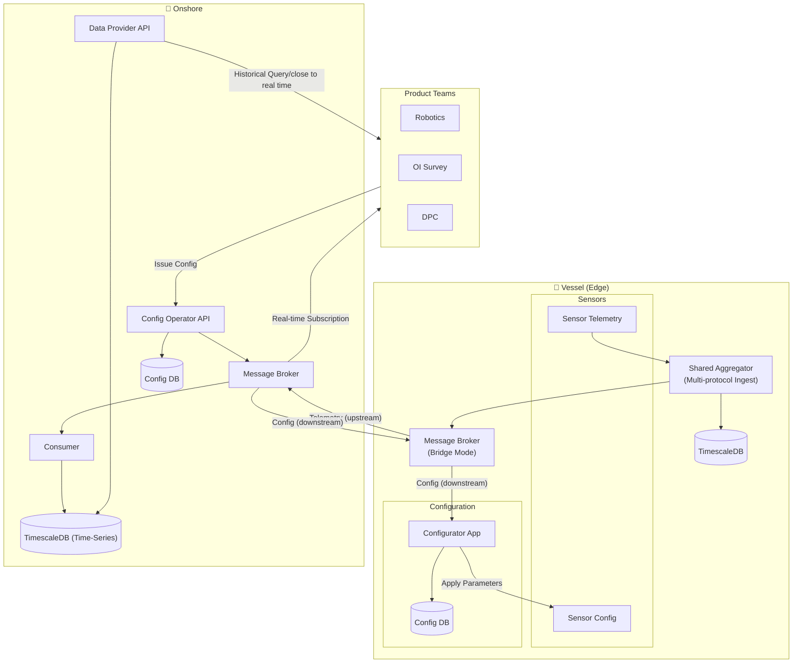
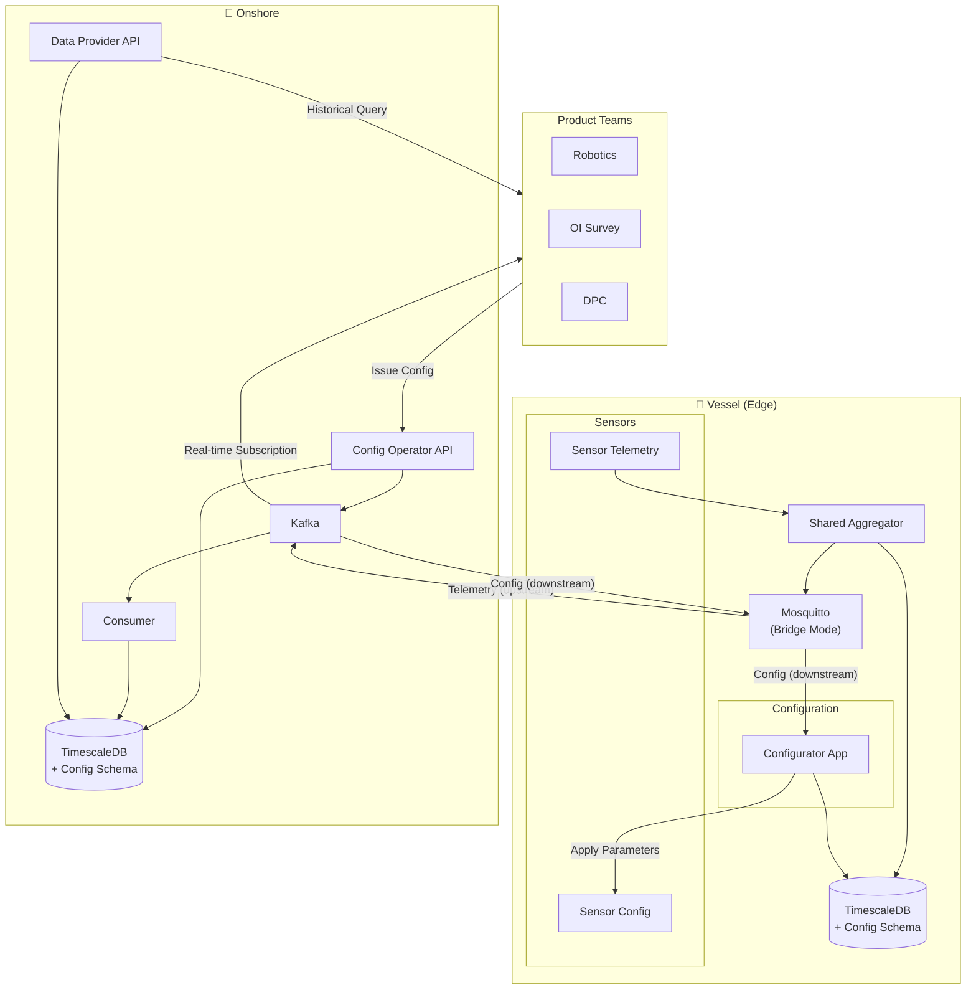
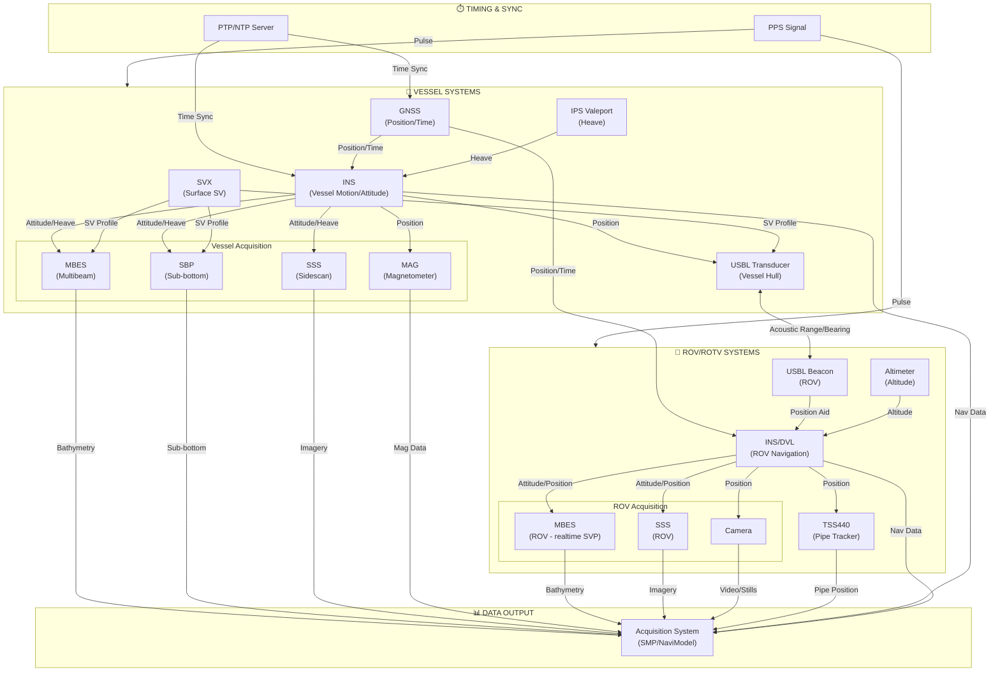
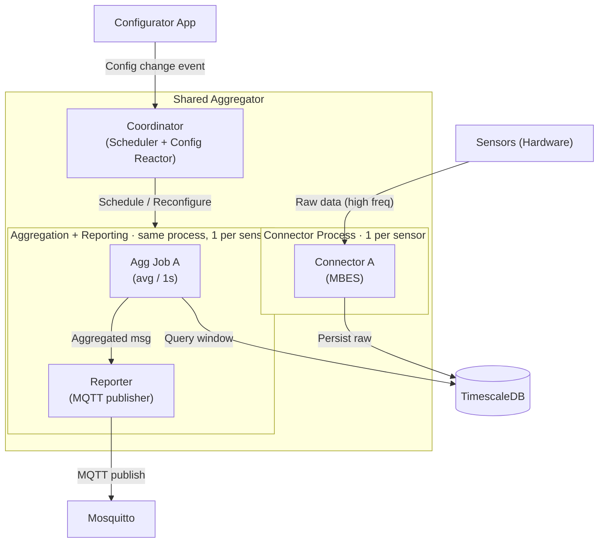
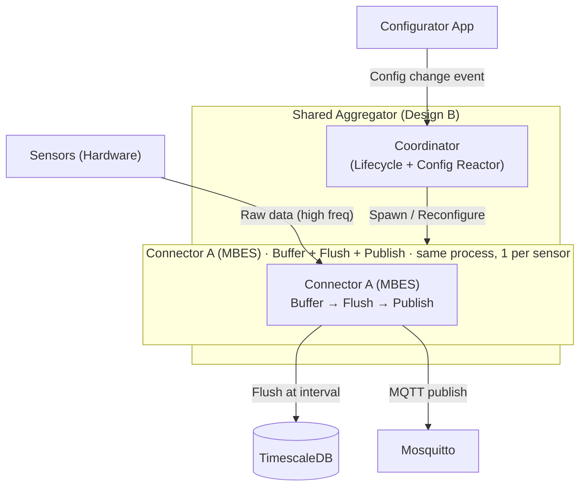
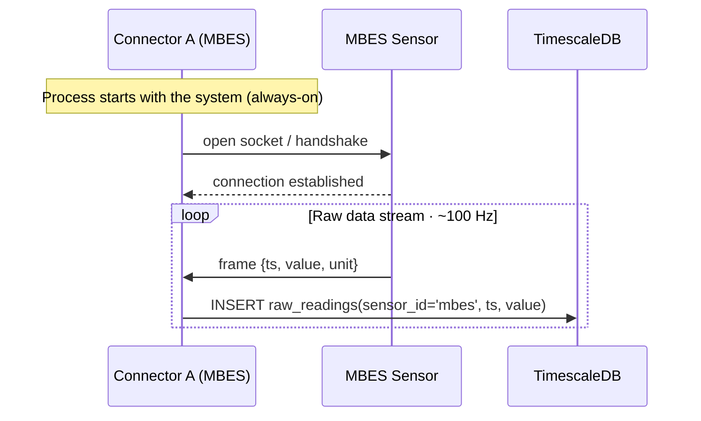
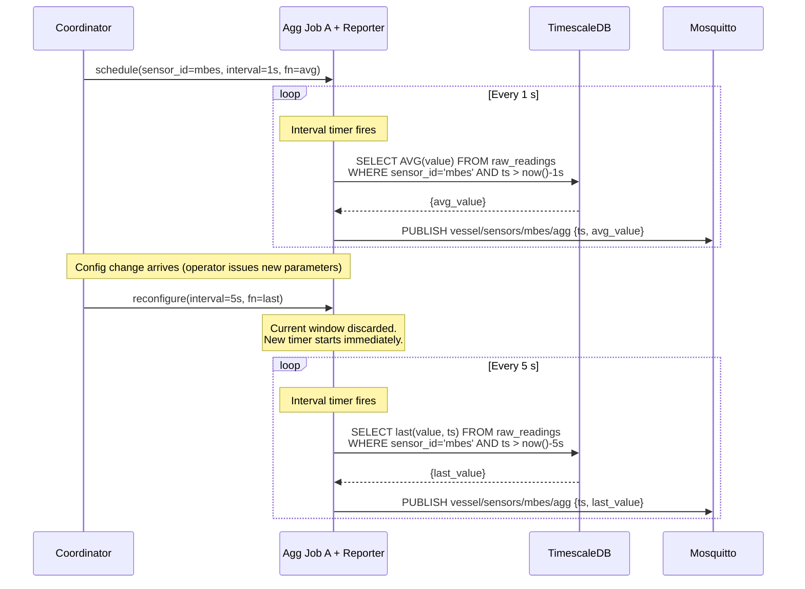
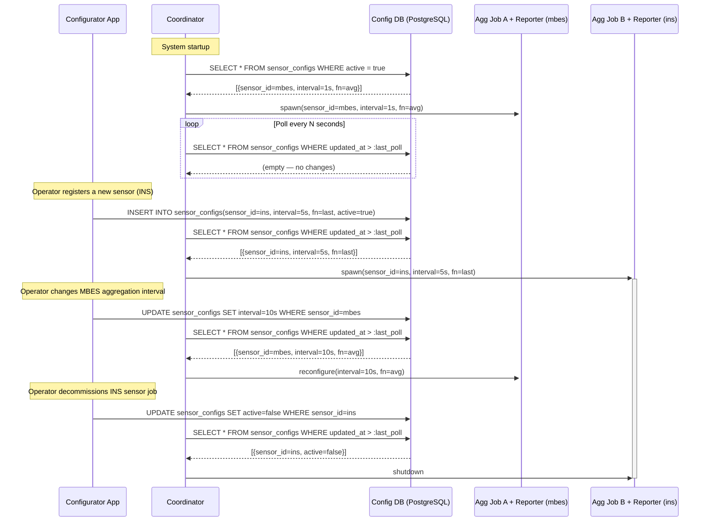

# ADR: Shared Vessel Data Platform

**Status:** Proposed
**Date:** 2026-02-23

---

## 1. Context

Today, distinct product teams — **Robotics**, **OI Survey**, **DPC**, **etc** — independently acquire and transmit operational data. Each team has built its own end-to-end stack in isolation, from sensor ingestion on the vessel all the way through to its own onshore environment.

### 1.1 Data Taxonomy

The data produced on a vessel falls into three broad categories:

| Category | Description | Characteristics |
| :--- | :--- | :--- |
| **Sensor / Telemetry** | Position, depth, pressure, heading, velocity, sonar returns, etc. | High-frequency, small payloads (~bytes to ~KB). The primary focus of this ADR. |
| **Real-Time Image Streams** | Live video feeds from ROVs, cameras, and sonar visualisations. | Very high bandwidth. **Out of scope for this ADR.** |
| **Log / File Data** | Proprietary binary logs, mission recordings, diagnostic dumps written to disk. | Large, bursty, tolerant of delayed transfer. **Addressed in a separate ADR.** |
| **Priority Commands** | Urgent operational inputs (e.g. emergency stops, critical overrides) transmitted directly via network to the vessel config service, bypassing the normal aggregation pipeline. | Low-frequency, latency-critical. **Out of scope for this ADR.** |

### 1.2 Connectivity Constraints

Vessels communicate onshore exclusively over **satellite links**. These links are the single most important constraint in any architectural decision:

- **Bandwidth is scarce and expensive** — typically in the range of a few Mbps shared across the entire vessel.
- **Links drop** — weather, orbital windows, and hardware resets cause intermittent outages that can last minutes to hours.


---

## 2. Problem Statement

The lack of a shared data platform creates **five compounding problems** that affect reliability, cost, and the ability to deliver new products.

### Problem 1 — Data Silos & No Interoperability

Each team uses a different wire protocol to ingest and transport sensor data:

| Team | Ingestion Protocol | Notes |
| :--- | :--- | :--- |
| Robotics | **LCM** (Lightweight Communications and Marshalling) | Efficient for intra-process robotics, not designed for WAN transport. |
| OI Survey | **gRPC** | Excellent for service-to-service, not a native message bus. |
| DPC | UDP | Unknown interoperability surface. |

Because there is no common data layer, **no team can consume another team's data**. Cross-team analysis (e.g., correlating a robotics event with a survey sensor reading from the same moment) is impossible without a manual data extraction and transformation step done after the mission.

### Problem 2 — Uncontrolled Bandwidth Competition

Each team's stack independently negotiates its own connection to the onshore environment over the shared satellite link. A **Vesta Manager** is deployed on the vessel to multiplex traffic across available network paths, providing network-level link management. However, it operates at the transport layer and offers no application-level governance across teams:

- It cannot distinguish a critical alarm from a bulk sensor transfer — application traffic from all teams is aggregated without priority differentiation.
- There is no concept of per-team rate limiting, message priority, or backpressure at the application layer.
- Total bandwidth consumption by the application layer remains uncoordinated and opaque across teams.

### Problem 3 — Environment Fragmentation

> **⚠️ Requires more information — out of scope for this ADR.** The full extent of environment fragmentation across teams (vessel-side and onshore) needs further investigation before it can be fully characterised. This problem is noted for completeness and will be addressed in a separate initiative once the current state of each team's infrastructure is better understood.

Each team maintains a **fully independent infrastructure stack**, both on the vessel and onshore. There are no shared services, no shared databases, and no shared compute:

- Operational overhead is multiplied by three: three sets of servers to maintain, three deployment pipelines, three monitoring stacks.
- On-premises servers are the primary runtime target, and **deployments are manual**. This is a significant operational risk for vessel-side software where physical access is constrained.
- *Note: Vessel-side deployment standardisation (containerisation and CI/CD) is being addressed in a separate initiative and is out of scope for this ADR, but it is a critical dependency for any proposed solution.*

### Problem 4 — Volatile Data Persistence (Data Loss Risk)

The current vessel-side architecture has no dedicated durable time-series store:

- Sensor data is held transiently in application memory before being forwarded onshore. A process crash or server reboot can result in **complete data loss** for any data not yet transmitted.
- There is no queryable local history for the crew on board — real-time dashboards depend entirely on a live connection to the onshore environment.
- There is currently **no ability to re-play or recover** sensor data for a time window that was missed due to a connectivity outage.

### Problem 5 — No Shared Operational Picture (Crew & Onshore)

Because data is siloed, there is no single onshore or vessel-side view of the current mission state. Product teams, vessel crew, and onshore operations teams each look at a different, incomplete picture. Cross-discipline decisions made during a mission (e.g., routing, dive planning, emergency response) are based on fragmented information.

---

## 3. AS-IS System Diagram

The diagram below represents the current state of the vessel data architecture.



---

## 4. Assumptions

The following are explicitly noted as constraints or companion decisions to keep this ADR focused:

1. **Real-time image streams are out of scope.** The bandwidth characteristics of live video require a dedicated, separate architectural treatment.
2. **Log/file synchronisation is out of scope.** The transfer of large vendor binary logs and mission recordings from vessel to shore is addressed in a companion ADR.
3. **Vessel-side deployment standardisation (CI/CD, containerisation) is a dependency.** This ADR assumes that a container runtime (e.g., Docker/Podman) will be available on vessel servers. The programme to standardise this is in progress.
4. **The focus is sensor/telemetry data only.** All subsequent sections address the acquisition, aggregation, prioritisation, and transmission of structured sensor data.

---

## 5. High-Level Solution Proposal

The proposed solution introduces a **Shared Vessel Data Platform** — a single, unified infrastructure layer that all product teams produce data into and consume data from, replacing the current collection of isolated per-team stacks.

The design is structured around four principles:

- **One ingestion point per vessel.** A single Shared Aggregator absorbs data from all sensors regardless of their original protocol, normalises it, and feeds one internal pipeline.
- **Durable edge persistence.** A time-series database on the vessel ensures that data is never lost during connectivity outages. The message broker only forwards what is already safely persisted.
- **Controlled, bidirectional bridge.** A single lightweight message broker — running in bridge mode — manages the satellite link. Telemetry flows upstream to onshore; configuration instructions flow downstream to the vessel. Bandwidth is governed in one place.
- **Shared onshore consumption layer.** All product teams consume data through a single **Data Provider API**, which exposes both historical queries and real-time subscriptions, removing the need for any team to maintain its own onshore data infrastructure.

---

### 5.1 TO-BE System Diagram



---

### 5.2 Key Component Responsibilities

| Component | Location | Responsibility |
| :--- | :--- | :--- |
| **Shared Aggregator** | Vessel | Ingests sensor data from all protocols, normalises, writes to TimescaleDB and broker. |
| **TimescaleDB** | Vessel | Durable short-term store. Ensures no data loss during outages. |
| **Message Broker (Bridge)** | Vessel | Forwards telemetry upstream; receives config instructions downstream. Single point of bandwidth control. |
| **Configurator App** | Vessel | Receives config messages from the broker, persists them, and applies parameter changes to sensors. |
| **Message Broker** | Onshore | Central ingestion point for all vessel telemetry. Routes config instructions downstream. |
| **Consumer** | Onshore | Reads from the broker, deserialises, writes to TimescaleDB. |
| **Config Operator API** | Onshore | API used by operators to issue sensor configuration commands. Publishes to the broker and records commands in Config DB. |
| **Data Provider API** | Onshore | Unified API for all product teams. Exposes historical queries (DB-backed). |
| **TimescaleDB** | Onshore | Permanent time-series archive for all vessel telemetry. |
| **Config DB** | Onshore | Stores the history of configuration commands issued to vessels. |

---

*Next section: [Low-Level Solution Options →]*

---

## 6. Low-Level Solution Options

This section evaluates concrete technology choices for the two critical decision points on each side of the bridge. Note that the **vessel broker and onshore broker are not fully independent choices** — the coupling is called out in each section.

---

### 6.1 Vessel — Message Broker

The vessel broker is the most constrained component in the system. It must operate reliably on a rack server with a satellite uplink that can drop for hours, consume minimal resources, and natively handle reconnection and message buffering.

#### Option A — Mosquitto (MQTT)

Eclipse Mosquitto is a C-based MQTT broker originally designed in the 1990s for monitoring oil pipelines over satellite links. It is the industry reference for edge telemetry.

| Attribute | Detail |
| :--- | :--- |
| **RAM footprint** | ~5 MB at idle |
| **Offline buffering** | File-backed queue (`mosquitto.db`); simple FIFO per bridge |
| **Reconnect handling** | Native — clean/persistent sessions, keep-alives, Last Will |
| **Per-topic priority** | Manual via two separate bridge definitions (e.g. `bridge-critical`, `bridge-bulk`) |
| **Onshore broker freedom** | Any MQTT-compatible broker: Kafka (MQTT proxy), RabbitMQ, HiveMQ, AWS IoT Core |
| **Ecosystem lock-in** | None — standardised MQTT protocol |
| **Operational maturity** | Extremely high — deployed in millions of IoT and maritime installations |

**Trade-off:** Mosquitto's buffering is a single flat queue per bridge. There are no per-stream retention policies — you cannot say "keep critical alarms indefinitely but cap sensor bulk to 2GB". That logic must live in the Aggregator or be handled via separate bridge configurations.

---

#### Option B — NATS JetStream (Leaf Node)

NATS JetStream is a modern, Go-based distributed messaging platform. In this topology the vessel runs a **Leaf Node** — a full NATS server that seamlessly extends the namespace of the central onshore NATS cluster.

| Attribute | Detail |
| :--- | :--- |
| **RAM footprint** | ~15–30 MB at idle |
| **Offline buffering** | Log-structured, disk-backed JetStream storage; per-stream retention policies |
| **Reconnect handling** | Native leaf node reconnection; configurable backoff |
| **Per-stream priority** | First-class — define `Critical_Alarms` (retain indefinitely) vs `Sensor_Bulk` (cap at 5 GB) |
| **Onshore broker freedom** | **Must run NATS onshore.** Integration with Kafka requires a Kafka Connect source connector. |
| **Ecosystem lock-in** | High — NATS protocol is proprietary; all consumers must use NATS clients |
| **Operational maturity** | Growing — strong cloud-native adoption but less maritime precedent than MQTT |

**Trade-off:** NATS eliminates the need for separate bridge configuration files and offers far more sophisticated buffering. However, it mandates a NATS cluster onshore, which either replaces Kafka entirely or adds a Kafka connector layer. It also replaces the familiar MQTT standard with a proprietary protocol across the whole stack.

---

#### Option C — Zenoh

Zenoh (Eclipse Foundation, written in Rust) is a data-centric pub/sub/query middleware designed for edge and constrained environments. It is not a traditional message broker — it is better described as a unified data-plane that can operate over UDP, TCP, serial links, and shared memory within the same binary. It has gained traction in the robotics community as a transport layer for ROS 2.

| Attribute | Detail |
| :--- | :--- |
| **RAM footprint** | ~1–2 MB — the lightest of all options |
| **Offline buffering** | Available via persistent storage plugins; less mature than Mosquitto's file DB or NATS JetStream |
| **Reconnect handling** | Native — designed for intermittent links and roaming nodes |
| **Per-topic priority** | Not natively defined; requires custom routing configuration |
| **Onshore broker freedom** | Must run Zenoh router onshore; bridges to ROS 2 natively but integration with Kafka requires a custom connector |
| **Ecosystem lock-in** | Moderate — open protocol (Eclipse), but tooling ecosystem is small compared to MQTT or NATS |
| **Operational maturity** | Low for production IoT/maritime; strong in robotics research |

**Trade-off:** Zenoh's smallest footprint and native roaming/intermittent-link behaviour are appealing. However, its production tooling, monitoring support, and enterprise integration story are significantly less mature than Mosquitto or NATS. Its main strength is in robotics pipelines (ROS 2), making it a potential fit for the Robotics team specifically, but a poor choice as the single shared platform broker where operational reliability and broad ecosystem support are required.

---

#### Option D1 — Kafka (KRaft, independent vessel cluster — no onshore replication)

Each vessel runs a fully independent Kafka broker in KRaft mode. The cluster exists only on the vessel — there is no cross-cluster replication or MirrorMaker 2. Since the onshore deployment already runs Kafka, ship-to-shore consumption is native: the onshore Kafka consumer points to the vessel cluster address over the satellite link and consumes topics directly, with no additional component required. Vessel-local consumers can also subscribe independently with their own offsets, and the durable log survives broker restarts.

| Attribute | Detail |
| :--- | :--- |
| **RAM footprint** | 1–2 GB minimum at idle (JVM); 4 GB recommended for stable production |
| **Total RAM cost** | ~2–3 GB for Kafka alone, before the Aggregator and databases |
| **Throughput ceiling** | Very high — millions of messages/sec; far exceeds any foreseeable vessel sensor rate |
| **Per-partition retention** | First-class — separate retention policies per topic (e.g. keep `alarms` indefinitely, cap `sensor_bulk` at 100 GB) |
| **Consumer groups / replay** | Native — multiple consumers with independent offsets; full log replay |
| **Familiarity** | Team already operates Kafka onshore |
| **Ship-to-shore transport** | Onshore Kafka consumer connects directly to the vessel cluster over the satellite link — no additional bridge component needed |
| **Satellite resilience** | Kafka clients include reconnect logic but are not designed for high-latency (>500 ms RTT) or hours-long outages. Consumer session timeouts, fetch timeouts, and producer retries all require deliberate tuning to behave correctly over a satellite link. Mosquitto bridge mode handles this by default. |
| **Single-broker availability** | No HA — a JVM crash or disk fill requires manual recovery; all vessel-local ingest stops until restored |
| **Operational complexity** | Full Kafka administration offshore: log retention tuning, JVM GC, disk management, topic governance |
| **Fleet scaling** | Each vessel is an independent cluster; 10 vessels = 10 clusters to manage, monitor, and upgrade separately |
| **Power draw** | JVM runs hot; measurably higher sustained CPU and memory draw than a C-binary like Mosquitto |

**Critical assessment:** The onshore native consumption argument is valid and removes one of the objections to this option. What remains is the JVM footprint — 2–3 GB on the vessel before the Aggregator and databases — and the operational overhead of administering independent Kafka clusters offshore. Kafka clients also require deliberate tuning to tolerate satellite-grade intermittency, where Mosquitto is purpose-built for it. Kafka's genuine strengths belong onshore. See [kafka_evaluation.md](kafka_evaluation.md) for the extended analysis.

---

#### Option D2 — Kafka (vessel broker as member of the onshore cluster)

In this topology the vessel Kafka broker is not an independent cluster but a participating broker in the same Kafka cluster as the onshore deployment. Topic partitions are replicated across the WAN using either Kafka's native ISR replication or MirrorMaker 2, with the vessel acting as a remote replica.

| Attribute | Detail |
| :--- | :--- |
| **Connectivity assumption** | Requires a stable, high-bandwidth, low-latency WAN link between vessel and onshore at all times |
| **Satellite compatibility** | Fundamentally incompatible — Kafka ISR replication requires sustained TCP with low round-trip time; satellite links are intermittent, high-latency, and bandwidth-limited |
| **Partition leader election** | A satellite outage triggers partition leader re-election; Kafka marks under-replicated partitions and may stall producers until quorum is restored |
| **MirrorMaker 2 (if used instead)** | MM2 is a JVM process designed for DC-to-DC links; it has no backpressure or retry strategy suited to hours-long satellite outages |
| **Operational complexity** | Stretch-cluster or cross-WAN Kafka operations are among the most complex configurations in the Kafka ecosystem |

**Eliminated immediately.** The assumption of a stable high-bandwidth link is irreconcilable with the satellite-connected vessel environment defined in Section 1. Included only because it is sometimes proposed as a "one cluster everywhere" simplification.

---

#### Broker Decision Matrix

| Criteria | Mosquitto | NATS JetStream | Zenoh | Kafka D1 (independent) | Kafka D2 (onshore cluster) |
| :--- | :---: | :---: | :---: | :---: | :---: |
| Resource footprint | ✅ ~5 MB | ✅ ~25 MB | ✅ ~2 MB | ❌ 2–3 GB (JVM) | ❌ 2–3 GB + MM2 |
| Satellite resilience | ✅ Purpose-built | ✅ Designed for edge | ✅ Designed for edge | ⚠️ Client tuning required | ❌ Incompatible by design |
| Per-stream retention | ⚠️ Manual workaround | ✅ Native | ❌ Plugin-dependent | ✅ Native per-partition | ✅ Native per-partition |
| Onshore broker freedom | ✅ Any MQTT-compatible | ❌ NATS required | ❌ Zenoh router required | ⚠️ Kafka required onshore | ✅ Same cluster |
| Operational precedent | ✅ Very high | ⚠️ Moderate | ❌ Low (maritime) | ⚠️ High onshore; low at edge | ⚠️ High onshore; low at edge |
| Self-hosting complexity | ✅ Near-zero | ✅ Low | ✅ Low | ❌ High (JVM, disk, GC tuning) | ❌ Very high (WAN cluster ops) |
| Fleet scalability | ✅ Simple (bridge config) | ✅ Leaf node auto-reconnect | ⚠️ Router per vessel | ❌ Cluster per vessel | ❌ Single cluster, WAN stretch |

---

### 6.2 Vessel — Database

The vessel carries a rack server with sufficient compute and storage for a full database process. The database serves two purposes: durable persistence to survive connectivity outages, and local queryability for crew dashboards.

#### Option A — TimescaleDB (PostgreSQL extension)

TimescaleDB is a PostgreSQL extension that adds automatic time-series partitioning, columnar compression, and retention management on top of standard SQL.

| Attribute | Detail |
| :--- | :--- |
| **Storage model** | Hypertables — automatically partitioned time-series on top of Postgres |
| **Compression** | Up to 95% on time-series columns via native columnar compression |
| **Retention** | `drop_chunks` policy — automatic pruning to match mission duration (e.g. 90 days) |
| **Query interface** | Full SQL — compatible with Grafana, pgAdmin, any Postgres client |
| **RAM footprint** | ~50–100 MB (shared with Postgres) |
| **Aggregation support** | Native SQL window functions and continuous aggregates — clean separation of raw vs. aggregated data |

**Trade-off:** Adds a Postgres process to the vessel. For a rack server this is negligible overhead, and the SQL interface makes it directly accessible to crew visualisation tools without additional middleware.

---

#### Option B — InfluxDB (OSS v2)

InfluxDB is a purpose-built time-series database with its own query language (Flux) and HTTP API.

| Attribute | Detail |
| :--- | :--- |
| **Storage model** | TSM engine — optimised for time-series writes |
| **Compression** | Good, though typically less than TimescaleDB columnar |
| **Retention** | Bucket-level retention policies |
| **Query interface** | Flux (proprietary) or InfluxQL — not standard SQL |
| **RAM footprint** | ~100–200 MB |
| **Ecosystem** | Telegraf integration; but v3 has shifted toward a commercial model |

**Trade-off:** InfluxDB's Flux language has a steep learning curve and is not transferable to other systems. Licensing uncertainty in v3 makes it a risk for long-term operational software. Does not share a query interface with the onshore relational Config DB, increasing cognitive overhead.

---

#### Option C — No local database (broker-only)

All data is written directly to the broker queue and never persisted locally in a queryable store.

| Attribute | Detail |
| :--- | :--- |
| **Complexity** | Lowest — one fewer component on the vessel |
| **Offline resilience** | Depends entirely on broker's own queue persistence |
| **Crew dashboards** | Not possible without an always-on subscriber writing to an in-memory store |
| **Aggregation** | Must be performed in-process within the Aggregator before publishing |

**Trade-off:** Simplifies the vessel stack but reintroduces the core risk described in Problem 4 — data that has not yet been forwarded onshore cannot be queried or recovered locally. Eliminated for any deployment where crew visibility or mission replay is a requirement.

---

#### Database Decision Matrix

| Criteria | TimescaleDB | InfluxDB | No DB |
| :--- | :---: | :---: | :---: |
| Standard query language (SQL) | ✅ | ❌ Flux | — |
| Compression efficiency | ✅ Very high | ✅ Good | — |
| Retention management | ✅ Native | ✅ Native | — |
| Shared stack with Config DB | ✅ (Postgres) | ❌ | — |
| Crew dashboard support | ✅ | ✅ | ❌ |
| Local data recovery on outage | ✅ | ✅ | ❌ |
| Licensing risk | ✅ Open source | ⚠️ v3 commercial | — |

---

### 6.3 Onshore — Message Broker

The onshore broker is the central hub that receives telemetry from all vessels simultaneously and routes configuration instructions back downstream. Unlike the vessel, there are no resource constraints — the primary criteria are throughput, durability, fan-out capability, and integration with the vessel broker choice.

> **Coupling note:** This choice is constrained by the vessel broker. If Mosquitto is chosen on the vessel, Kafka or RabbitMQ are natural fits. If NATS JetStream is chosen, a NATS cluster is required onshore.

#### Option A — Kafka

| Attribute | Detail |
| :--- | :--- |
| **Throughput** | Millions of messages/sec; designed for high-volume ingest |
| **Durability** | Durable, replayable log — consumers can re-read any time window |
| **Fan-out** | Consumer groups — each product team (Robotics, OI Survey, DPC) reads independently with no coupling |
| **Vessel compatibility** | Requires an MQTT proxy (Confluent or open-source) to accept MQTT bridge connections from Mosquitto |
| **Real-time subscription** | Native via consumer groups; teams can subscribe directly |
| **Operational complexity** | Higher — cluster management, topic configuration, consumer group offsets |

---

#### Option B — RabbitMQ

| Attribute | Detail |
| :--- | :--- |
| **Throughput** | Tens of thousands of messages/sec — sufficient for telemetry at scale |
| **Durability** | Durable queues; no native log replay beyond queue retention |
| **Fan-out** | Exchange/binding model — flexible but requires explicit topology design |
| **Vessel compatibility** | Native MQTT plugin — Mosquitto bridge connects directly, no proxy needed |
| **Real-time subscription** | AMQP consumers or MQTT subscribers |
| **Operational complexity** | Moderate — well-understood, simpler cluster model than Kafka |

**Trade-off:** RabbitMQ lacks Kafka's durable replay log. Once a message is consumed and acknowledged, it is gone. This means the Consumer must write to the database reliably — there is no second chance to re-process a message window. Suitable if replay is not a requirement.

---

#### Option C — NATS JetStream (Cluster)

Required if NATS Leaf Nodes are chosen on the vessel. Can also optionally bridge into Kafka via a Kafka Connect source connector if the enterprise mandates Kafka downstream.

| Attribute | Detail |
| :--- | :--- |
| **Throughput** | Very high — comparable to Kafka |
| **Durability** | JetStream persistent streams with configurable retention |
| **Fan-out** | Consumer groups (JetStream consumers) |
| **Vessel compatibility** | Native — Leaf Node connects directly to the cluster |
| **Real-time subscription** | Native |
| **Operational complexity** | Moderate — single binary, but requires NATS expertise |

---

#### Onshore Broker Decision Matrix

| Criteria | Kafka | RabbitMQ | NATS JetStream |
| :--- | :---: | :---: | :---: |
| High throughput at scale | ✅ | ⚠️ Sufficient | ✅ |
| Durable replay log | ✅ | ❌ | ✅ |
| Native MQTT vessel compatibility | ⚠️ Needs proxy | ✅ Native plugin | ❌ NATS vessel required |
| Independent team fan-out | ✅ Consumer groups | ✅ Exchanges | ✅ Consumer groups |
| Industry adoption | ✅ Very high | ✅ High | ⚠️ Growing |

---

### 6.4 Onshore — Database

The onshore database serves two distinct workloads with different characteristics, which is why the high-level design separates them into two stores.

#### Time-Series Store (Telemetry)

The same TimescaleDB analysis from §6.2 applies, with one addition: at the onshore scale, TimescaleDB can be deployed as a cluster (via Citus extension or managed service) to handle the aggregate write load from all vessels simultaneously. This is the natural choice for consistency across vessel and onshore stacks — same query language, same operational tooling, same schema patterns.

InfluxDB remains an alternative but carries the same Flux/licensing trade-offs as on the vessel.

#### Configuration Store

The Config DB holds structured, relational data: which vessel received which configuration command, by whom, at what time, and whether it was acknowledged. This is a classic transactional workload, not time-series.

| Option | Notes |
| :--- | :--- |
| **PostgreSQL** | Natural fit — relational, ACID, excellent for audit history. If TimescaleDB is already running (which is Postgres), the Config DB can be a separate schema on the same instance, reducing operational overhead. |
| **MongoDB** | Flexible document schema — useful if configuration payloads vary significantly per sensor type. Adds a second database technology to operate. |

**Recommendation:** Use PostgreSQL (co-hosted with TimescaleDB) for the Config DB. It avoids introducing a second database engine and benefits from the same backup, monitoring, and access control infrastructure.

---

*Next section: [Suggested Approach →]*

---

## 7. Suggested Approach

Based on the trade-off analysis in Section 6, the following technology choices are recommended.

### 7.1 Decision Summary

| Decision Point | Choice | Primary Rationale |
| :--- | :--- | :--- |
| **Vessel broker** | Mosquitto (MQTT) | Purpose-built for satellite/edge; 5 MB footprint; universal protocol; zero lock-in; highest operational maturity |
| **Vessel time-series DB** | TimescaleDB | SQL interface; high compression; native retention; shared Postgres stack with Config DB |
| **Vessel config DB** | PostgreSQL (separate schema, same instance) | Relational, ACID, co-hosted with TimescaleDB at zero additional operational cost |
| **Onshore broker** | Kafka | Already deployed in the company; durable replay log; consumer group fan-out per team; MQTT proxy bridges Mosquitto directly |
| **Onshore time-series DB** | TimescaleDB | Consistent tooling with vessel; scalable to multi-vessel write load via Citus or managed service |
| **Onshore config DB** | PostgreSQL (co-hosted with TimescaleDB) | Same reasoning as vessel — relational audit history, no additional engine to operate |

---

### 7.2 Rationale

**Mosquitto on the vessel** is the most conservative and defensible choice. It was designed in the 1990s specifically for the problem we are solving — low-bandwidth, intermittent, satellite-connected telemetry. Its 5 MB footprint, native keep-alive/reconnect semantics, and QoS-based delivery guarantees make it the reference implementation for this class of problem. Critically, it speaks standard MQTT, which means the onshore broker can be replaced or upgraded independently without touching the vessel software.

**Kafka onshore** is already part of the company's infrastructure, which eliminates the adoption risk entirely. The MQTT proxy (available in both Confluent Platform and as an open-source component) allows the Mosquitto bridge to publish directly into Kafka topics without any intermediary service. Kafka's durable log and consumer group model gives each product team an independent read position — the Robotics team consuming at a different rate than DPC has zero impact on either team's data completeness.

**TimescaleDB on both sides** provides a consistent operational and development story. Developers write the same SQL queries on the vessel as onshore. Grafana dashboards work against both instances identically. The Postgres foundation means the Config DB is simply an additional schema in the same database process — no second engine, no second backup job, no second set of credentials to manage.

---

### 7.3 Architecture with Concrete Technologies



---

### 7.4 Strategic Intent

The technology choices above solve the immediate problem — siloed stacks, bandwidth competition, no shared operational picture. They are also deliberately designed to support a broader long-term direction. This section captures the strategic commitments that should guide the implementation roadmap beyond the initial rollout.

---

#### 7.4.1 Decommission of Legacy Protocols

In the AS-IS architecture each product team transmits vessel data to shore using its own point-to-point protocol: LCM (Robotics), gRPC (OI Survey), and UDP (DPC). These protocols bypass any shared bandwidth governance and create parallel, uncoordinated paths that cannot be observed or controlled centrally.

The long-term target is to decommission all of them in favour of the single MQTT/Kafka pipeline. This cannot happen in one step. The proposed phased approach is:

| Stage | Action | Outcome |
| :--- | :--- | :--- |
| **1 — Parallel run** | New sensors are connected to the Shared Aggregator via MQTT. Existing pipelines continue unchanged. | Shared platform is live and proven; legacy paths still operating in parallel. |
| **2 — Team-by-team migration** | Each product team migrates its sensor feeds to the Shared Aggregator and switches its onshore consumption to Kafka consumer groups. One team at a time. | Gradual traffic shift; teams migrate on their own schedule without depending on each other. |
| **3 — Onshore decommission** | Once all sensor data flows through the shared platform, team-specific shore-side receivers (Robotics Server, OI Survey Server, DPC Server) are retired. | AS-IS onshore stack eliminated. |
| **4 — Protocol retirement** | Legacy vessel-side emitters using LCM, gRPC, and UDP are removed. | Single codepath end-to-end; no parallel stacks to maintain. |

Teams with use-cases genuinely outside sensor telemetry — for example, direct ROS 2 topic exchange for control — may retain purpose-specific protocols for those specific flows. The governing rule is: **all sensor and telemetry data must flow through the shared platform**.

---

#### 7.4.2 Centralized Aggregator Across Product Teams

A single Shared Aggregator instance on the vessel replaces the per-team aggregators of the AS-IS architecture. Sensor connectors are defined and maintained centrally as part of the shared platform — they are not owned by individual product teams.

Teams express their requirements (which sensors, at what interval, with which aggregation function) through the Configurator App. The Aggregator executes those requirements and publishes to the shared broker. Teams consume from Kafka via dedicated consumer groups with no access to Aggregator internals.

This centralisation has three direct consequences:

- **Bandwidth governance is centralized.** No single team can independently drive high-frequency data to shore. Aggregation interval and function are the control levers — the Configurator enforces them.
- **Sensor normalisation is centralized.** Each sensor type has exactly one connector implementation. There is no risk of two teams implementing different interpretations of the same MBES output format.
- **Operational responsibility is centralized.** One system to deploy, monitor, upgrade, and debug — not three isolated stacks that differ in subtle and undocumented ways.

---

#### 7.4.3 Centralized Sensor Data Contracts

All sensor data — inbound from sensors to the Aggregator and outbound from the Aggregator to the broker — is governed by centrally defined, versioned contracts.

**Inbound contracts** specify the expected message format for each sensor type. A Connector for the MBES must conform to the registered MBES inbound schema. New sensor types require a contract to be registered before a Connector can be merged. This prevents ad hoc format proliferation where each team encodes the same sensor differently.

**Outbound contracts** define the MQTT topic structure and payload schema published by the Aggregator onto Mosquitto (and mirrored into Kafka).

Contracts are versioned. Breaking changes are introduced as a new path segment (e.g. `/v2/`) so that existing consumers are never broken mid-mission. Teams pin to a specific version and migrate when ready. Onshore, a Kafka Schema Registry (Protobuf or Avro) can enforce contract compliance at publish time, preventing malformed messages from reaching consumers.

---

## 8. Aggregator — Component Design

The Shared Aggregator is the most critical custom-built component in the vessel stack. It is responsible for absorbing high-frequency sensor data across multiple protocols, persisting it durably, and publishing bandwidth-efficient aggregated messages to Mosquitto.

This section details its internal structure, the key design decisions, and two competing implementation patterns.

---

### 8.0 Vessel Sensor Network — Physical Context

The diagram below shows the physical sensor interconnections and navigation data flows across the vessel and ROV. It provides context for the Aggregator's Connector design: the data flows between sensors (e.g. GNSS → INS, INS → MBES) are handled entirely at the hardware level and are not mediated by the Aggregator. Each Connector reads the native output of its assigned payload, which is already the result of those hardware-level integrations. Connectors have no knowledge of, or dependency on, one another.



> **Design implication:** Payloads such as the MBES receive navigation inputs (position, attitude, sound velocity) directly from the INS and SVX at the hardware level. The MBES native output is already the processed, navigation-integrated product. The MBES Connector reads this output directly — no cross-payload context embedding is required at the platform level. The same principle applies to all payload types shown. This is why Connectors are independent and topology-unaware: the physical data dependencies are resolved in hardware before any Connector reads a frame.

---

### 8.1 Sub-Components

The Aggregator is composed of four logical sub-components:

| Sub-component | Role |
| :--- | :--- |
| **Coordinator** | Manages the lifecycle of Aggregation Jobs only. Reacts to configuration change events from the Configurator App and re-schedules the affected Aggregation Job with the new parameters. |
| **Sensor Connector** | One per sensor. Always running — connects to the sensor using its native protocol, receives raw readings, and persists them to TimescaleDB continuously. Operates independently of the Coordinator. |
| **Aggregation Job** | One per sensor. Fires on a configured interval (e.g. 1s, 5s). Queries TimescaleDB for the raw readings in the elapsed window and applies the configured function (average or last value) to produce one aggregated message. |
| **Reporter** | Single publisher. Receives aggregated messages from all Aggregation Jobs and publishes them to the local Mosquitto broker as MQTT messages. |

---

### 8.2 Design A — DB-Mediated Aggregation (Proposed)

The Connector writes raw data to the DB. The Aggregation Job reads from the DB at interval time. The Reporter publishes to Mosquitto.



#### Design Decisions

**Buffer strategy:** Aggregation Jobs query TimescaleDB for the raw readings in the elapsed window (e.g., `SELECT AVG(value) FROM readings WHERE sensor_id = X AND ts > now() - interval '1s'`). This keeps the connector simple and makes the DB the authoritative source of truth for all aggregation.

> **Future optimisation note:** If sensors prove to be extremely chatty (e.g., >1000 Hz) and DB query overhead becomes measurable, a per-connector **in-memory ring buffer** can be introduced. The Aggregation Job would read from the ring buffer instead of the DB. The DB write would remain but could be batched. This is a localised change to the Connector and Aggregation Job contracts with no impact on the Reporter or Mosquitto.

**Process model:** Each Sensor Connector runs as an **independent, always-on process**. Connectors are not managed by the Coordinator — they start with the system and run continuously, persisting raw data to TimescaleDB regardless of aggregation state. This gives isolated failure domains: a crash in Connector A does not affect Connector B, and neither affects the Aggregation Jobs or Reporter. Further detail on the process supervision model is deferred to the implementation ADR.

**Raw data persistence — open question for team discussion:**

| Option | Description | Trade-off |
| :--- | :--- | :--- |
| **Option 1 — Write every reading** | Every raw sample from the sensor is written to TimescaleDB immediately. | Full fidelity for diagnostics and replay. Higher write throughput required. At 100 Hz × N sensors, assess DB write capacity. |
| **Option 2 — Time-based batching** | The Connector buffers readings in memory and flushes to the DB once per configured interval (same cadence as aggregation). | Lower DB write load. Raw data within the current window is lost if the connector crashes before the flush. |

> **Team discussion needed:** Agree on which option to start with based on the expected sensor count and Hz rates. Option 1 is recommended as the safe default until write throughput becomes a proven constraint.

**Config change reaction:** An immediate reset is acceptable. Configuration changes (interval, aggregation function) are applied only to the **Aggregation Job** — the Coordinator re-schedules the job with the new parameters immediately. The Connector continues writing raw readings to the DB uninterrupted, so DB-level consistency is preserved. Any partial window at the time of the config change is discarded.

---

### 8.3 Design B — Connector-Owned Aggregation (Alternative)

This alternative collapses the Aggregation Job and Reporter into the Connector itself. Each Connector buffers its own readings in memory, flushes to the DB at interval time, computes the aggregate from the buffer, and publishes directly to Mosquitto. The Reporter is eliminated.



#### Trade-off Analysis

| Criteria | Design A (DB-mediated) | Design B (Connector-owned) |
| :--- | :--- | :--- |
| **Component count** | Higher — Connector + Agg Job + Reporter | Lower — Connector only |
| **Raw data on crash** | Safe — DB written continuously | At risk — in-memory buffer lost before flush |
| **DB write pattern** | Continuous (every raw sample) | Batched (once per interval) |
| **Aggregation logic location** | Isolated in Agg Job — easy to test, swap, extend | Embedded in Connector — tightly coupled |
| **MQTT connections** | One shared connection (Reporter) | One per sensor connector |
| **Config change complexity** | Coordinator re-schedules Agg Job only | Connector must reset its own timer and buffer atomically |
| **Separation of concerns** | Clean — read, store, aggregate, publish are separate | Mixed — one process does everything |
| **Testability** | Each component testable in isolation | Connector unit tests cover multiple responsibilities |

**Recommendation:** Design A is preferred. The separation of concerns makes each component testable and replaceable independently. The single Reporter means one MQTT connection regardless of sensor count. The DB write cost is manageable for the expected sensor rates, and if it is not, the in-memory buffer optimisation can be applied as a targeted change without restructuring the component model.

Design B is worth revisiting only if operational complexity (running N+1 processes) proves to be a significant burden in practice.

---

### 8.4 Sequence Diagrams — Design A

#### 8.4.1 Connector A (MBES) — Steady-State

Shows the full lifecycle of a single Connector process: startup handshake driven by the Coordinator, followed by the continuous high-frequency raw data ingest loop writing to TimescaleDB.



---

#### 8.4.2 Aggregation Job + Reporter — Steady-State and Config Change

Shows the interval-driven aggregation loop and what happens when the Coordinator delivers a configuration change mid-operation. The Connector (and its raw writes to TimescaleDB) is unaffected throughout.



---

#### 8.4.3 Coordinator — Startup and Job Lifecycle

Shows how the Coordinator bootstraps from the Config DB on startup and reacts to changes written by the Configurator App — spawning, reconfiguring, and decommissioning Aggregation Jobs without any involvement in the Connector processes.



---

## 9. Vessel-Side TimescaleDB — Raw Sensor Readings Schema

This section covers how the vessel-side TimescaleDB stores raw sensor readings written by Connectors and consumed by Aggregation Jobs and the crew dashboard.

---

### 9.1 Performance Reference

TimescaleDB on modest vessel hardware (8-core, 32 GB RAM):

| Operation | Ballpark |
| :--- | :--- |
| Single-row INSERT throughput | 10k–20k rows/sec |
| Batch INSERT / COPY | 100k–500k rows/sec |
| Point-in-time query (`ORDER BY ts DESC LIMIT N`) | < 1 ms with index |
| Sustained QPS (point lookups, range scans) | 5k–20k QPS |

**Vessel load estimate**: 20 sensors × 100 Hz = 2,000 rows/sec. Even at 50 sensors × 1,000 Hz = 50,000 rows/sec, batch inserts keep this well within range. TimescaleDB is not the bottleneck on vessel hardware for these workloads.

---

### 9.2 Schema Design

Sensor readings vary significantly across sensor types (MBES depth soundings, INS position/attitude, GNSS fix, etc.). Two schema strategies were evaluated.

---

#### Option A — Single unified hypertable with JSONB payload ✅ Suggested

```sql
CREATE TABLE sensor_readings (
    ts          TIMESTAMPTZ     NOT NULL,
    sensor_id   TEXT            NOT NULL,
    source_type TEXT            NOT NULL,   -- e.g. 'MBES', 'INS', 'GNSS'
    payload     JSONB           NOT NULL
);

SELECT create_hypertable('sensor_readings', 'ts');

CREATE INDEX ON sensor_readings (sensor_id, ts DESC);
```

**Strengths:**

- Adding a new sensor model requires only a new Connector deployment — no DB schema migration.
- The primary read pattern is a short time-window scan per sensor, served efficiently by the composite index regardless of payload shape:

  ```sql
  SELECT * FROM sensor_readings
  WHERE sensor_id = $1
    AND ts > now() - interval '1 second';
  ```

- Aggregation Jobs consume this window and process it entirely in memory. The DB is never asked to aggregate typed fields, so the lack of column-level indexing inside `payload` is not a practical limitation.
- TimescaleDB columnar compression applies to `ts`, `sensor_id`, and `source_type` — the most repetitive fields — and JSONB chunks compress well at the storage level.

**Trade-offs:**

- No DB-level type enforcement on payload fields.
- Field-level queries inside `payload` (e.g. `(payload->>'depth')::float`) carry no index support. Acceptable given aggregation is in-memory, but limits ad-hoc analytical queries.

---

#### Option B — One hypertable per sensor family

```sql
-- Example tables; one per sensor model family
CREATE TABLE mbes_readings  (ts TIMESTAMPTZ NOT NULL, sensor_id TEXT, depth DOUBLE PRECISION, swath_width DOUBLE PRECISION, ...);
CREATE TABLE ins_readings   (ts TIMESTAMPTZ NOT NULL, sensor_id TEXT, lat DOUBLE PRECISION, lon DOUBLE PRECISION, heading DOUBLE PRECISION, ...);
CREATE TABLE gnss_readings  (ts TIMESTAMPTZ NOT NULL, sensor_id TEXT, lat DOUBLE PRECISION, lon DOUBLE PRECISION, altitude DOUBLE PRECISION, ...);

SELECT create_hypertable('mbes_readings', 'ts');
-- repeat for each table
```

**Strengths:**

- Fully typed columns; TimescaleDB compression, continuous aggregates, and columnar storage operate at maximum efficiency.
- Schema is self-documenting; field-level indexing and DB-native aggregation are available.
- Natural fit for long-term onshore analytics where per-sensor-type query patterns are well defined.

**Trade-offs:**

- Introducing a new sensor model requires a DB schema migration (new table) in addition to a Connector deployment — coupling operational change to a DB change.
- Vessel-side operations teams must manage schema evolution across potentially many sensor families.
- On the vessel, where all aggregation is in-memory and read patterns are uniform (`last N rows for sensor X`), the typed column benefit is not exercised.

---

**Suggested: Option A.** On the vessel, the raw readings table acts as a short-lived staging buffer. The access pattern is uniform across all sensor types, aggregation is always in-memory, and the operational simplicity of schema-free payload additions outweighs the typing benefits that Option B would provide. Option B is better suited to the onshore store, where Kafka consumers can project the typed fields they care about into dedicated analytical tables.

---

### 9.3 Retention Policy

Raw sensor readings are retained on the vessel for **30 days**, after which TimescaleDB drops older chunks automatically via a retention policy.

```sql
SELECT add_retention_policy('sensor_readings', INTERVAL '30 days');
```

This provides:

- A local rolling window sufficient for crew dashboard replay and offline operation.
- Automatic space reclamation without manual intervention.
- Coverage well beyond the longest expected satellite blackout period.

Onshore, the full raw reading stream is forwarded by the Reporter in batches to the Mosquitto bridge, which relays to Kafka. Onshore consumers own their own long-term retention independently of the vessel.
