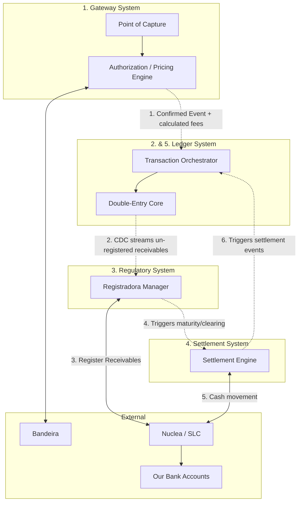
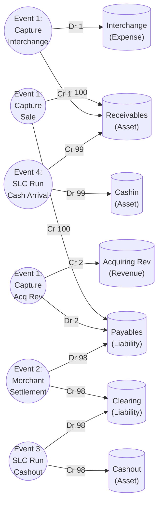

# Double-Entry Ledger Design & Accounting Architecture

> **Status:** APPROVED  
> **Context:** Immutable double-entry bookkeeping ledger for a Brazilian bank-acquirer, handling Visa/MC/Elo clearing, installments (parcelado), and Registradora (CIP/CERC/Tag) requirements.

---

## 1. Macro Systems Architecture

The acquiring process involves separate systems handling specific domains. The **Gateway** is the absolute source of truth for pricing calculations, while the **Ledger** strictly enforces accounting integrity and state.



## 2. Shared Pointers & Responsibilities

1. **Gateway calculates, Ledger records:** The Gateway determines the explicit Interchange and MDR (Revenue) amounts. The Ledger does not recalculate fees; it simply posts the entries it is given.
2. **Immutable Append-Only:** Journal entries are never `UPDATE`d. To correct an error, a new offsetting (reversing) journal entry is posted.
3. **The 1-1-2 Rule:** The data model strictly enforces: `Transaction (1)` ➔ `Journal Entry (1)` ➔ `Account Entries (>= 2: balancing Dr/Cr)`.

---

## 3. Database Schema

We are adopting **Approach B** for tracking receivable dimensions. The Ledger maintains high-level account balances, while an external operational view/table tracks the lifecycle of every discrete operational aspect (like CIP/Registradora status).

### Core Accounting Tables (Immutable)

```sql
-- Chart of Accounts
CREATE TABLE accounts (
    account_id      SMALLINT PRIMARY KEY,
    account_type    VARCHAR(50) NOT NULL,    -- 'Asset', 'Liability', 'Revenue', 'Expense'
    name            VARCHAR(100) NOT NULL,   -- 'Receivables', 'Payables', 'Clearing', 'Cashin', 'Cashout'
    normal_balance  VARCHAR(10) NOT NULL     -- 'Debit' or 'Credit'
);

-- Transaction: The business event trigger
CREATE TABLE transactions (
    transaction_id  UUID PRIMARY KEY,
    gateway_ref_id  VARCHAR(100) NOT NULL,
    status          VARCHAR(50) NOT NULL,
    captured_at     TIMESTAMPTZ NOT NULL,
    created_at      TIMESTAMPTZ DEFAULT NOW()
);

-- Journal Entry: The grouping of credits/debits
CREATE TABLE journal_entries (
    entry_id        UUID PRIMARY KEY,
    transaction_id  UUID NOT NULL REFERENCES transactions(transaction_id),
    event_type      VARCHAR(50) NOT NULL,    -- 'sale', 'settlement', 'clearing'
    posted_at       TIMESTAMPTZ NOT NULL DEFAULT NOW()
);

-- Account Entries: The actual balances
CREATE TABLE account_entries (
    account_entry_id UUID PRIMARY KEY,
    entry_id         UUID NOT NULL REFERENCES journal_entries(entry_id),
    account_id       SMALLINT NOT NULL REFERENCES accounts(account_id),
    amount           NUMERIC(18,2) NOT NULL,
    direction        VARCHAR(6) NOT NULL,    -- 'Debit' or 'Credit'
    
    -- Dimensions (Used for granular reporting and matching)
    dim_bandeira     VARCHAR(50),            -- 'Visa', 'Mastercard'
    dim_method       VARCHAR(50),            -- 'Credit', 'Debit', 'Parcelado'
    dim_target_date  DATE                    -- Expected settlement maturity
);
```

### Operational Receivables Table (Mutable State)

To support integration with the Regulatory Engine (Agenda de Recebíveis), a separate table projects the ledger state into individual discrete receivables.

```sql
CREATE TABLE receivables (
    receivable_id       UUID PRIMARY KEY,
    transaction_id      UUID NOT NULL REFERENCES transactions(transaction_id),
    installment_num     SMALLINT NOT NULL,
    amount              NUMERIC(18,2) NOT NULL,
    maturity_date       DATE NOT NULL,
    
    -- Operacional Regulatory Status
    registradora_status VARCHAR(50) DEFAULT 'PENDING',  -- COMPLETED, PLEDGED, ANTICIPATED
    nuclea_ref_id       VARCHAR(100),
    
    -- Clearing Status
    clearing_status     VARCHAR(50) DEFAULT 'AWAITING_CLEARING'
);
```

---

## 4. Accounts Taxonomy

| Account Type | Name | Normal Balance | Purpose / Dimensions Tracked |
|--------------|------|----------------|------------------------------|
| **Asset** | `Receivables` | Debit | Amounts owed by `Bandeira`, grouped by `Method`, `Date` |
| **Asset** | `Cashin` | Debit | Bank account receiving funds from Nuclea |
| **Asset** | `Cashout` | Debit | Bank account funding payouts to Merchants |
| **Liability**| `Payables` | Credit | Amounts owed to `Merchant`, grouped by `Bandeira`, `Date`, `Method` |
| **Liability**| `Clearing` | Credit | Aggregation/transit account grouping funds designated for SLC payout. Dimensions: `Bandeira`, `Method`, `Date` |
| **Revenue** | `Acquiring_Revenue` | Credit | MDR fee retained off transactions |
| **Expense** | `Interchange_Expense` | Debit | Scheme/Interchange fees paid out |

> **Accounting Rule:** 
> - A **Debit (Dr)** increases an Asset or Expense, and decreases a Liability or Revenue.
> - A **Credit (Cr)** increases a Liability or Revenue, and decreases an Asset or Expense.

---

## 5. Accounting Flows

For a **R$ 100,00** transaction (where Gateway prices: Interchange = R$ 1, Acquiring Rev = R$ 2).

### 5.1 Graphic View of Flow (Funds Lifecycle)

The arrows strictly display the Credit/Debit movements executing against our Ledger.



### 5.2 Sequence Table Verification

To ensure perfect balancing to 0, here is the state of the accounts.

| Event | Account | Type | Debit | Credit | Running Balance |
|-------|---------|------|-------|--------|-----------------|
| **1a. Sale Rec/Pay** | Receivables | Asset | 100 | - | Rec: +100 |
| | Payables | Liab | - | 100 | Pay: +100 |
| **1b. Interchange** | Interchange_Exp | Expense | 1 | - | Exp: +1 |
| | Receivables | Asset | - | 1 | Rec: +99 |
| **1c. Acquiring Rev** | Payables | Liab | 2 | - | Pay: +98 |
| | Acq_Revenue | Revenue | - | 2 | Rev: +2 |
| **2a. Clearing Gen** | Payables | Liab | 98 | - | Pay: 0 |
| | Clearing | Liab | - | 98 | Clr: +98 |
| **3a. SLC Outbound** | Clearing | Liab | 98 | - | Clr: 0 |
| | Cashout | Asset | - | 98 | Cout: -98 |
| **4a. SLC Inbound** | Cashin | Asset | 99 | - | Cin: +99 |
| | Receivables | Asset | - | 99 | Rec: 0 |

**End State Balances:**
- `Cashin` = +99 
- `Cashout` = -98
- `Acq_Revenue` = +2
- `Interchange_Exp` = +1 (A positive expense reduces Net Income)
*Net Income = Rev(2) - Exp(1) = R$ 1. This matches Cashin(99) - Cashout(-98) = R$ 1.* 

---

## 6. The Agenda de Recebíveis & Registradora Integration

Brazilian Bacen regulations mandate that every card receivable be registered with an authorized Registradora (like Nuclea) within D+1 of capture. 

### Why the Operational `receivables` Table Matters
While the Ledger tracks pure numbers and dimensions, the Regulatory Engine requires mutable state tracking (e.g. `PENDING` -> `PLEDGED` -> `CLEARED`).
Instead of mutating perfectly audited Ledger entries, the Gateway triggers creating a record in `receivables`. This table acts as a caching layer purely for tracking Registradora integration with Nuclea and enabling merchants to use receivables as collateral for external loans via the *trava de domicílio*.
