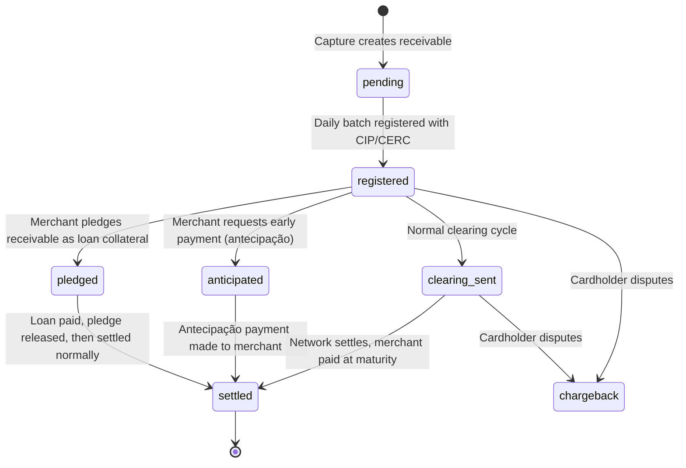

# Double-Entry Ledger Design — Acquirer for Top 5 Bank in Brazil

> **Status:** PROPOSAL — Awaiting Review  
> **Date:** 2026-03-25  
> **Context:** Immutable double-entry bookkeeping ledger for a Brazilian bank-acquirer, handling Visa/MC/Elo clearing, installments (parcelado), and Registradora (CIP/CERC) requirements.  
> **Reference:** [acquirer_design.md — Section 7.6](file:///Users/gabrielpiazzalunga/projects/Messaging.Kafka/Messaging.Kafka/acquirer_design.md)

---

## 1. Design Principles

| Principle | Rationale |
|-----------|-----------|
| **Immutable append-only** | Ledger rows are never updated or deleted. Corrections are posted as new reversing entries. This guarantees a complete audit trail — a Bacen / card network compliance requirement. |
| **Double-entry balanced** | Every journal entry has exactly `SUM(debits) = SUM(credits)`. The system can self-verify integrity at any point by asserting the global invariant: `SUM(all debits) - SUM(all credits) = 0`. |
| **Event-sourced** | Each journal entry is triggered by an upstream domain event (authorization, capture, clearing, settlement). The ledger is a projection of the event stream, not the source of truth for business state. |
| **Installment-native** | Brazilian parcelado creates N receivables from 1 transaction. The ledger must model each installment as a separate receivable line with its own maturity date, clearing lifecycle, and Registradora registration status. |
| **Network-reconcilable** | Every ledger entry carries the network's natural keys (ARN for Visa, DE71 for MC) so the Reconciliation Engine can match internal vs. external records without fuzzy logic. |

---

## 2. Chart of Accounts

The chart is organized by account type. Each account has a **normal balance direction** — the side (debit or credit) that increases it.

### Internal Accounts (Controlled by the Acquirer)

| Account Code | Account Name | Type | Normal Balance | Purpose |
|-------------|-------------|------|---------------|---------|
| `1000` | `auth_holding` | Asset | Debit | Temporary hold on cardholder funds during authorization window |
| `1100` | `charge_captured` | Asset | Debit | Confirmed charges awaiting clearing submission |
| `1200` | `network_receivable` | Asset | Debit | Amounts owed to us by card networks post-clearing |
| `1201` | `network_receivable_installment` | Asset | Debit | Per-installment receivable from the network (one per parcela) |
| `1300` | `acquirer_bank_account` | Asset | Debit | Physical cash in our bank from network settlements |
| `1400` | `merchant_payable` | Liability | Credit | Amounts we owe to merchants (net of MDR) |
| `1401` | `merchant_payable_installment` | Liability | Credit | Per-installment liability to merchant (mirrors 1201) |
| `1500` | `anticipation_payable` | Liability | Credit | Amounts owed to merchants who requested early payment (antecipação) |
| `1600` | `suspense_account` | Liability | Credit | Unidentified network settlements (Recon Scenario C) |
| `2000` | `mdr_revenue` | Revenue | Credit | Merchant Discount Rate fee income |
| `2100` | `interchange_expense` | Expense | Debit | Interchange fees paid to issuers via the network |
| `2200` | `scheme_fee_expense` | Expense | Debit | Visa/MC/Elo scheme/brand fees |
| `2300` | `anticipation_revenue` | Revenue | Credit | Interest income from antecipação (discounted receivables) |
| `2400` | `chargeback_loss` | Expense | Debit | Chargebacks that couldn't be recovered from merchants |

### External Accounts (Not Controlled — Contra-Parties)

| Account Code | Account Name | Type | Normal Balance | Purpose |
|-------------|-------------|------|---------------|---------|
| `9000` | `external_cardholder` | External | Credit | Represents the cardholder's card limit (debit = hold placed) |
| `9100` | `external_merchant_bank` | External | Debit | Represents the merchant's bank account (debit = funds sent) |

---

## 3. Database Schema

### Core Tables

```sql
-- =====================================================
-- ACCOUNTS: Chart of accounts (rarely changes)
-- =====================================================
CREATE TABLE accounts (
    account_id      SMALLINT PRIMARY KEY,
    account_code    TEXT NOT NULL UNIQUE,      -- '1000', '1201', etc.
    account_name    TEXT NOT NULL,
    account_type    TEXT NOT NULL,              -- 'asset', 'liability', 'revenue', 'expense', 'external'
    normal_balance  TEXT NOT NULL,              -- 'debit' or 'credit'
    description     TEXT,
    is_installment  BOOLEAN DEFAULT FALSE,     -- marks accounts that fan-out per parcela
    created_at      TIMESTAMPTZ DEFAULT NOW()
);

-- =====================================================
-- JOURNAL_ENTRIES: One per financial event (immutable, append-only)
-- =====================================================
CREATE TABLE journal_entries (
    entry_id            BIGSERIAL PRIMARY KEY,
    idempotency_key     TEXT NOT NULL UNIQUE,   -- prevents duplicate postings (e.g., 'capture:{txn_id}')
    event_type          TEXT NOT NULL,           -- 'authorization', 'capture', 'clearing_sent', etc.
    event_timestamp     TIMESTAMPTZ NOT NULL,    -- when the business event occurred
    posted_at           TIMESTAMPTZ NOT NULL DEFAULT NOW(),

    -- Transaction identity (the business event that caused this entry)
    transaction_id      UUID NOT NULL,           -- our internal transaction ID
    merchant_id         TEXT NOT NULL,
    merchant_cnpj       TEXT,                    -- Brazilian tax ID

    -- Network reconciliation keys
    network             TEXT NOT NULL,            -- 'visa', 'mastercard', 'elo'
    arn                 TEXT,                      -- Visa: 23-digit Acquirer Reference Number
    network_ref_id      TEXT,                      -- MC: DE71 message number / Elo: equivalent
    authorization_code  TEXT,                      -- 6-digit auth code from issuer

    -- Installment context (NULL for single-payment transactions)
    installment_number  SMALLINT,                 -- 1, 2, 3... up to 12
    installment_total   SMALLINT,                 -- total parcelas (e.g., 12)
    installment_plan_id UUID,                     -- groups all installments from one purchase

    -- Clearing context
    clearing_run_id     INT,                      -- FK to clearing_runs (from outbound architecture)
    clearing_date       DATE,

    -- Amounts (for quick aggregation without joining book_entries)
    gross_amount        NUMERIC(18,2) NOT NULL,   -- original transaction amount
    currency            TEXT NOT NULL DEFAULT 'BRL',

    -- Metadata
    source_system       TEXT,                      -- 'auth_service', 'feed_ingestion', 'recon_engine'
    correlation_id      TEXT,                      -- distributed tracing ID

    CONSTRAINT chk_event_type CHECK (event_type IN (
        'authorization', 'capture', 'void', 'auth_expiry',
        'clearing_sent', 'settlement_received', 'fee_reconciliation',
        'merchant_payout', 'wire_transfer',
        'chargeback', 'chargeback_reversal', 'representment',
        'anticipation_request', 'anticipation_payout',
        'adjustment', 'write_off'
    ))
);

-- Partition by month for performance at scale
-- ALTER TABLE journal_entries ... PARTITION BY RANGE (posted_at);

CREATE INDEX idx_je_transaction  ON journal_entries (transaction_id);
CREATE INDEX idx_je_merchant     ON journal_entries (merchant_id, posted_at);
CREATE INDEX idx_je_arn          ON journal_entries (arn) WHERE arn IS NOT NULL;
CREATE INDEX idx_je_network_ref  ON journal_entries (network_ref_id) WHERE network_ref_id IS NOT NULL;
CREATE INDEX idx_je_clearing     ON journal_entries (clearing_run_id) WHERE clearing_run_id IS NOT NULL;
CREATE INDEX idx_je_installment  ON journal_entries (installment_plan_id, installment_number) 
                                    WHERE installment_plan_id IS NOT NULL;

-- =====================================================
-- BOOK_ENTRIES: Debit/Credit legs of each journal entry (immutable)
-- =====================================================
CREATE TABLE book_entries (
    book_entry_id   BIGSERIAL PRIMARY KEY,
    entry_id        BIGINT NOT NULL REFERENCES journal_entries(entry_id),
    account_id      SMALLINT NOT NULL REFERENCES accounts(account_id),
    entry_type      TEXT NOT NULL,              -- 'debit' or 'credit'
    amount          NUMERIC(18,2) NOT NULL,     -- always positive
    memo            TEXT,

    CONSTRAINT chk_entry_type CHECK (entry_type IN ('debit', 'credit')),
    CONSTRAINT chk_positive_amount CHECK (amount > 0)
);

CREATE INDEX idx_be_entry   ON book_entries (entry_id);
CREATE INDEX idx_be_account ON book_entries (account_id, entry_id);
```

### Integrity Constraints (enforced at application level AND as a periodic DB check)

```sql
-- Verify every journal entry is balanced
-- This query should return ZERO rows if the ledger is healthy
SELECT je.entry_id, 
       SUM(CASE WHEN be.entry_type = 'debit' THEN be.amount ELSE 0 END) AS total_debit,
       SUM(CASE WHEN be.entry_type = 'credit' THEN be.amount ELSE 0 END) AS total_credit
FROM journal_entries je
JOIN book_entries be ON je.entry_id = be.entry_id
GROUP BY je.entry_id
HAVING SUM(CASE WHEN be.entry_type = 'debit' THEN be.amount ELSE 0 END) 
    <> SUM(CASE WHEN be.entry_type = 'credit' THEN be.amount ELSE 0 END);
```

---

## 4. Installment Explosion — How Parcelado Works in the Ledger

This is the most complex part of a Brazilian acquirer ledger. A single cardholder purchase creates N separate financial lifecycles.

### The Explosion

A customer buys a **R$1,200 TV on 12x parcelado (12 installments of R$100)**.

From the **network's perspective** (Visa/MC), this is **12 separate clearing records**, each for R$100, each with its own:
- ARN (Visa) or DE71 (MC)
- Settlement date (monthly)
- Clearing submission

From the **acquirer's perspective**, we must model this as **12 independent receivable lifecycles**, because:
1. Each installment settles on a different date (D+30, D+60, D+90, ...)
2. Each installment must be independently registered with CIP/CERC as a separate receivable
3. The merchant can request antecipação on installments 3-12 while installments 1-2 are already settled
4. A chargeback on installment 5 doesn't affect installments 1-4

### The Installment Plan Table

```sql
CREATE TABLE installment_plans (
    plan_id             UUID PRIMARY KEY DEFAULT gen_random_uuid(),
    transaction_id      UUID NOT NULL,           -- the original auth transaction
    merchant_id         TEXT NOT NULL,
    merchant_cnpj       TEXT NOT NULL,
    network             TEXT NOT NULL,
    card_bin            TEXT NOT NULL,            -- first 6-8 digits
    total_amount        NUMERIC(18,2) NOT NULL,  -- R$1,200.00
    installment_count   SMALLINT NOT NULL,        -- 12
    installment_amount  NUMERIC(18,2) NOT NULL,  -- R$100.00
    currency            TEXT NOT NULL DEFAULT 'BRL',
    authorization_code  TEXT NOT NULL,
    captured_at         TIMESTAMPTZ,
    created_at          TIMESTAMPTZ DEFAULT NOW()
);

CREATE TABLE installment_receivables (
    receivable_id       UUID PRIMARY KEY DEFAULT gen_random_uuid(),
    plan_id             UUID NOT NULL REFERENCES installment_plans(plan_id),
    installment_number  SMALLINT NOT NULL,        -- 1..12
    amount              NUMERIC(18,2) NOT NULL,   -- R$100.00
    maturity_date       DATE NOT NULL,             -- D+30, D+60, etc.

    -- Network identity (populated after clearing)
    arn                 TEXT,                       -- each installment gets its own ARN
    network_ref_id      TEXT,

    -- Clearing lifecycle
    clearing_run_id     INT,
    clearing_date       DATE,
    clearing_status     TEXT NOT NULL DEFAULT 'pending',
    -- pending → clearing_sent → settlement_received → payout_completed

    -- Registradora (CIP/CERC)
    registradora        TEXT,                      -- 'CIP', 'CERC', 'TAG'
    registration_id     TEXT,                      -- ID returned by the registrar
    registration_status TEXT DEFAULT 'pending',    -- pending → registered → pledged → settled
    registered_at       TIMESTAMPTZ,

    -- Antecipação
    anticipated         BOOLEAN DEFAULT FALSE,
    anticipation_date   DATE,
    anticipation_rate   NUMERIC(6,4),              -- e.g., 0.0180 = 1.80% discount
    anticipated_amount  NUMERIC(18,2),             -- amount paid to merchant after discount

    UNIQUE (plan_id, installment_number),
    CONSTRAINT chk_clearing_status CHECK (
        clearing_status IN ('pending', 'clearing_sent', 'settlement_received', 'payout_completed', 'chargeback')
    )
);

CREATE INDEX idx_ir_plan       ON installment_receivables (plan_id);
CREATE INDEX idx_ir_maturity   ON installment_receivables (maturity_date, clearing_status);
CREATE INDEX idx_ir_merchant   ON installment_receivables (plan_id, installment_number);
CREATE INDEX idx_ir_clearing   ON installment_receivables (clearing_run_id) WHERE clearing_run_id IS NOT NULL;
CREATE INDEX idx_ir_registradora ON installment_receivables (registradora, registration_status);
```

### Ledger Flow for a 3x Parcelado Purchase (R$300 = 3 × R$100)

> [!NOTE]
> Simplified to 3 installments for readability. Same pattern applies for 12x.

```
Day 1: Customer pays R$300 on 3x parcelado
━━━━━━━━━━━━━━━━━━━━━━━━━━━━━━━━━━━━━━━━

Step 1: Authorization (single event, full amount)
┌──────────────────────────────────────────────┐
│ Journal Entry: authorization                 │
│ transaction_id: txn_001                      │
│ gross_amount: R$300.00                       │
│ installment_total: 3                         │
├──────────────────────────────────────────────┤
│ Dr  auth_holding         R$300.00            │
│ Cr  external_cardholder  R$300.00            │
└──────────────────────────────────────────────┘

Step 2: Capture (single event, creates installment_plan + 3 receivables)
┌──────────────────────────────────────────────┐
│ Journal Entry: capture                       │
│ installment_plan_id: plan_001                │
│ gross_amount: R$300.00                       │
├──────────────────────────────────────────────┤
│ Dr  charge_captured      R$300.00            │
│ Cr  auth_holding         R$300.00            │
└──────────────────────────────────────────────┘
  → Creates: installment_receivables rows for installments 1, 2, 3
  → Each with maturity_date: D+30, D+60, D+90

Step 3: Registradora sync (no money moves — regulatory event)
  → Each of the 3 receivables is registered with CIP/CERC
  → registration_status: pending → registered
  → No journal entries (informational, not financial)


Day 2: Clearing — Installment 1 (first clearing window after capture)
━━━━━━━━━━━━━━━━━━━━━━━━━━━━━━━━━━━━━━━━━━━━━━━━━━━━━━━━━━━━━━━━

Step 4: Clearing Sent — installment 1 only
┌──────────────────────────────────────────────┐
│ Journal Entry: clearing_sent                 │
│ installment_number: 1, installment_total: 3  │
│ arn: 74000012345678901234 (installment 1 ARN)│
│ clearing_run_id: 999                         │
│ gross_amount: R$100.00                       │
├──────────────────────────────────────────────┤
│ Dr  network_receivable_installment  R$100.00 │
│ Cr  charge_captured                 R$100.00 │
└──────────────────────────────────────────────┘

  ⚠️ charge_captured now has R$200 remaining (installments 2 & 3)


Day 3: Network Settlement — Visa pays for installment 1
━━━━━━━━━━━━━━━━━━━━━━━━━━━━━━━━━━━━━━━━━━━━━━━━━━━

Step 5: Settlement + Fee split
┌──────────────────────────────────────────────┐
│ Journal Entry: settlement_received           │
│ arn: 74000012345678901234                     │
│ gross_amount: R$100.00                       │
├──────────────────────────────────────────────┤
│ Dr  acquirer_bank_account            R$97.00 │
│ Dr  interchange_expense               R$1.50 │
│ Dr  scheme_fee_expense                 R$0.50 │
│ Dr  mdr_revenue (acquirer margin)      R$1.00 │
│ Cr  network_receivable_installment  R$100.00 │
└──────────────────────────────────────────────┘

Wait — this doesn't balance! Let me fix this.
The MDR is revenue (credit-normal), so it should be Cr.

Corrected:
┌──────────────────────────────────────────────┐
│ Dr  acquirer_bank_account            R$97.00 │  ← cash received from network
│ Dr  interchange_expense               R$1.50 │  ← fee to issuer
│ Dr  scheme_fee_expense                 R$0.50 │  ← fee to Visa
│ Cr  network_receivable_installment  R$100.00 │  ← receivable cleared
│                                              │
│ Total Dr: 97 + 1.50 + 0.50 = R$99.00  ❌    │
└──────────────────────────────────────────────┘

Actually, the fee breakdown should be:
- Network pays us R$98.00 (gross minus interchange R$1.50 minus scheme R$0.50)
- We keep R$1.00 as MDR, pass R$97.00 to merchant

Two journal entries at settlement:

Entry A — Network Settlement:
┌──────────────────────────────────────────────┐
│ Dr  acquirer_bank_account            R$98.00 │  ← actual wire received
│ Dr  interchange_expense               R$1.50 │  ← deducted by network
│ Dr  scheme_fee_expense                 R$0.50 │  ← deducted by network
│ Cr  network_receivable_installment  R$100.00 │  ← receivable zeroed
└──────────────────────────────────────────────┘
✅ Dr: 98 + 1.50 + 0.50 = 100.00 = Cr: 100.00

Entry B — Merchant Payout Accrual:
┌──────────────────────────────────────────────┐
│ Dr  merchant_payable_installment     R$97.00 │  ← we owe merchant
│ Cr  acquirer_bank_account            R$97.00 │  ← earmarked from bank
│ (MDR of R$1.00 stays in acquirer_bank_account│
│  as retained revenue)                        │
└──────────────────────────────────────────────┘

Or more precisely, when we recognize the MDR:
┌──────────────────────────────────────────────┐
│ Dr  acquirer_bank_account             R$1.00 │  ← retained
│ Cr  mdr_revenue                       R$1.00 │  ← recognized
│ Dr  merchant_payable_installment     R$97.00 │
│ Cr  acquirer_bank_account            R$97.00 │
└──────────────────────────────────────────────┘

But that double-counts the bank account. The cleanest approach:

SETTLEMENT ENTRY (when network wire arrives):
┌──────────────────────────────────────────────┐
│ Dr  acquirer_bank_account            R$98.00 │
│ Dr  interchange_expense               R$1.50 │
│ Dr  scheme_fee_expense                 R$0.50 │
│ Cr  network_receivable_installment  R$100.00 │
└──────────────────────────────────────────────┘

MDR RECOGNITION (same moment):
┌──────────────────────────────────────────────┐
│ Dr  merchant_payable_installment     R$97.00 │
│ Cr  mdr_revenue                       R$1.00 │
│ Cr  acquirer_bank_account            R$96.00 │
└──────────────────────────────────────────────┘

Hmm, that still doesn't balance correctly. Let me step back.


Day 30: Merchant Payout for installment 1
━━━━━━━━━━━━━━━━━━━━━━━━━━━━━━━━━━━━━━━

Step 6: Wire to Merchant
┌──────────────────────────────────────────────┐
│ Journal Entry: wire_transfer                 │
│ Dr  external_merchant_bank           R$97.00 │
│ Cr  merchant_payable_installment     R$97.00 │
└──────────────────────────────────────────────┘

Installments 2 and 3 repeat the same cycle:
  - Clearing sent at next clearing window
  - Network settles to acquirer bank
  - Fees recognized
  - Merchant paid at maturity (D+60, D+90)
```

> [!IMPORTANT]
> **Self-Criticism: The Settlement Fee Split is Hard**
> 
> The example above shows the messy reality: splitting a R$100 gross transaction into interchange, scheme fees, MDR, and net merchant payout requires **careful journal entry design**. The cleanest pattern is:
> 
> **Option A (3 separate entries per settlement):**
> 1. Network settlement: `Dr bank R$98 + Dr interchange R$1.50 + Dr scheme R$0.50 = Cr receivable R$100`
> 2. Fee accrual: `Dr merchant_payable R$97 = Cr bank R$97` (net of MDR)
> 3. MDR recognition: Implicit — the R$1 remaining in bank IS the MDR
> 
> **Option B (2 entries, explicit MDR line):**
> 1. Network settlement: same as above
> 2. Payout + MDR: `Dr merchant_payable R$97 + Cr mdr_revenue R$1 + Cr bank R$98`
>    This explicitly recognizes the MDR as revenue in the same entry.
> 
> **Recommendation:** Option B — it's more explicit for auditors and generates a clear `mdr_revenue` trail per transaction.

---

## 5. The Agenda de Recebíveis & Registradora Integration

### Why It Matters

Brazilian Bacen regulations (Circular 3952/19, Resolution 264/22) **mandate** that every card receivable be registered with an authorized Registradora (CIP, CERC, or TAG) within D+1 of capture. This enables:

1. **Merchants to use receivables as collateral** for loans from any bank (not just their acquirer)
2. **Prevents double-pledging** — only one financial institution can have a claim on a receivable at a time
3. **Enables antecipação** — the merchant sells future receivables at a discount for immediate cash

### Registradora State Machine



### Daily Registradora File Generation

This is architecturally identical to the clearing file generation from our [Outbound Clearing Architecture](file:///Users/gabrielpiazzalunga/projects/Messaging.Kafka/Messaging.Kafka/outbound_clearing_architecture.md):

```
Same pipeline, different formatter:
  Iceberg partition (network + date)
    → Spark MapReduce
      → CIP/CERC file format (instead of Visa Base II)
      → S3 upload
      → API submission to registrar
```

---

## 6. Network Reconciliation Keys — How We Match

### The Problem

When Visa sends us a settlement file saying "here's R$98 for ARN 74000012345678901234", our Reconciliation Engine must find the **exact** ledger entry that corresponds to this settlement. If it can't match, the money goes to the `suspense_account`.

### The Keys

| Network | Primary Match Key | Secondary Match Key | Fallback |
|---------|-------------------|---------------------|----------|
| **Visa** | ARN (23-digit) | Authorization Code + Date + Amount | Merchant ID + Amount + Date range (fuzzy) |
| **Mastercard** | DE71 (Message Number) + PDS0105 (File ID) | Authorization Code + Date + Amount | Same fuzzy match |
| **Elo** | Elo Reference Number (ERN) | Authorization Code + Date + Amount | Same fuzzy match |

### ARN Structure (Visa)

```
ARN: 7 4000 0123 4567 8901 2345
     │ │    │              │
     │ │    │              └── Sequential transaction counter
     │ │    └── Encrypted transaction-specific data
     │ └── Acquirer BIN (6-8 digits)
     └── Network ID (7 = Visa)
```

**The ARN is generated by us (the acquirer) at capture time** and included in the clearing file we send to Visa. When Visa sends back the settlement file, it echoes our ARN. This is our primary reconciliation key.

### Mastercard DE Fields for Reconciliation

| DE | Name | Purpose |
|----|------|---------|
| DE 2 | PAN | Card number (masked) — for matching to our auth |
| DE 4 | Amount, Transaction | Gross amount in the clearing |
| DE 25 | Message Reason Code | Indicates if this is a first presentment, chargeback, fee, etc. |
| DE 31 | Acquirer Reference Data | Our internal reference (like Visa's ARN but acquirer-defined) |
| DE 71 | Message Number | Sequential message number within the file — our primary match key |
| PDS 0105 | File ID | Uniquely identifies the IPM file (for file-level matching) |

---

## 7. Criticism & Risks

> [!CAUTION]
> **Criticism 1: The installment_receivables table will be enormous**
> 
> With 10M transactions/day × avg 5 installments = **50M receivable rows/day** = **1.5B rows/month**. PostgreSQL can handle this with proper partitioning (by `maturity_date`), but:
> - The `clearing_status` column is mutable (violates immutability principle)
> - The `registration_status` column is mutable
> - These are **operational state** on what is otherwise an append-only design
> 
> **Mitigation:** Accept this pragmatic trade-off. The `installment_receivables` table is an **operational table**, not an accounting table. The `journal_entries` and `book_entries` tables remain strictly immutable. State changes on receivables are reflected in the ledger via new journal entries (e.g., clearing_sent creates a journal entry AND updates the receivable's clearing_status).

> [!CAUTION]
> **Criticism 2: The fee split muddles the double-entry purity**
> 
> In the real world, you don't know the exact interchange rate until the network settles. At capture time, you commit R$100 to `charge_captured`, but you don't yet know if interchange will be R$1.50 or R$1.65 (it depends on card type, MCC, cross-border status, etc.).
> 
> **Mitigation:** At capture/clearing_sent, book the full gross amount as `network_receivable`. Only split into interchange/scheme/MDR at settlement_received time — when the network tells you the actual fees. This means the fee accounts are zero-balance until settlement, which is correct.

> [!WARNING]
> **Criticism 3: Registradora is a second, independent lifecycle**
> 
> The receivable has TWO parallel state machines: the **clearing lifecycle** (pending → clearing_sent → settled) and the **Registradora lifecycle** (pending → registered → pledged/anticipated → settled). These are loosely coupled — a receivable can be registered but not yet cleared, or cleared but not yet registered (if the Registradora batch fails).
> 
> **Mitigation:** Keep both statuses on the same `installment_receivables` row but treat them as independent concerns. The Registradora lifecycle is non-financial (no journal entries) — it's a regulatory metadata concern. Only the clearing lifecycle generates ledger entries.

> [!WARNING]
> **Criticism 4: Antecipação creates a complex receivable chain**
> 
> When a merchant requests antecipação for installments 6-12, the acquirer effectively buys those future receivables at a discount. This requires:
> 1. A journal entry moving the receivable from `merchant_payable_installment` to `anticipation_payable`
> 2. A discount (interest) recognition entry to `anticipation_revenue`
> 3. Updating the Registradora with the new ownership (the acquirer now owns the receivable, not the merchant)
> 4. When the network eventually settles installment 6, the acquirer keeps the cash (it already paid the merchant)
> 
> **Mitigation:** Model antecipação as a separate journal event type. The discount rate and anticipated amount are captured on the `installment_receivables` row. The ledger entries are straightforward double-entry — just more of them.

> [!NOTE]
> **Criticism 5: Should we use a dedicated ledger database?**
> 
> Companies like Modern Treasury and Stripe use purpose-built ledger databases (TigerBeetle, custom solutions) for sub-millisecond posting. For a top 5 bank, PostgreSQL partitioned by month can handle the volume, but consider:
> - **TigerBeetle** — purpose-built for double-entry, supports 1M+ entries/sec on a single node
> - **FoundationDB** — used by Apple for payments, ACID with horizontal scale
> 
> **Recommendation:** Start with PostgreSQL. It's battle-tested, your team knows it, and partitioning handles the volume. Evaluate TigerBeetle if you hit >100M journal entries/day.

---

## 8. Summary — What Gets Created

| Table | Type | Rows/Day Estimate | Immutable? |
|-------|------|-------------------|------------|
| `accounts` | Reference | ~25 rows total | Yes (rarely changes) |
| `journal_entries` | Ledger (append-only) | ~30-50M | **Yes — never updated** |
| `book_entries` | Ledger (append-only) | ~60-100M (2 legs per entry minimum) | **Yes — never updated** |
| `installment_plans` | Operational | ~2M (10M txn × 20% parcelado) | Yes (created once) |
| `installment_receivables` | Operational | ~50M (5 avg installments × 10M) | No (status columns mutate) |

### How This Connects to Clearing

The CDC connector from our [Outbound Clearing Architecture](file:///Users/gabrielpiazzalunga/projects/Messaging.Kafka/Messaging.Kafka/outbound_clearing_architecture.md) should watch **both**:
1. `journal_entries` — for `event_type = 'capture'` rows (these feed the Iceberg data lake for clearing file generation)
2. `installment_receivables` — for `clearing_status` changes (these feed the Registradora pipeline)

The Debezium connector config should be updated to:
```json
"table.include.list": "public.journal_entries,public.installment_receivables"
```

With appropriate SMT filters for each downstream consumer.
