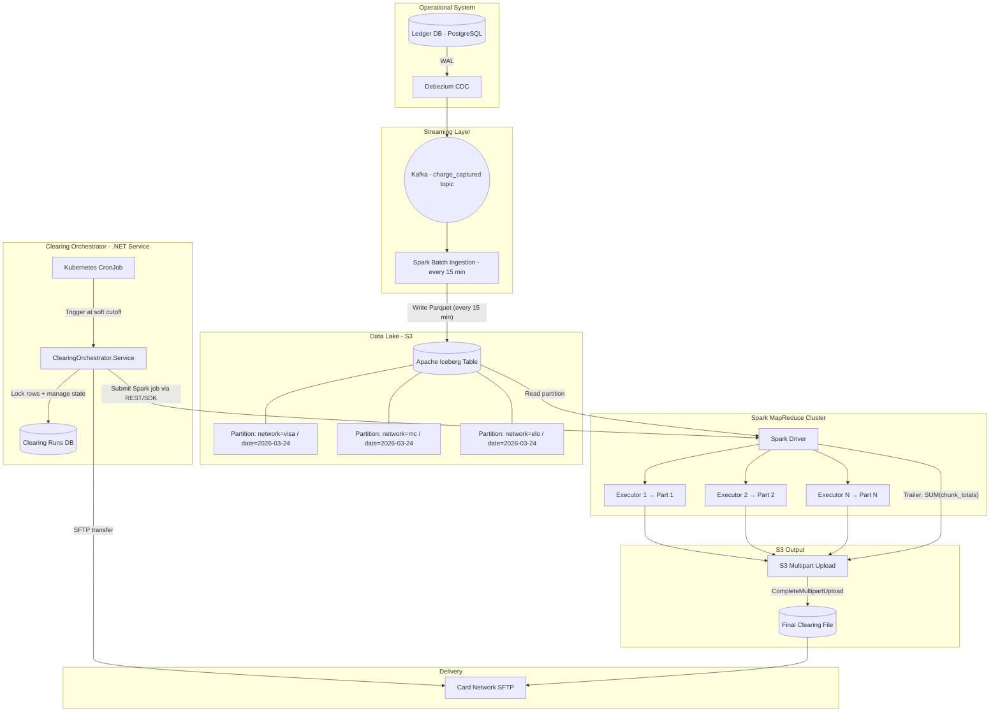
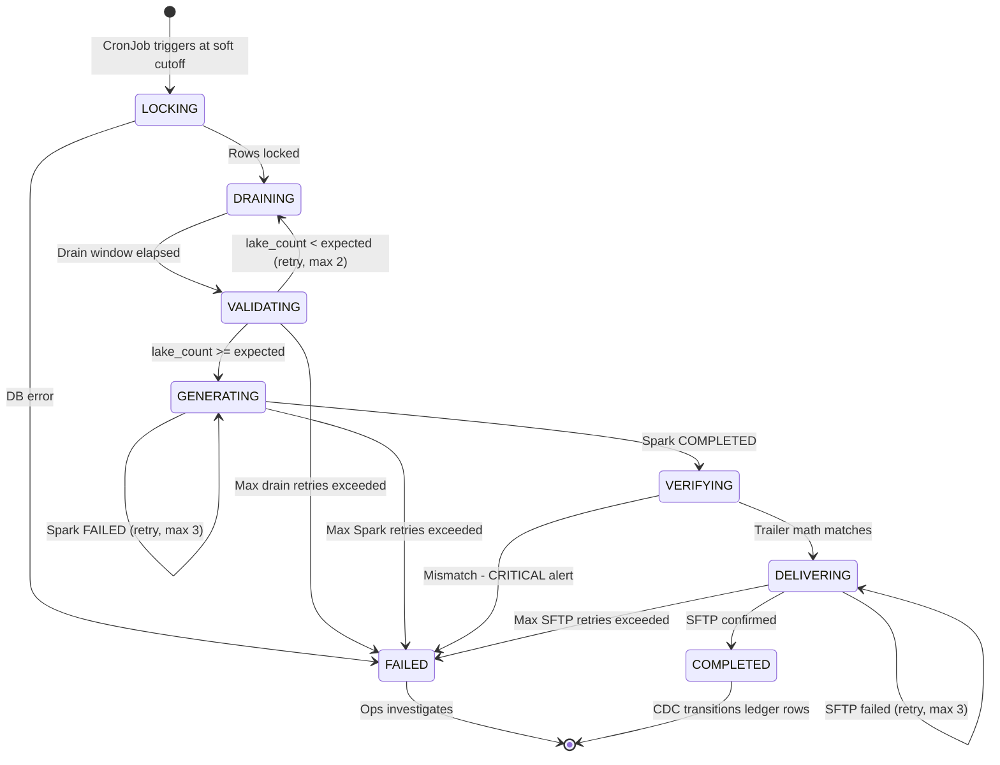

# Architecture Decision Record: Outbound Clearing File Service

> **Status:** APPROVED  
> **Date:** 2026-03-24  
> **Context:** Top 5 bank in Brazil — acquirer clearing pipeline for Visa, Mastercard, Elo  
> **Reference:** [acquirer_design.md](file:///Users/gabrielpiazzalunga/projects/Messaging.Kafka/Messaging.Kafka/acquirer_design.md) (Sections 7.10)

---

## Decision Summary

| Concern | Decision |
|---------|----------|
| **Architecture style** | Uber-style Distributed MapReduce + CDC data lake |
| **Data lake format** | Apache Iceberg on S3 (Parquet columnar storage) |
| **Iceberg catalog** | JDBC Catalog on PostgreSQL (same DB, local and production) |
| **Object storage** | AWS S3 (production) / MinIO (local K8s) |
| **CDC pipeline** | Debezium → Kafka → Spark batch ingestion (every 15 min) |
| **File generation** | Apache Spark MapReduce → S3 Multipart Upload |
| **Spark cluster** | Native K8s mode (`--master k8s://`), dynamic Executor pods |
| **Orchestrator** | .NET `BackgroundService` triggered by Kubernetes CronJob |
| **Cutoff strategy** | Soft cutoff (T-35 min before network hard deadline) |
| **Row locking** | Run ID staging pattern (bulk `UPDATE SET clearing_run_id`) |
| **Delivery** | SFTP via SSH.NET / Renci to card network |

---

## 1. High-Level Architecture



---

## 2. Data Flow — Step by Step

### Phase 1: Continuous CDC Ingestion (runs 24/7)

```
Ledger DB (charge_captured row)
  → Debezium reads WAL (~100ms delay)
  → Publishes to Kafka topic: clearing.charge_captured
  → Spark batch job (every 15 min) reads Kafka
  → Writes Parquet files to Iceberg table
     partitioned by (network, clearing_date)
  → Data queryable in lake within ~19 min worst case
```

**Iceberg table schema:**
```sql
CREATE TABLE clearing_lake.captured_transactions (
    transaction_id      STRING,
    network             STRING,     -- 'visa', 'mastercard', 'elo'
    clearing_date       DATE,
    merchant_id         STRING,
    acquirer_ref_number STRING,     -- ARN (natural idempotency key)
    amount_cents        BIGINT,
    currency            STRING,
    captured_at         TIMESTAMP,
    card_bin            STRING,
    installment_number  INT,        -- Brazil: 1-12 for parcelado
    installment_total   INT,
    raw_payload         BINARY      -- original protobuf/avro for formatting
)
PARTITIONED BY (network, clearing_date);
```

### Phase 2: Clearing Run (triggered daily at soft cutoff)

**Timeline with 15-minute ingestion and 4:00 PM EST hard cutoff:**

```
3:25 PM EST ─── SOFT CUTOFF
                ├── Orchestrator starts
                ├── INSERT clearing_run (id=999, status=LOCKING)
                ├── UPDATE ledger SET clearing_run_id=999
                │   WHERE status='captured'
                │     AND clearing_run_id IS NULL
                │     AND captured_at < '2026-03-24T20:25:00Z'
                └── Result: 18,432,991 rows locked

3:25-3:40 PM ── DRAIN WINDOW (15 min, configurable)
                ├── Spark ingestion batch at 3:30 PM picks up
                │   last CDC events from before cutoff
                └── All data now in Iceberg

3:40 PM ─────── VALIDATION
                ├── Query Iceberg: SELECT COUNT(*)
                │   WHERE network='visa' AND clearing_date=today
                ├── Compare: lake_count >= expected_count? ✅
                └── If not: extend drain (max 2 retries)

3:40-3:55 PM ── SPARK MAPREDUCE
                ├── Submit Spark job via REST API / EMR SDK
                ├── Driver reads Iceberg partition metadata
                │   → 20M rows across N Parquet files
                ├── Partitions into 100 chunks of 200K rows
                ├── Pre-assigns sequence numbers:
                │   Executor 1: lines 1-200,000
                │   Executor 2: lines 200,001-400,000
                │   ...
                ├── Each Executor:
                │   1. Reads its Parquet chunk
                │   2. Formats to Visa Base II fixed-width
                │   3. Uploads to S3 as Multipart Part
                │   4. Returns (chunk_count, chunk_amount)
                ├── Driver computes:
                │   total = SUM(chunk_amounts)
                │   count = SUM(chunk_counts)
                ├── Generates Header (Part 0) + Trailer (final Part)
                └── Calls CompleteMultipartUpload → S3 stitches file

3:55 PM ─────── VERIFICATION
                └── trailer_count == expected_count? ✅

3:55-4:00 PM ── DELIVERY
                ├── SFTP transfer to card network
                └── Update clearing_run → COMPLETED

4:00 PM ─────── NETWORK HARD CUTOFF ✅ (5 min headroom)
```

### Phase 3: Post-Clearing (async)

```
After COMPLETED:
  → CDC picks up clearing_run status change
  → Async job transitions ledger rows:
      UPDATE ledger SET status='clearing_sent'
      WHERE clearing_run_id = 999
  → Clearing Outbound topic publishes confirmation events
  → Balance Service updates merchant balances
```

---

## 3. The Clearing Orchestrator (.NET Service)

### State Machine



### Technology Stack

| Component | Technology | Notes |
|-----------|-----------|-------|
| **Service** | .NET 8 `BackgroundService` | Triggered by K8s CronJob |
| **State persistence** | PostgreSQL (`clearing_runs` table) | Crash-safe: resumes from last completed step |
| **Spark submission** | `spark-submit --master k8s://` via `Process.Start()` | Or K8s .NET SDK to create Spark Driver pod directly |
| **Spark monitoring** | Poll K8s pod status via K8s API (`KubernetesClient`) | Watch Driver pod phase: Running → Succeeded/Failed |
| **SFTP delivery** | SSH.NET (Renci) | Checksum verification post-transfer |
| **Alerting** | PagerDuty / Slack webhook | On any `FAILED` state transition |

### Database Schema

```sql
CREATE TABLE clearing_runs (
    id                  SERIAL PRIMARY KEY,
    network             TEXT NOT NULL,          -- 'visa', 'mastercard', 'elo'
    clearing_date       DATE NOT NULL,
    status              TEXT NOT NULL,          -- LOCKING, DRAINING, VALIDATING, etc.
    cutoff_timestamp    TIMESTAMPTZ NOT NULL,
    expected_count      BIGINT,
    actual_count        BIGINT,
    expected_amount     NUMERIC(18,2),
    actual_amount       NUMERIC(18,2),
    spark_app_id        TEXT,
    s3_file_path        TEXT,
    sftp_transfer_id    TEXT,
    error_message       TEXT,
    retry_count         INT DEFAULT 0,
    created_at          TIMESTAMPTZ DEFAULT NOW(),
    completed_at        TIMESTAMPTZ,
    UNIQUE (network, clearing_date)
);

-- The run lock on the ledger
ALTER TABLE ledger ADD COLUMN clearing_run_id INT REFERENCES clearing_runs(id);
CREATE INDEX idx_ledger_clearing_run ON ledger (clearing_run_id) WHERE clearing_run_id IS NOT NULL;
```

### Graduation Path

Start with the .NET `BackgroundService`. Graduate to **Temporal** or **Airflow** when:
- You operate **10+ clearing pipelines** (Visa, MC, Elo, Hipercard, PIX, CIP, CERC, Tag, Nuclea)
- You need **human approval gates** (compliance sign-off before SFTP)
- You need **cross-pipeline dependencies** (e.g., Registradora waits for Visa clearing)

---

## 4. Sizing & Configuration

### Soft Cutoff Buffer (Configurable)

| Parameter | Default | Environment Variable |
|-----------|---------|---------------------|
| Ingestion frequency | 15 min | `CLEARING_INGESTION_INTERVAL_MIN` |
| Drain window | 15 min | `CLEARING_DRAIN_WINDOW_MIN` |
| Spark processing budget | 15 min | `CLEARING_SPARK_BUDGET_MIN` |
| Safety margin | 5 min | `CLEARING_SAFETY_MARGIN_MIN` |
| **Total buffer** | **35 min** | Computed |

**The soft cutoff is calculated as:**
```
soft_cutoff = network_hard_cutoff - (ingestion_interval + drain_window + spark_budget + safety_margin)
```

### Spark Chunk Sizing

| Parameter | Default | Rationale |
|-----------|---------|-----------|
| Rows per chunk | 200,000 | ~20MB memory per Executor, well above S3 5MB min part |
| Max Executors | 100 | Handles 20M rows in ~72 seconds |
| Max S3 parts | 10,000 | S3 hard limit; 100 chunks << 10,000 |

### Iceberg Catalog & Table Configuration

**Catalog:** JDBC on PostgreSQL (works identically in local and production).
The catalog stores only lightweight metadata (table definitions, partition specs, snapshot pointers) — typically tens to hundreds of rows. All heavy data (Parquet files) lives in S3/MinIO. PostgreSQL is queried once at Spark job startup to resolve file locations, not during data processing.

```properties
# Spark configuration for Iceberg JDBC catalog
spark.sql.catalog.clearing                       = org.apache.iceberg.spark.SparkCatalog
spark.sql.catalog.clearing.type                   = jdbc
spark.sql.catalog.clearing.uri                    = jdbc:postgresql://postgres:5432/iceberg_catalog
spark.sql.catalog.clearing.jdbc.user              = postgres
spark.sql.catalog.clearing.jdbc.password           = ${POSTGRES_PASSWORD}
spark.sql.catalog.clearing.warehouse              = s3a://clearing-lake/warehouse
spark.sql.catalog.clearing.io-impl                = org.apache.iceberg.aws.s3.S3FileIO

# Local (MinIO)
spark.hadoop.fs.s3a.endpoint                      = http://minio:9000
spark.hadoop.fs.s3a.access.key                    = minioadmin
spark.hadoop.fs.s3a.secret.key                    = minioadmin
spark.hadoop.fs.s3a.path.style.access             = true

# Production (AWS S3) — remove the endpoint override, use IAM roles
# spark.hadoop.fs.s3a.aws.credentials.provider = com.amazonaws.auth.InstanceProfileCredentialsProvider
```

**Iceberg table properties:**
```
write.format.default = parquet
write.parquet.compression-codec = zstd
write.target-file-size-bytes = 134217728    -- 128 MB per Parquet file
write.metadata.delete-after-commit.enabled = true
```

---

## 5. Failure & Recovery

| Failure | Impact | Recovery |
|---------|--------|----------|
| **Spark Executor crash** | One chunk not uploaded | Spark retries the task automatically |
| **Spark Driver crash** | Entire job fails | Orchestrator retries (max 3). S3 parts from previous attempt are abandoned. |
| **Orchestrator crash** | Pipeline stalls | K8s restarts the pod. Service reads `clearing_run.status` and resumes. |
| **SFTP failure** | File not delivered | Orchestrator retries (max 3). File is idempotent — same run_id = same file. |
| **Lake data missing** | Validation fails | Orchestrator extends drain window (max 2 retries), then alerts ops. |
| **Trailer mismatch** | Data corruption suspected | **CRITICAL alert.** Ops must investigate before manual retry. |
| **Total pipeline failure** | No clearing file sent | Ops nulls `clearing_run_id` on ledger rows, fixes root cause, re-triggers. Transactions go into next day's file. |

---

## 6. Why This Architecture (Decision Rationale)

| Alternative Considered | Why Rejected |
|------------------------|-------------|
| **Monolithic batch query** | Deep OFFSET pagination kills DB at 20M+ rows. Cannot resume on crash. |
| **Stripe CDC Outbox (single-node)** | Works for 1-5M rows/day. Brazil's installment explosion (12x) pushes to 40-80M — needs distributed processing. |
| **Continuous S3 Materialization** (our proposed hybrid) | Elegant, but crash-induced duplicate S3 parts risk double-billing. No atomic commit between S3 and Kafka. Sequence numbering requires Redis serialization. |
| **Streaming (Flink/Spark Streaming)** for CDC ingestion | Over-engineered for MVP. 15-min batch achieves T-35 cutoff, which is acceptable. Graduate later if needed. |

**The Uber approach wins because:**
1. **Scale** — Handles Brazil's 40-80M receivables/day with horizontal Spark parallelism.
2. **Shared data lake** — Same Iceberg table feeds clearing, Registradoras, anticipation pricing, and analytics.
3. **Simplicity** — The .NET orchestrator is just a state machine polling Spark. No complex consumer coordination.
4. **Sequence numbers solved natively** — Spark Driver pre-assigns ranges. No Redis needed.
5. **Fault tolerance** — Spark retries individual Executor failures. Orchestrator retries entire jobs. Run lock guarantees exactly-once inclusion.

---

## 7. Local Development Infrastructure

| Production Service | Local K8s Equivalent | Notes |
|---|---|---|
| AWS S3 | **MinIO** (`minio/minio:latest`) | S3-compatible, supports Multipart Upload |
| AWS Glue / Catalog | **JDBC Catalog on PostgreSQL** | Same as production — just different S3 endpoint |
| AWS EMR / Databricks | **Spark on K8s** (`apache/spark:3.5.1`) | `--master k8s://`, dynamic Executor pods |
| Kafka | (existing) | Already deployed |
| Redis | (existing) | Already deployed |
| PostgreSQL | (existing) | Already deployed — add `iceberg_catalog` database |

**New manifests needed:**
- `eng/manifests-kraft/minio.yaml` — MinIO deployment + service (ports 9000 API, 9001 console)

---

## 8. Implementation Roadmap

### Phase 1: Infrastructure (Week 1-2)
- [ ] Create `eng/manifests-kraft/minio.yaml` (MinIO S3-compatible storage)
- [ ] Create `iceberg_catalog` database in existing PostgreSQL for JDBC catalog
- [ ] Create Iceberg table with partition schema `(network, clearing_date)`
- [ ] Configure Debezium CDC connector for `charge_captured` events
- [ ] Write Spark ingestion job (Kafka → Iceberg, 15-min scheduled)
- [ ] Validate local Spark-on-K8s with a trivial test job (`--master k8s://`)

### Phase 2: Clearing File Generator (Week 3-4)
- [ ] Write Spark MapReduce job (Iceberg partition → Visa Base II format → S3 Multipart)
- [ ] Implement sequence number pre-assignment in Spark Driver
- [ ] Implement trailer computation (reduce phase)
- [ ] Write unit tests with sample Visa Base II golden files

### Phase 3: Orchestrator Service (Week 4-5)
- [ ] Create `ClearingOrchestrator.Service` (.NET 8)
- [ ] Implement state machine with PostgreSQL persistence
- [ ] Implement Spark job submission (`spark-submit --master k8s://` via Process or K8s SDK)
- [ ] Implement SFTP delivery (SSH.NET)
- [ ] Implement retry logic + alerting
- [ ] Create `clearing_runs` table migration
- [ ] Create Kubernetes CronJob manifest

### Phase 4: Validation & Go-Live (Week 5-6)
- [ ] End-to-end test with synthetic 1M-row clearing run
- [ ] Validate trailer math against expected totals
- [ ] Verify SFTP transfer to sandbox network endpoint
- [ ] Load test with 20M rows to validate Spark cluster sizing
- [ ] Deploy to staging with real CDC data (shadow mode — generate but don't send)
- [ ] Production go-live with Visa, then MC, then Elo
