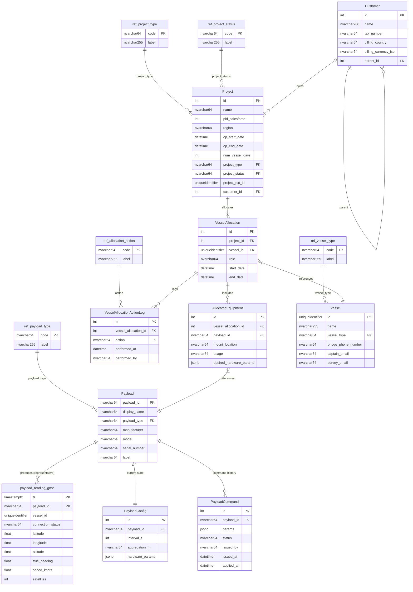

### Entity Relationship Diagram

```mermaid
erDiagram

    %% ── Reference tables ─────────────────────────────────────────────────────

    ref_vessel_type {
        nvarchar64 code PK
        nvarchar255 label
    }

    ref_payload_type {
        nvarchar64 code PK
        nvarchar255 label
    }

    ref_project_type {
        nvarchar64 code PK
        nvarchar255 label
    }

    ref_project_status {
        nvarchar64 code PK
        nvarchar255 label
    }

    ref_allocation_action {
        nvarchar64 code PK
        nvarchar255 label
    }

    %% ── OI Ops domain ────────────────────────────────────────────────────────

    Customer {
        int id PK
        nvarchar200 name
        nvarchar64 tax_number
        nvarchar64 billing_country
        nvarchar64 billing_currency_iso
        int parent_id FK
    }

    Project {
        int id PK
        nvarchar64 name
        int pid_salesforce
        nvarchar64 region
        datetime op_start_date
        datetime op_end_date
        int num_vessel_days
        nvarchar64 project_type FK
        nvarchar64 project_status FK
        uniqueidentifier project_ext_id
        int customer_id FK
    }

    VesselAllocation {
        int id PK
        int project_id FK
        uniqueidentifier vessel_id FK
        nvarchar64 role
        datetime start_date
        datetime end_date
    }

    %% Chronological log of actions performed against an allocation.
    VesselAllocationActionLog {
        int id PK
        int vessel_allocation_id FK
        nvarchar64 action FK
        datetime performed_at
        nvarchar64 performed_by
    }

    AllocatedEquipment {
        int id PK
        int vessel_allocation_id FK
        nvarchar64 payload_id FK
        nvarchar64 mount_location
        nvarchar64 usage
        jsonb desired_hardware_params
    }

    %% ── Cross-cutting layer ───────────────────────────────────────────────────

    Vessel {
        uniqueidentifier id PK
        nvarchar255 name
        nvarchar64 vessel_type FK
        nvarchar64 bridge_phone_number
        nvarchar64 captain_email
        nvarchar64 survey_email
    }

    Payload {
        nvarchar64 payload_id PK
        nvarchar64 display_name
        nvarchar64 payload_type FK
        nvarchar64 manufacturer
        nvarchar64 model
        nvarchar64 serial_number
        nvarchar64 label
    }

    %% representative — one hypertable per payload type
    payload_reading_gnss {
        timestamptz ts PK
        nvarchar64 payload_id PK
        uniqueidentifier vessel_id
        nvarchar64 connection_status
        float latitude
        float longitude
        float altitude
        float true_heading
        float speed_knots
        int satellites
    }

    PayloadConfig {
        int id PK
        nvarchar64 payload_id FK
        int interval_s
        nvarchar64 aggregation_fn
        jsonb hardware_params
    }

    PayloadCommand {
        int id PK
        nvarchar64 payload_id FK
        jsonb params
        nvarchar64 status
        nvarchar64 issued_by
        datetime issued_at
        datetime applied_at
    }

    %% ── Relationships ────────────────────────────────────────────────────────

    %% Reference tables
    ref_vessel_type ||--o{ Vessel : "vessel_type"
    ref_payload_type ||--o{ Payload : "payload_type"
    ref_project_type ||--o{ Project : "project_type"
    ref_project_status ||--o{ Project : "project_status"
    ref_allocation_action ||--o{ VesselAllocationActionLog : "action"

    %% OI Ops domain
    Customer ||--o{ Customer : "parent"
    Customer ||--o{ Project : "owns"
    Project ||--|{ VesselAllocation : "allocates"
    VesselAllocation ||--o{ VesselAllocationActionLog : "logs"
    VesselAllocation ||--o{ AllocatedEquipment : "includes"

    %% OI Ops ↔ Cross-cutting boundary
    VesselAllocation }|--|| Vessel : "references"
    AllocatedEquipment }|--|| Payload : "references"

    %% Cross-cutting layer
    Payload ||--o{ payload_reading_gnss : "produces (representative)"
    Payload ||--|| PayloadConfig : "current state"
    Payload ||--o{ PayloadCommand : "command history"
```
