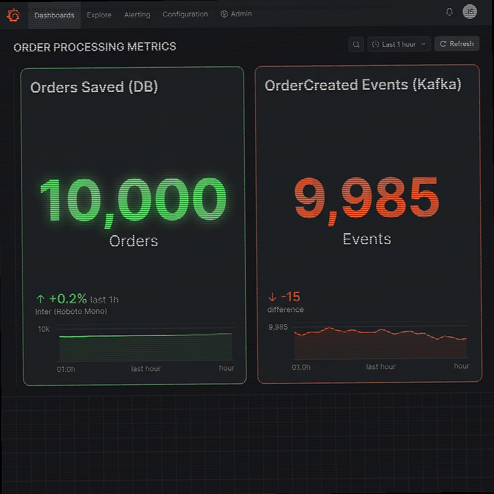
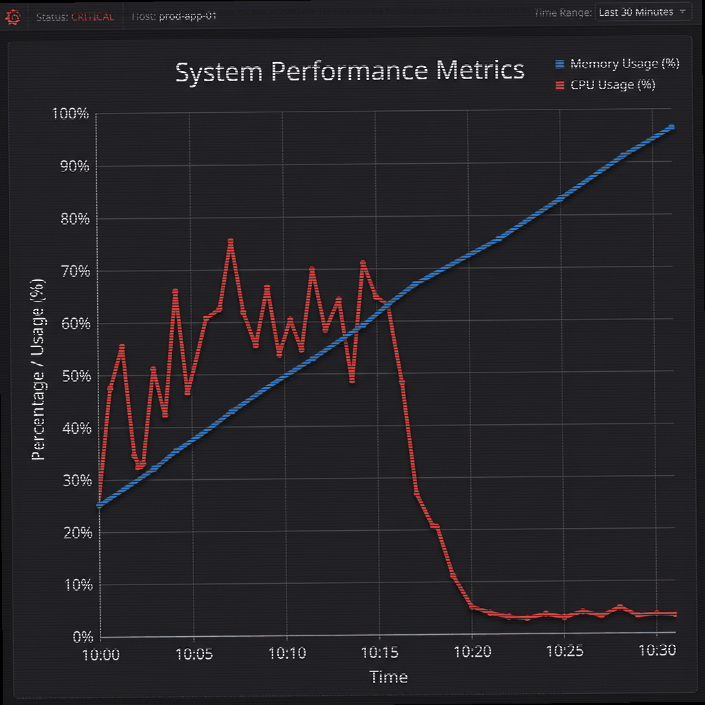
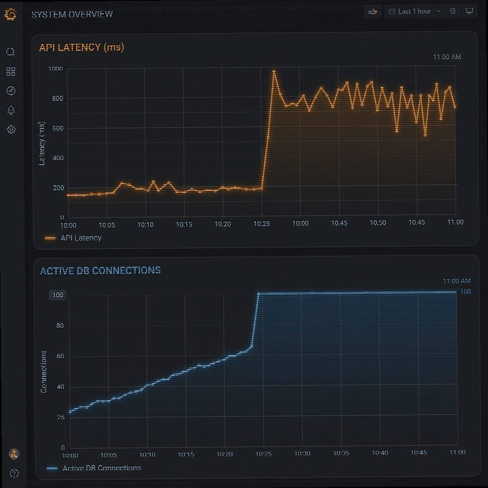
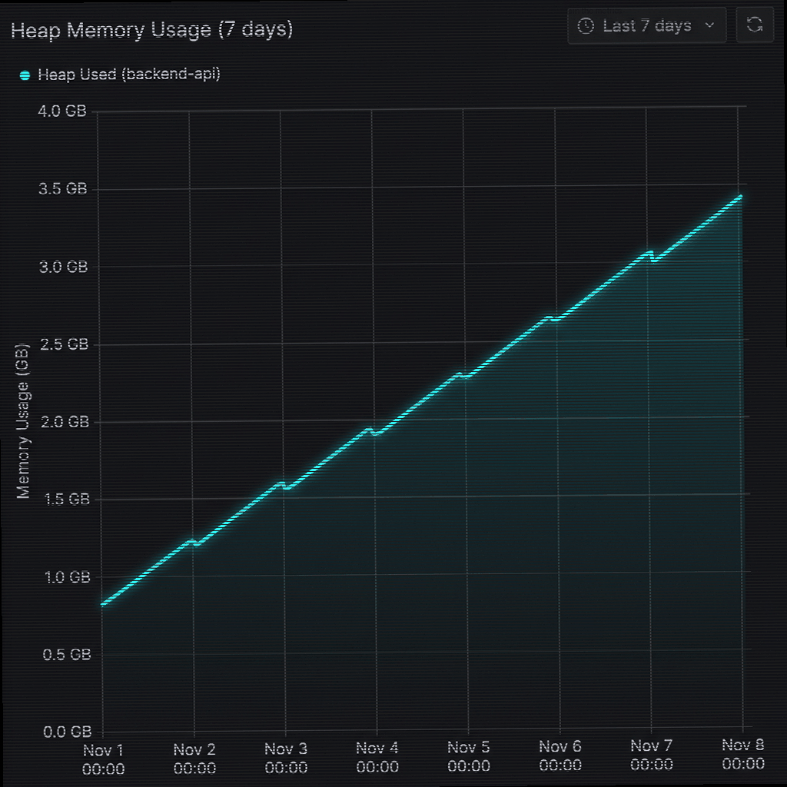

# Senior Software Engineer Interview Guide (1 Hour)

**Interviewer Training Note:** *This document serves as your pacing guide for a 1-hour interview. Stick to the time boxes below to ensure you get a complete signal on the candidate. The "Choose Your Adventure" section allows candidates to shine in their strongest domain, while the live coding ensures they can translate concepts into working code.*
## 1. Intro & Background (5-10 mins)
*   Brief introduction about yourself and the company.
*   "To start off, please take a minute to tell me about your technical background and a recent complex system you designed or scaled."

---

## 2. "Choose Your Adventure": Architectural Scenarios (15-20 mins)
*Ask the candidate where they feel most comfortable and present the corresponding scenario. This evaluates practical debugging and system design skills.*

### Option A: Event-Driven Design (Kafka & Async)
*   **Scenario:** Show the candidate the Dual-Write Discrepancy dashboard.
    
*   **Question:** "Our checkout service saves an order to the Postgres database, and then immediately publishes an `OrderCreated` event to Kafka. Looking at this dashboard over a 24-hour period, we have a discrepancy. What causes this, and how would you redesign the system to guarantee 100% consistency?"
*   **What to look for:** They should instantly recognize the "Dual Write" anti-pattern. If the DB commits but the network call to Kafka fails, the event is lost. They should suggest the **Transactional Outbox Pattern**: writing the event to an `outbox` table in the same DB transaction, and using a separate worker (or CDC tool like Debezium) to relay it to Kafka.

### Option B: Regular API / Backend Internals
*   **Scenario:** Show the candidate the Thread Exhaustion dashboard.
    
*   **Question:** "Looking at this dashboard from an unresponsive application, what do you think is happening? Why did the CPU drop if requests are still coming in?"
*   **Why this indicates Thread Exhaustion:**
    *   **CPU Drops:** When a system runs out of available threads, it's usually because all existing threads are blocked waiting for an external resource (e.g., a slow DB, a hanging API). Since they are just waiting and not executing instructions, CPU usage plummets.
    *   **Memory Climbs:** New requests keep arriving and are placed into an internal queue (consuming memory). If the thread pool is unbounded, the system spawns new idle threads, consuming stack memory. 
    *   *(Note: Thread exhaustion is also often a side-effect of a severe **Memory Leak**. If the application is constantly out of memory, it may spend all its CPU cycles doing "Stop-The-World" Garbage Collection, which freezes threads and backs up the system).*
*   **How to Tackle It:**
    *   *Short-term:* Increase the thread pool size or restart the instance.
    *   *Long-term:* Implement Timeouts, Circuit Breakers, or switch to Asynchronous I/O.

### Option C: Database Architecture
*   **Scenario:** Show the candidate the Connection Pool dashboard.
    
*   **Question:** "Our API latency suddenly spiked. We checked the DB dashboard and saw the active connections climbing and then flatlining at exactly 100. Is the database CPU/Disk the bottleneck here? What else could be causing this?"
*   **What to look for:** Identifying **Connection Pool Exhaustion**. A hard, flat ceiling usually means the app hit its maximum configured connection limit. A senior engineer will point out that the database itself might be totally fine; the issue could be an application-side **connection leak** (forgetting to close connections), or an **N+1 query** bug where a single request hoards a connection for too long.

### Option D: Memory & Runtime Internals
*   **Scenario:** Show the candidate the Heap Memory dashboard.
    
*   **Question:** "This is the heap memory usage of our backend over a week. What does this pattern tell you, and what specific steps would you take to find the root cause?"
*   **What to look for:** Identifying a classic **Memory Leak** (the "staircase" lacks the normal sawtooth pattern of healthy Garbage Collection). For troubleshooting, they should suggest triggering a **Heap Dump**, loading it into a memory profiler (like dotMemory or equivalent), and looking for the "GC Roots" holding onto large objects (e.g., static collections, un-unregistered event listeners).

---

## 3. General Technical Knowledge (Rapid Fire) (5 mins)
*(Pick 1 or 2 to test breadth if time allows before moving to coding)*
*   **Stack vs. Heap:** What's the difference? When would an allocation end up on the heap? (Stack is fast, contiguous, short-lived; Heap is dynamic, requires GC).
*   **Process vs. Thread:** Difference in memory isolation and context switching overhead.
*   **Composition vs. Inheritance:** Why favor composition? (Avoids fragile base classes, tight coupling).
*   **Database Isolation Levels:** Give an example of a problem that occurs at Read Committed that wouldn't happen at Serializable (e.g., Phantom reads).

---

## 4. Live Coding: Transactional Key-Value Store (25-30 mins)
*This is an excellent, scalable coding question. It tests data structures, state management, and refactoring skills as constraints are added.*

**Phase 1: Basic Operations**
Design an in-memory key-value store with the following methods:
*   `INSERT(key, value)`: Stores the value for a new key. Returns an error if the key already exists.
*   `UPDATE(key, value)`: Updates the value for an existing key. Returns an error if the key does not exist.
*   `GET(key)`: Returns the value for the given key, or null if it doesn't exist.
*   `DELETE(key)`: Removes the key from the store. Returns an error if the key does not exist.
*   *What to look for:* Quick 5-minute warm-up using a Hash Map. Splitting into INSERT/UPDATE forces candidates to handle existence checks early.

**Phase 2: Transactions (Non-Nested)**
Add support for transactions with the following methods:
*   `BEGIN()`: Starts a transaction. *If a transaction is already active, return an error (no nesting allowed yet).*
*   `COMMIT()`: Applies all changes made within the transaction. Return an error if no transaction is active.
*   `ROLLBACK()`: Reverts all changes made within the transaction. Return an error if no transaction is active.
*   *Example:* `BEGIN` -> `INSERT(A, 1)` -> `GET(A)` returns 1 -> `ROLLBACK` -> `GET(A)` returns null.
*   *What to look for:* A good approach is to maintain a single "current transaction" Hash Map. On `GET`, check the transaction map first; if not found, check the global map. On `UPDATE`, verify the key exists in either map before modifying. On `DELETE`, they must insert a **tombstone** (a special marker indicating deletion) so that subsequent `GET`s inside the transaction don't incorrectly fallback to the global map. On `COMMIT`, merge the transaction map into the global map and clear it. On `ROLLBACK`, simply clear the transaction map.

**Phase 3: Nested Transactions (Follow-up 1)**
Modify the transaction logic to support nested transactions. 
*   `BEGIN()` can be called multiple times.
*   `COMMIT()` and `ROLLBACK()` only apply to the most recently opened transaction.
*   *What to look for:* The optimal data structure here is a **Stack of Hash Maps**. 
    *   `BEGIN`: Push a new empty map onto the stack.
    *   `INSERT/UPDATE/DELETE`: Update the map at the top of the stack. (Note: `DELETE` still needs the "tombstone" value).
    *   `GET`: Iterate down the stack from top to bottom, then check the global map.
    *   `COMMIT`: Pop the top map and merge it into the map below it (or the global map if it was the last transaction).
    *   `ROLLBACK`: Simply pop the top map and discard it.

**Phase 4: Value Frequency (Follow-up 2)**
Add a method `COUNT(value)` that returns the number of keys containing that value.
*   *Constraint:* `COUNT` must operate in $O(1)$ time.
*   *What to look for:* They will need a secondary Hash Map that tracks `Value -> Count`. The real challenge is keeping this secondary map synchronized during transactions.

---

## 5. Wrap-up & Candidate Questions (5 mins)
*   "That concludes the technical portion! Do you have any questions for me about the role, the tech stack, or the company?"
